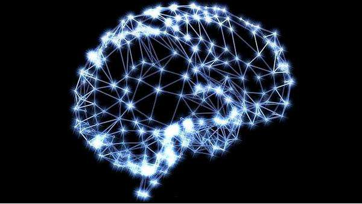
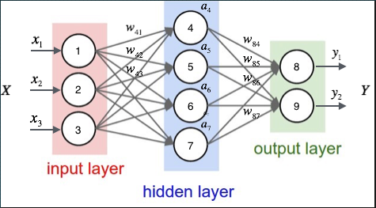
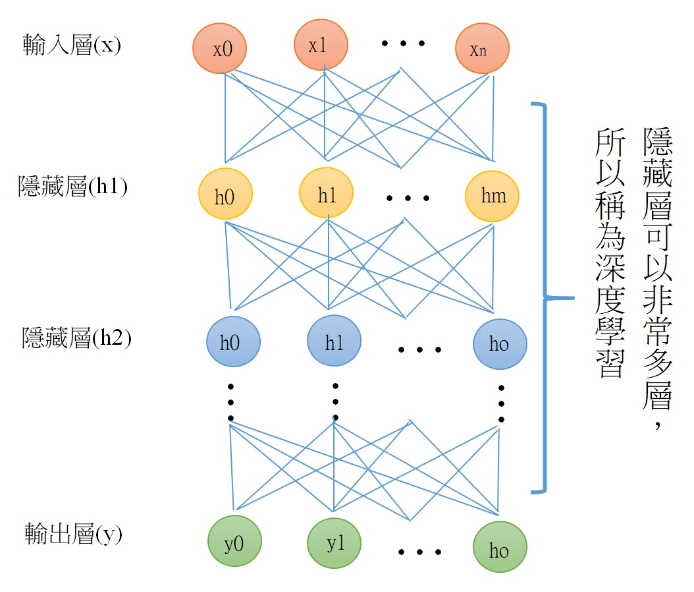
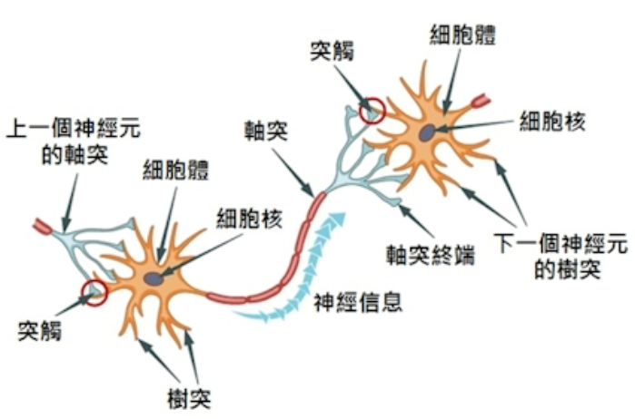
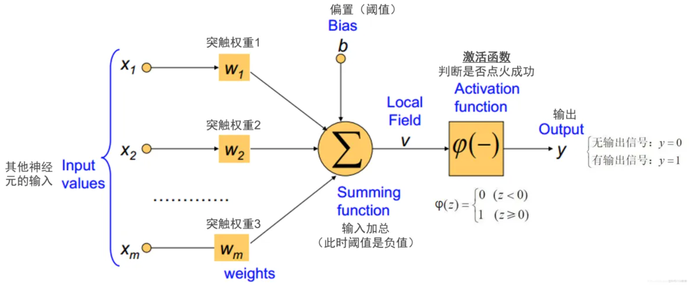

= 机器学习入门
:scripts: cjk
:toc: left
:toclevels: 3
:toc-title: 目录
:numbered:
:sectnums:
:sectnum-depth: 3
:source-highlighter: coderay

== 人工智能、机器学习、深度学习之间的关系
image::人工智能、机器学习、深度学习之间的关系.png[人工智能、机器学习、深度学习之间的关系]

== 人工智能
* 人工智能（Artificial Intelligence，AI）是计算机科学的一个分支，研究如何让机器模拟人类的智能
* 人工智能的愿景是希望机器能像人类大脑一样，通过训练能够做出判断和决策，解决人类面临的问题，甚至最终超载人类
* 从发展水平可分为：
** 弱人工智能: 只能解决特定领域的特定任务
** 强人工智能: 匹敌人类，跨领域解决各种复杂任务
** 超人工智能: 超越人类，完成人类无法完成的任务

== 人工智能的发展史
. 逻辑推理时代
** 人工智能的起步阶段，赋予机器逻辑推理的能力，自然语言处理也有了初步雏形
. 专家系统时代
** 用特定的规则来回答特定领域内的问题
** 通过吸收专业知识来回答专业问题，但是过度依赖知识库，局限在特定领域，难以拓展
. 机器学习和深度学习时代

== 机器学习
* 机器学习（Machine Learning，ML）是人工智能的一个分支，研究如何让机器从大数据中找出规律
* 机器学习的本质，是在庞乱无形的数据中，寻找规律并总结出一套适配的逻辑
* 机器学习通过算法，使用大量数据做训练，训练完成后产生模型，该模型可以用于预测、分类、推荐、图像识别等等
* 如果使用传统算法，几乎不可能找到一个有用的规律，但是使用机器学习，让机器吞吐海量数据后，不断迭代学习，就可以找到其中隐藏的逻辑

== 机器学习分类
* 监督学习(supervised learning)
** 最大的特点是：输入的数据有标签
** 模型通过学习已有的数据和标签对，提取特征并总结规律，从而预测新数据的标签
** 根据任务种类分为:
*** 分类(classification): 通过制定规则，将一堆线性可分离的数据点分为多个分类
*** 回归(regression): 与分类不同，回归任务的输出不是一个分类，而是一个数值，比如温度、价格、销量、评分等等
* 无监督学习(unsupervised learning)
** 与监督学习一样要输入数据，不同的数据没有标签
** 机器从零开始自行摸索，常用于聚合分类
* 强化学习(reinforcement learning)
** 强化学习，也叫RL，是一种机器学习方法，通过建立奖惩机制，在训练中获取积极或消极的反馈，不断调整迭代，最终学会执行某项任务的算法

== 深度学习
* 深度学习（Deep Learning，DL）是机器学习的一个分支，通过模仿人类的神经网络来构建模型
* 人脑的神经网络
** 人脑估计具有860亿个神经元，超过100M条神经连接
** 神经元是大脑中的基本单元，每个神经元都是通过其邻近的数千个神经元连接
** 神经元接收来自外部世界的感觉输入，并将其转化为对行动有用的电信号
** 数百万个神经元将相互作用，产生有用的信息的电脉冲
+

* 人工神经网络
** 人们通过模拟这一结构，创建了一个包含节点和连接的人工结构，称为人工神经网络
** 我们一般把人工神经网络分为三层: 输入层, 隐藏层和输出层，如下图所求，圆圈代表神经元，箭头线代表计算路径
+

** 图中X(x1,x2,x3)为输入向量，Y(y1,y2)为输出向量，X的每个元素可以当作输入层神经元的激活值，分别为1，2，3
** 通过上一层的激活值，以及连线的权重w，计算下一层的激活值，依此往下推，直到输出层，得到最终的输出结果Y(y1,y2)
* 深度学习
** 深度学习的训练过程往往包含多个隐藏层，因此被称为“深度”学习
+

== 人类神经元的信息传导

* 轴突传送信息: 神经元长出一个细长条的轴突，以电流方式将信息传递给另一个神经元
* 树突接收信息: 接收其他神经元传来的电化学信息，再传递给本身的细胞
* 突触是输入与输出的神经元传递的机制: 输入与输出的神经元之间发展出的特殊结构称为突触，神经元通过释放化学物质来传递信息，当电压达到临界值时，就会通过轴突传送电脉冲动作电位至接收神经元

== 数学公式仿真神经元的信息传导

* 输入x: 输入神经元通过电化学信息传递给隐藏神经元
* 激活函数: 隐藏神经元通过激活函数计算输出
* 输出: 输出神经元通过电化学信息传递给输出神经元
