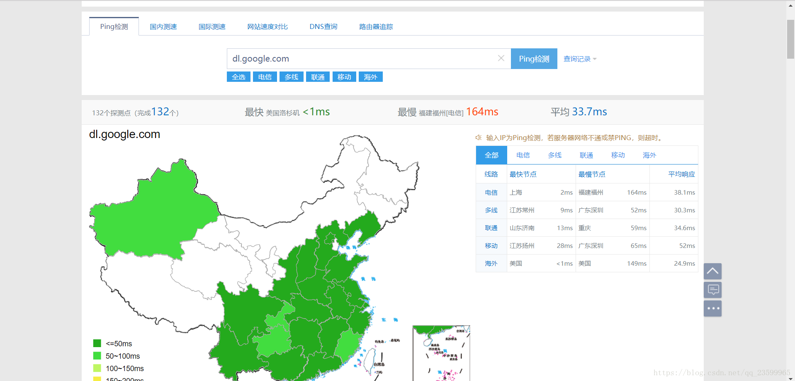

# 翻墙安装androidSDK

## 1. 首先取消方式一中设置的HTTP Proxy

## 2. 进入网站 <http://ping.chinaz.com/>，进行 dl.google.com ping检查，选择大陆响应时间最短的IP地址

## 3. 进入cmd对此IP地址进行ping测试，如果可以将（IP地址 dl.google.com）加入hosts文件中

hosts文件地址：
mac /etc/hosts
windows C:\WINDOWS\System32\drivers\etc\hosts

## 4. 点击Apply、OK，重新打开Android SDK，可以看到列表已经获得

勾选对应的项点击Apply即可下载安装。
