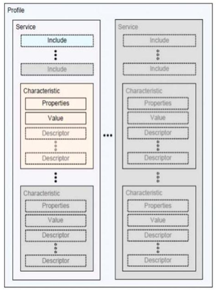
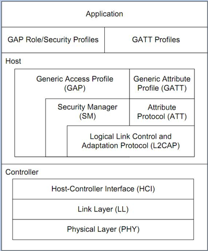
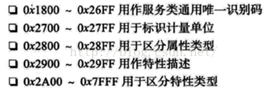

# 蓝牙设备的特征值及其编码

[TOC]

## 服务与特征值

蓝牙4.0是以参数来进行数据传输的，即服务端定好一个参数，客户端可以对这个参数进行读，写，通知等操作，这个东西我们称之为 **特征值**（characteristic）。

但一个参数不够我们用，比如我们这个特征值是电量的值，另一个特征值是设备读取的温度值。那这时候会有多个特征值，并且我们还会对它们分类，分出来的类我们称之为 **服务**（service）。

一个设备可以有多个服务，每一个服务可以包含多个特征值。为了方便操作，每个特征值都有他的**属性**，例如长度（size）,权限（permission），值（value）,描述（descriptor），如下图。



## ATT与GATT

蓝牙4.0版本推出了低功耗规范，引入了两个核心协议：**ATT**（Attribute Protocol）和 **GATT**（Generic Attribute Protocol）.这两个协议主要目标是BLE，但是也可以运行在传统蓝牙上（BR/EDR)。

ATT主要是规定了"属性"的定义，GATT则是将这些"属性"包装成我们上面所讲的服务、特征值等。



## 属性的定义

属性的定义分为 **Handle**,**Type**,**Permission**,**Value**

- Handle
  其实属性表在程序里只是一个数组而已，所以Handle这个值其实我们是不需要专门去存的，他只是一个索引而已。
- Type:
  属性的类型，也即 UUID，蓝牙标准组织已经对UUID进行了分类([UUID分类](#uuid分类))。
  而特征值Declaration 的Type就是0x2803。至于特征值Value的Type可以是用户自定义的。
- Permission
  属性的访问权限，一般有Read、Write、 notifications、 indications
- Value
  属性的值 最长可达512字节

**属性示例**

每一个属性会告诉使用者说，我是什么，我带有什么，你能对我做什么，即描述，值，权限,如下表

| 序号  | 描述                   | 权限 | 值                                                           |
| :---- | ---------------------- | ---- | ------------------------------------------------------------ |
| 属性1 | 我是 服务A的开头       | 只读 | 服务号0001                                                   |
| 属性2 | 我是 特征值1的开头     | 只读 | 特征值1的值放在属性3里<br>特征值1的值类型<br>特征值1的值权限 |
| 属性3 | 我是 特征值1的值       | /    | 0                                                            |
| 属性4 | 我是 特征值1的特殊操作 | 读写 | 关闭                                                         |
| 属性5 | 我是 特征值2的开头     | 只读 | …                                                            |
| 属性6 | 我是 特征值2的值       | /    | …                                                            |
| 属性7 | 我是 特征值2的特殊操作 | 读写 | …                                                            |
| 属性8 | 我是 服务B的开头       | 只读 | 服务号0002                                                   |

而真实的属性表其实看起来是这样的

| Handle | Type                                                      | Permission     | Value                                                                                                                                         |
| :----- | --------------------------------------------------------- | -------------- | --------------------------------------------------------------------------------------------------------------------------------------------- |
| 39     | 0x2800<br>(GATT Primary Service UUID)                     | Read           | E0:FF(2 bytes)<br>(0xFFE0 = simple keys service custom UUID)                                                                                  |
| 40     | 0x2803<br>(GATT Characteristic Declaration UUID)          | Read           | 10:29:00:E1:FF(5 byte)<br>(0xFFE1 = Simple keys value custom UUID)<br>(0x0029 = handle 41)<br>(0x10 = characteristic properties :notify only) |
| 41     | 0xFFE1<br>(simple keys state)                             | (none)         | 00(1 byte)<br>(value indicates states of keys）                                                                                               |
| 42     | 0x2902<br>(GATT Client Characteristic Configuration UUID) | Read and Write | 00:00(2 byte)<br>(value indicates whether notifications or indications are enabled)                                                           |
| 43     | 0x2800<br>(GATT Primary Service UUID)                     | Read           | A1:DD(2 byte)<br>(0xDDA1 = Other Service custom UUID)                                                                                         |

## UUID分类

蓝牙标准组织已经对UUID进行了分类。



如上表中，服务的Type就是0X2800，所以每到一个服务，就会有一个Type类型为0x2800的属性出现。

## UUID格式

蓝牙广播中对UUID的格式定义有三种16bit，32bit和12bit。

16bit和32bit和128bit之间的转换关系

```ini
128_bit_UUID = 16_bit_UUID * 2^96 + Bluetooth_Base_UUID
128_bit_UUID = 32_bit_UUID * 2^96 + Bluetooth_Base_UUID
```

其中 **Bluetooth_Base_UUID** 定义为 `00000000-0000-1000-8000-00805F9B34FB`

示例

| iOS  | Android                              |
| :--- | ------------------------------------ |
| fff1 | 0000fff1-0000-1000-8000-00805f9b34fb |
| fff2 | 0000fff2-0000-1000-8000-00805f9b34fb |
| ffa1 | 0000ffa1-0000-1000-8000-00805f9b34fb |
| ffa2 | 0000ffa2-0000-1000-8000-00805f9b34fb |

