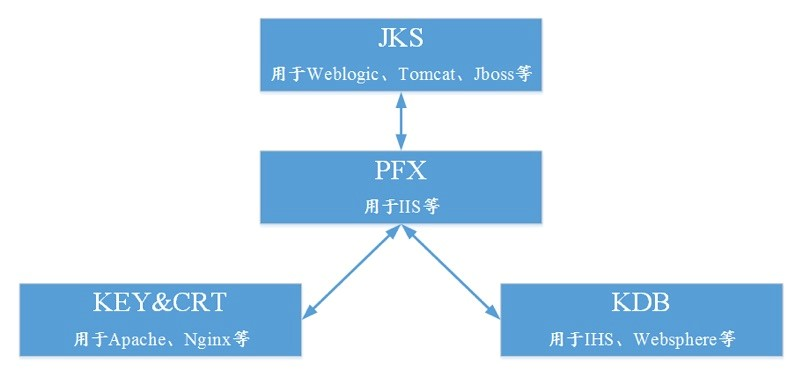

# 证书常见问题

[TOC]

## 1. 主流数字证书都有哪些格式？

一般来说，主流的 Web 服务软件，通常都基于 OpenSSL 和 Java 两种基础密码库。

- Tomcat、Weblogic、JBoss 等 Web 服务软件，一般使用 Java 提供的密码库。通过 Java Development Kit （JDK）工具包中的 Keytool 工具，生成 Java Keystore（JKS）格式的证书文件。
- Apache、Nginx 等 Web 服务软件，一般使用 OpenSSL 工具提供的密码库，生成 PEM、KEY、CRT 等格式的证书文件。
- IBM 的 Web 服务产品，如 Websphere、IBM Http Server（IHS）等，一般使用 IBM 产品自带的 iKeyman 工具，生成 KDB 格式的证书文件。
- 微软 Windows Server 中的 Internet Information Services（IIS）服务，使用 Windows 自带的证书库生成 PFX 格式的证书文件。

## 2. 如何判断证书文件是文本格式还是二进制格式？

您可以使用以下方法简单区分带有后缀扩展名的证书文件：

- *.DER 或 *.CER 文件： 这样的证书文件是二进制格式，只含有证书信息，不包含私钥。
- *.CRT 文件： 这样的证书文件可以是二进制格式，也可以是文本格式，一般均为文本格式，功能与 *.DER 及 *.CER 证书文件相同。
- *.PEM 文件： 这样的证书文件一般是文本格式，可以存放证书或私钥，或者两者都包含。 *.PEM 文件如果只包含私钥，一般用 *.KEY 文件代替。
- *.PFX 或 *.P12 文件： 这样的证书文件是二进制格式，同时包含证书和私钥，且一般有密码保护。

您也可以使用记事本直接打开证书文件。如果显示的是规则的数字字母，例如：

```text
—–BEGIN CERTIFICATE—–
MIIE5zCCA8+gAwIBAgIQN+whYc2BgzAogau0dc3PtzANBgkqh......
—–END CERTIFICATE—–
```

那么，该证书文件是文本格式的。

如果存在——BEGIN CERTIFICATE——，则说明这是一个证书文件。
如果存在—–BEGIN RSA PRIVATE KEY—–，则说明这是一个私钥文件。
证书格式转换
以下证书格式之间是可以互相转换的。

## 3. 证书格式转换关系

您可使用以下方式实现证书格式之间的转换：

注意： 云盾证书服务统一使用 PEM 格式的数字证书文件。



### 3.1. 将 JKS 格式证书转换成 PFX 格式

您可以使用 JDK 中自带的 Keytool 工具，将 JKS 格式证书文件转换成 PFX 格式。

例如，您可以执行以下命令将 server.jks 证书文件转换成 server.pfx 证书文件：

```sh
keytool -importkeystore -srckeystore D:\server.jks -destkeystore D:\server.pfx -srcstoretype JKS -deststoretype PKCS12
```

### 3.2. 将 PFX 格式证书转换为 JKS 格式

您可以使用 JDK 中自带的 Keytool 工具，将 PFX 格式证书文件转换成 JKS 格式。

例如，您可以执行以下命令将 server.pfx 证书文件转换成 server.jks 证书文件： 

```sh
keytool -importkeystore -srckeystore D:\server.pfx -destkeystore D:\server.jks -srcstoretype PKCS12 -deststoretype JKS
```

### 3.3. 将 PEM/KEY/CRT 格式证书转换为 PFX 格式

您可以使用 OpenSSL工具，将 KEY 格式密钥文件和 CRT 格式公钥文件转换成 PFX 格式证书文件。

例如，将您的 KEY 格式密钥文件（server.key）和 CRT 格式公钥文件（server.crt）拷贝至 OpenSSL 工具安装目录，使用 OpenSSL 工具执行以下命令将证书转换成 server.pfx证书文件：

```sh
openssl pkcs12 -export -out server.pfx -inkey server.key -in server.crt
```

### 3.4. 将PFX转换为PEM/KEY/CRT

您可以使用 OpenSSL工具，将 PFX 格式证书文件转化为 KEY 格式密钥文件和 CRT 格式公钥文件。

例如，将您的 PFX 格式证书文件拷贝至 OpenSSL 安装目录，使用 OpenSSL 工具执行以下命令将证书转换成 server.pem 证书文件、KEY 格式密钥文件（server.key）和 CRT 格式公钥文件（server.crt）：

```sh
openssl pkcs12 -in server.pfx -nodes -out server.pem
openssl rsa -in server.pem -out server.key
openssl x509 -in server.pem -out server.crt
```

注意： 此转换步骤是专用于通过 Keytool 工具生成私钥和 CSR 申请证书文件的，并且通过此方法您可以在获取到 PEM 格式证书公钥的情况下分离私钥。在您实际部署数字证书时，请使用通过此转换步骤分离出来的私钥和您申请得到的公钥证书匹配进行部署。

