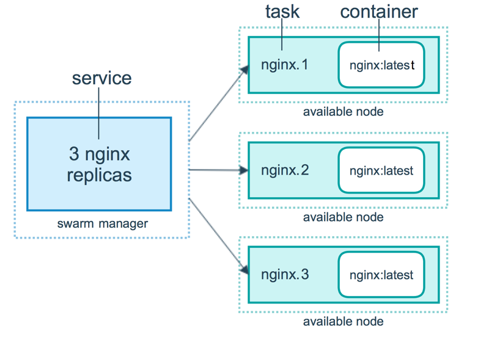

# SWARM 简介

[TOC]

Docker 1.12 Swarm mode 已经内嵌入 Docker 引擎，成为了 docker 子命令 docker swarm。请注意与旧的 Docker Swarm 区分开来。
Swarm mode 内置 kv 存储功能，提供了众多的新特性，比如：具有容错能力的去中心化设计、内置服务发现、负载均衡、路由网格、动态伸缩、滚动更新、安全传输等。使得 Docker 原生的 Swarm 集群具备与 Mesos、Kubernetes 竞争的实力。

## 1. 基本概念

Swarm 是使用 SwarmKit 构建的 Docker 引擎内置（原生）的集群管理和编排工具。

### 1.1. 节点

运行 Docker 的主机可以主动初始化一个 Swarm 集群或者加入一个已存在的 Swarm 集群，这样这个运行 Docker 的主机就成为一个 Swarm 集群的节点 (node) 。
节点分为管理 (manager) 节点和工作 (worker) 节点。

管理节点用于 Swarm 集群的管理，docker swarm 命令基本只能在管理节点执行（节点退出集群命令 docker swarm leave 可以在工作节点执行）。一个 Swarm 集群可以有多个管理节点，但只有一个管理节点可以成为 leader，leader 通过 raft 协议实现。

工作节点是任务执行节点，管理节点将服务 (service) 下发至工作节点执行。管理节点默认也作为工作节点。你也可以通过配置让服务只运行在管理节点。

来自 Docker 官网的这张图片形象的展示了集群中管理节点与工作节点的关系。


### 1.2. 服务和任务

任务 （Task）是 Swarm 中的最小的调度单位，目前来说就是一个单一的容器。

服务 （Services） 是指一组任务的集合，服务定义了任务的属性。服务有两种模式：

- replicated services
  按照一定规则在各个工作节点上运行指定个数的任务。
- global services
  每个工作节点上运行一个任务

两种模式通过 docker service create 的 --mode 参数指定。
来自 Docker 官网的这张图片形象的展示了容器、任务、服务的关系。



## 2. 创建集群

### 2.1. 初始化集群

- 初始化Swarm集群，并将本机自动设置为管理节点。

```sh
docker swarm init
```

- 如果主机有多个网卡，拥有多个 IP，必须使用 --advertise-addr 指定 IP

```sh
docker swarm init --advertise-addr <IP>
```

### 2.2. 将机器加入集群

#### 2.2.1. 作为 worker 节点加入

在 manager 节点上执行

```sh
docker swarm join-token worker
```

在运行命令后可以得到加入的指令，形式如下:

```sh
docker swarm join --token xxxxx <集群节点IP>:<PORT>
```

可以直接复制到到要加入的机器上执行即可

#### 2.2.2. 作为 manager 节点加入

在 manager 节点上执行

```sh
docker swarm join-token manager
```

在运行命令后可以得到加入的指令，形式如下:

```sh
docker swarm join --token xxxxx <集群节点IP>:<PORT>
```

可以直接复制到到要加入的机器上执行即可

### 2.3. 添加管理

```sh
docker swarm join-token manager
```

### 2.4. 查看集群

```sh
docker node ls
```

## 3. 开通通信端口

默认情况下，防火墙拦截了docker创建的虚拟网络链接，需要开通以下通信端口，使各节点能够正常通信

```sh
firewall-cmd --zone=public --add-port=2376/tcp --permanent
firewall-cmd --zone=public --add-port=2377/tcp --permanent
firewall-cmd --zone=public --add-port=7946/tcp --permanent
firewall-cmd --zone=public --add-port=7946/udp --permanent
firewall-cmd --zone=public --add-port=4789/tcp --permanent
firewall-cmd --zone=public --add-port=4789/udp --permanent
firewall-cmd --reload
```

- 集群节点之间保证TCP 2377、TCP/UDP 7946和UDP 4789端口通信
  - 用于Docker客户端安全通信的TCP端口2376，Docker Machine工作需要这个端口，Docker Machine用于对Docker主机进行编排
  - TCP端口2377集群管理端口
  - TCP与UDP端口7946节点之间通讯端口
  - TCP与UDP端口4789 overlay网络通讯端口

## 4. 节点 Label 管理

- 添加Label(已存在则为修改)

```sh
docker node update --label-add role=web node1
```

- 删除Label

```sh
docker node update --label-rm role node1
```

- 查看节点的Label

```sh
docker node inspect node1 | grep Labels -A 2
```

## 5. 服务管理

### 5.1. 部署服务

在集群中创建并运行一个名为 nginx 服务

```sh
docker service create --replicas 3 -p 80:80 --name nginx nginx:1.13.7-alpine
```

现在我们使用浏览器，输入任意节点 IP ，即可看到 nginx 默认页面。

### 部署条件约束

```sh
version: '3.9'
services:
  nginx:
    ....
    deploy:
      placement:
        constraints:
          - node.labels.role==web
```

### 5.2. 查看服务

- 查看服务列表

  ```sh
  docker service ls
  ```

- 查看单个服务详情

  ```sh
  docker service ps nginx
  
  ```

- 查看单个服务启动失败的详情

  ```sh
  docker service ps --no-trunc nginx
  ```

- 查看单个服务日志

  ```sh
  docker service logs -n2000 --raw nginx
  ```

### 5.3. 服务伸缩

根据数字可伸可缩

```sh
docker service scale nginx=5
```

### 5.4. 更新镜像并重启

```sh
docker service update --image nginx:1.13.12-alpine nginx
```

### 5.5. 强制更新并重启

一般可以通过更新服务配置来重启服务，但是有时候配置没有改变，也要重启，就用下面的命令

```sh
docker service update --force xxx
```

### 5.6. 删除服务

```sh
docker service rm nginx
```

## 6. Secrets

### 6.1. 创建 secret

```sh
# 创建 secret(20位随机密码)
openssl rand -base64 20 | docker secret create mysql_root_password -
# 创建 secret(自定义密码)
echo "xxxxxxx" | docker secret create mysql_root_password -
```

### 6.2. 查看密钥(在创建容器后)

```sh
# 进入容器
docker exec -it <容器id> /bin/sh
# 在容器中查看密钥
cat /run/secrets/mysql_root_password
```

### 6.3. 更新 Secret

```sh
docker service update \
    --secret-add source=mysql_root_password_v2,target=mysql_root_password \
    --secret-rm mysql_root_password \
    mysql
```

## 7. Configs

### 7.1. 添加 config

```sh
docker config create nginx.conf /usr/local/nginx/nginx.conf
```

### 7.2. 查看 config

```sh
docker config ls
```

### 7.3. 删除 config

```sh
docker config rm nginx.conf
```

### 7.4. 创建服务时使用 config

```sh
docker service create \
    --name nginx \
    -p 80:80 \
    --config source=nginx.conf,target=/etc/nginx/nginx.conf \
    nginx
```

### 7.5. 更新 config

更新 config 不能直接删除 config，应该先更新服务，然后才可以删除旧 config

```sh
docker config create nginx1.conf /usr/local/nginx/nginx.conf
docker service update --config-rm nginx.conf --config-add src=nginx1.conf,target=/etc/nginx/nginx.conf nginx 
```
