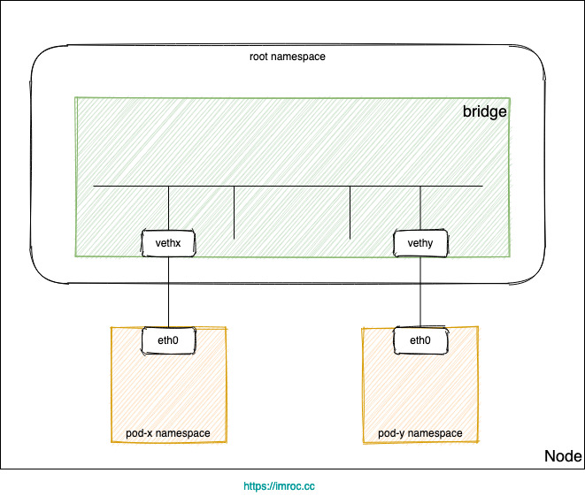
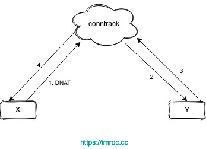
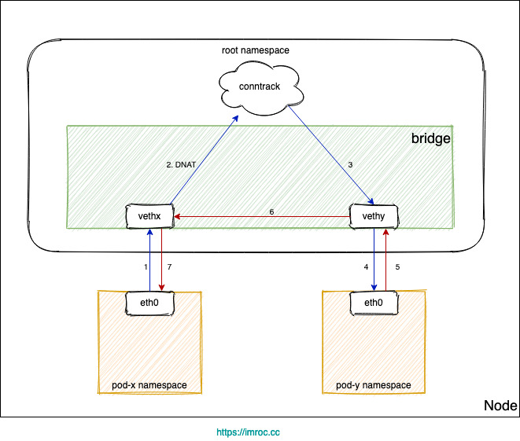

# 为什么 kubernetes 环境要求开启 bridge-nf-call-iptables

[TOC]

## 参考

<https://izsk.me/2021/08/18/Kubernetes-bridge-nf-call-iptables/>

## 背景

`swarm` 环境中，很多时候都要求节点内核参数开启 bridge-nf-call-iptables:

```sh
vi /etc/sysctl.conf
```

```ini
....
net.bridge.bridge-nf-call-iptables = 1
net.bridge.bridge-nf-call-ip6tables = 1
net.bridge.bridge-nf-call-arptables = 1
....
```

```sh
# 加载并查看是否设置成功
sysctl -p
```

如果不开启或中途因某些操作导致参数被关闭了，就可能造成一些奇奇怪怪的网络问题，排查起来非常麻烦

## 基于网桥的容器网络

Kubernetes 集群网络有很多种实现，有很大一部分都用到了 `Linux` 网桥



- 每个 `Pod` 的网卡都是 `veth` 设备，`veth pair` 的另一端连上宿主机上的网桥。
- 由于网桥是虚拟的二层设备，同节点的 `Pod` 之间通信直接走二层转发，跨节点通信才会经过宿主机 `eth0`

## Service 同节点通信问题

不管是 `iptables` 还是 `ipvs` 转发模式，`Kubernetes` 中访问 `Service` 都会进行 `DNAT`，将原本访问 `ClusterIP:Port` 的数据包 `DNAT` 成 `Service` 的某个 `Endpoint` (PodIP:Port)，然后内核将连接信息插入 `conntrack` 表以记录连接，目的端回包的时候内核从 `conntrack` 表匹配连接并反向 `NAT`，这样原路返回形成一个完整的连接链路



但是 `Linux` 网桥是一个虚拟的二层转发设备，而 `iptables conntrack` 是在三层上，所以如果直接访问同一网桥内的地址，就会直接走二层转发，不经过 `conntrack`

1. `Pod` 访问 `Service`，目的 `IP` 是 `Cluster IP`，不是网桥内的地址，走三层转发，会被 `DNAT` 成 PodIP:Port。
2. 如果 `DNAT` 后是转发到了同节点上的 `Pod`，目的 `Pod` 回包时发现目的 `IP` 在同一网桥上，就直接走二层转发了，没有调用 `conntrack`，导致回包时没有原路返回 (见下图)



由于没有原路返回，客户端与服务端的通信就不在一个 “频道” 上，不认为处在同一个连接，也就无法正常通信。

常见的问题现象就是偶现 `DNS` 解析失败，当 `coredns` 所在节点上的 `pod` 解析 `dns` 时，`dns` 请求落到当前节点的 `coredns pod` 上时，就可能发生这个问题
