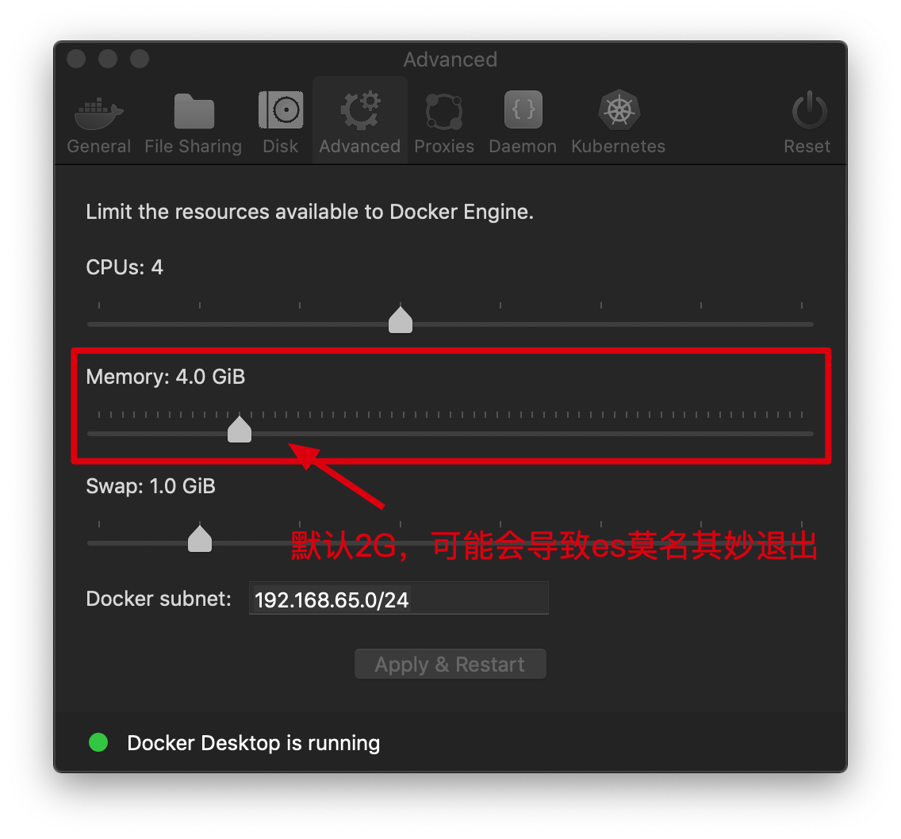

# 制作ElasticSearch的Docker容器

[TOC]

## 1. ElasticSearch单机版

### 1.1. 生产模式需要设置 `vm.max_map_count`

- Linux

The vm.max_map_count setting should be set permanently in /etc/sysctl.conf:

```sh
$ grep vm.max_map_count /etc/sysctl.conf
vm.max_map_count=262144
```

To apply the setting on a live system type: sysctl -w vm.max_map_count=262144

- macOS with Docker for Mac

The vm.max_map_count setting must be set within the xhyve virtual machine:

```sh
screen ~/Library/Containers/com.docker.docker/Data/vms/0/tty
```

Just press enter and configure the sysctl setting as you would for Linux:

```sh
sysctl -w vm.max_map_count=262144
```

### 1.2. 调整docker配置(Mac)



### 1.3. 开发模式(命令行)

```sh
docker run -d --restart=always --name es01 -p 9200:9200 -p 9300:9300 -e "discovery.type=single-node" docker.elastic.co/elasticsearch/elasticsearch:7.3.0
```

### 1.4. 开发模式(docker-compose)

```sh
docker-compose up -d
```

见本目录下的 `docker-compose.yml` 文件

### 1.5. 优化内存

使用 `ES_JAVA_OPTS` 环境变量来设置内存使用大小，默认 `-Xms2g -Xmx2g`，开发根据实际需要可以改小些，如: `-e ES_JAVA_OPTS="-Xms1g -Xmx1g"` 。

### 1.6. 检查是否正常运行

在浏览器中浏览 <http://127.0.0.1:9200/>，如果返回类似如下内容，说明正常运行

```json
{
  "name" : "93e8e4378a4d",
  "cluster_name" : "docker-cluster",
  "cluster_uuid" : "xgDxGORZSlSiQElPzuvGtQ",
  "version" : {
    "number" : "7.3.0",
    "build_flavor" : "default",
    "build_type" : "docker",
    "build_hash" : "de777fa",
    "build_date" : "2019-07-24T18:30:11.767338Z",
    "build_snapshot" : false,
    "lucene_version" : "8.1.0",
    "minimum_wire_compatibility_version" : "6.8.0",
    "minimum_index_compatibility_version" : "6.0.0-beta1"
  },
  "tagline" : "You Know, for Search"
}
```

### 1.7. 安装插件注意

- 安装插件也就是把release的文件复制到plugin目录下
- 如果用install安装出现类似下面的问题:

```text
java.lang.IllegalArgumentException: Plugin [analysis-xxx] was built for Elasticsearch version x.x.x but version x.x.x is running
```

把release中的 `plugin-descriptor.properties` 文件修改内容如下:

```ini
elasticsearch.version=ElasticSearch当前的版本
```

- 安装后，记得重启es

### 1.8. 安装ik插件

注意安装后可能需要重启 `ElasticSearch`

```sh
./bin/elasticsearch-plugin install --batch https://github.com/medcl/elasticsearch-analysis-ik/releases/download/v7.3.0/elasticsearch-analysis-ik-7.3.0.zip
```

最好是先下载下来，复制到容器中去，再安装

```sh
./bin/elasticsearch-plugin install --batch file:./elasticsearch-analysis-ik-6.8.2.zip
```

### 1.9. 安装pinyin分词插件

```sh
./bin/elasticsearch-plugin install --batch https://github.com/medcl/elasticsearch-analysis-pinyin/releases/download/v7.3.0/elasticsearch-analysis-pinyin-7.3.0.zip
```

## 2. ElasticSearch集群

TODO
