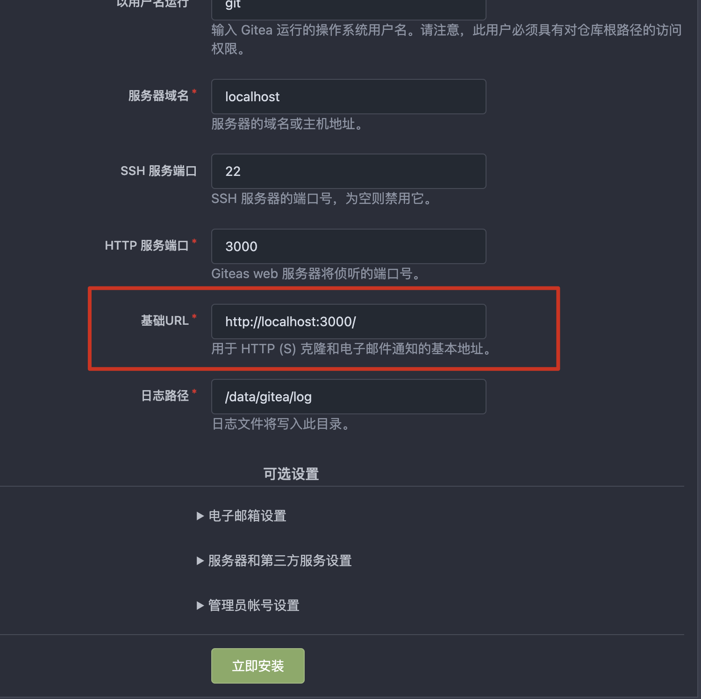

= Gitea
:scripts: cjk
:toc:
:toc-title: 目录
:toclevels: 4

== 单机
[,shell]
----
mkdir /usr/local/gitea
vi /usr/local/gitea/stack.yml
----

[source,yaml,linenums]
----
version: "3.9"

services:
  svr:
    image: gitea/gitea
    volumes:
      - giteadata:/data
    environment:
      # 实际访问gitea的地址
      - GITEA__server_ROOT_URL=https://xxx.xxx.xxx.xxx:xxxxx/gitea/
      # 最好使用此设定时区，其它镜像也可以使用
      - TZ=CST-8
    ports:
      # Http端口
      - "30000:3000"
      # SSH端口
      - "220:22"

volumes:
  giteadata:

networks:
  default:
    external: true
    name: rebue
----

****
注意修改 *GITEA__server_ROOT_URL* 的值为实际访问gitea的地址
****

* 部署

[,shell]
----
docker-compose -f /usr/local/gitea/stack.yml up -d
----

== Swarm
[,shell]
----
mkdir /usr/local/gitea
vi /usr/local/gitea/stack.yml
----

[source,yaml,linenums]
----
version: "3.9"

services:
  svr:
    image: gitea/gitea
    volumes:
      - giteadata:/data
    environment:
      # 最好使用此设定时区，其它镜像也可以使用
      - TZ=CST-8
    #ports:
      # Http端口
      #- "30000:3000"
      # SSH端口
      #- "220:22"
    deploy:
      placement:
        constraints:
          # 限定部署的节点
          - node.labels.role==app
    logging:
      options:
        max-size: 8m

volumes:
  giteadata:

networks:
  default:
    external: true
    name: rebue
----

- 部署

[,shell]
----
docker stack deploy -c /usr/local/gitea/stack.yml gitea
----

== 初始化

注意修改下面的选项
****
* 基础URL
** http://<访问的主机名>:<访问的端口>/<二级路径>/
** 这里填写的是浏览器访问输入的基础URL，而不是容器内服务器启动使用的主机名和端口号
** 如果有二级甚至三级路径前缀，请注意一定要填写
****

== 修改文件并提交

. 进入gitea容器
+
[,shell]
----
docker exec -it <容器ID> bash
----
. 进入data目录
+
[,shell]
----
cd /data
----
. clone
+
[,shell]
----
git clone http://127.0.0.1:3000/***.git
----
. 修改本地文件
. 提交并推送
+
[,shell]
----
git add .
git commit -m xxx
git push
....
----
