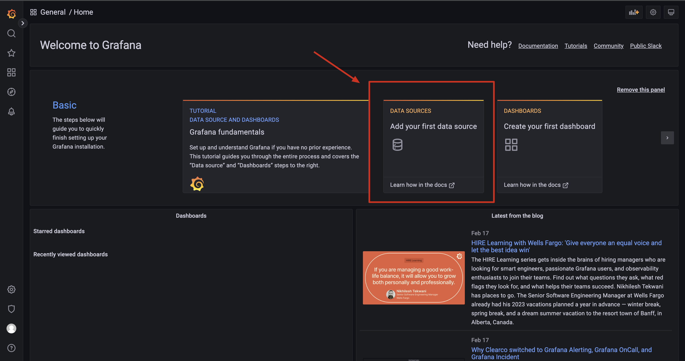
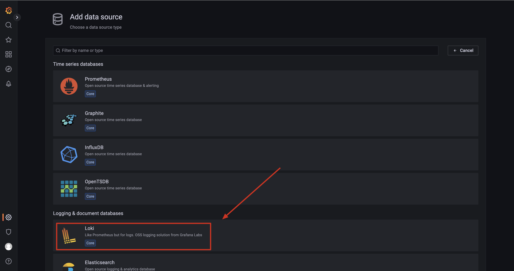
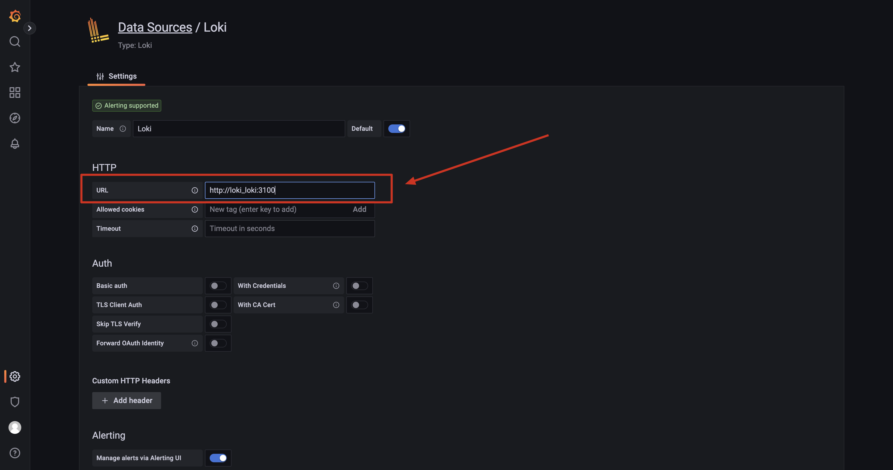
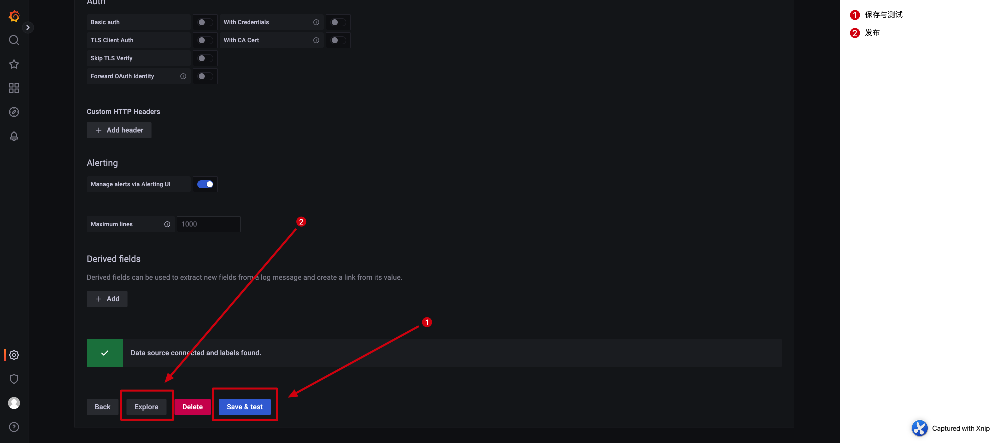

= Loki
:scripts: cjk
:toc:
:toc-title: 目录
:toclevels: 4

== Swarm
[,shell]
----
mkdir /usr/local/loki
vi /usr/local/loki/promtail-config.yml
----

./usr/local/loki/promtail-config.yml
[source,yaml,%linenums]
----
server:
  http_listen_port: 9080
  grpc_listen_port: 0

positions:
  filename: /tmp/positions.yaml

clients:
  - url: http://loki_loki:3100/loki/api/v1/push

scrape_configs:
- job_name: system
  static_configs:
  - targets:
      - localhost
    labels:
      job: varlogs
      __path__: /var/log/*log
----

[,shell]
----
vi /usr/local/loki/grafana-config.ini
----

./usr/local/loki/grafana-config.ini
[source,ini,%linenums]
----
[server]
domain = example.com
root_url = %(protocol)s://%(domain)s:%(http_port)s/grafana/
serve_from_sub_path = true
----
[NOTE]
====
注意修改domain的值为实际的域名
====

[,shell]
----
vi /usr/local/loki/stack.yml
----

./usr/local/loki/stack.yml
[source,yaml,%linenums]
----
version: "3.9"

services:
  loki:
    image: grafana/loki:2.7.0
    #ports:
    #  - "3100:3100"
    environment:
      # 最好使用此设定时区，其它镜像也可以使用
      - TZ=CST-8
    volumes:
      - lokidata:/loki
    command: -config.file=/etc/loki/local-config.yaml
    logging:
      options:
        max-size: 50m

  promtail:
    image: grafana/promtail:2.7.0
    environment:
      # 最好使用此设定时区，其它镜像也可以使用
      - TZ=CST-8
    volumes:
      - /usr/local/loki/promtail-config.yml:/etc/promtail/config.yml:z
      # 被监视日志存放的路径
      - /var/log:/var/log
    command: -config.file=/etc/promtail/config.yml
    deploy:
      mode: global
    logging:
      options:
        max-size: 50m

  grafana:
    image: grafana/grafana:latest
    #ports:
    #  - "3000:3000"
    environment:
      # 最好使用此设定时区，其它镜像也可以使用
      - TZ=CST-8
    volumes:
      - /usr/local/loki/grafana-config.ini:/etc/grafana/grafana.ini
      # grafana数据目录
      - grafanadata:/var/lib/grafana
    logging:
      options:
        max-size: 50m

volumes:
  lokidata:
  grafanadata:

networks:
  default:
    external: true
    name: rebue
----

- 部署

[,shell]
----
docker stack deploy -c /usr/local/loki/stack.yml loki
----

== 初始化

. 访问地址
+
  https://example.com/grafana

. 首次登录名与密码
+
  admin/admin

. 修改密码
+
. 添加数据源
+

