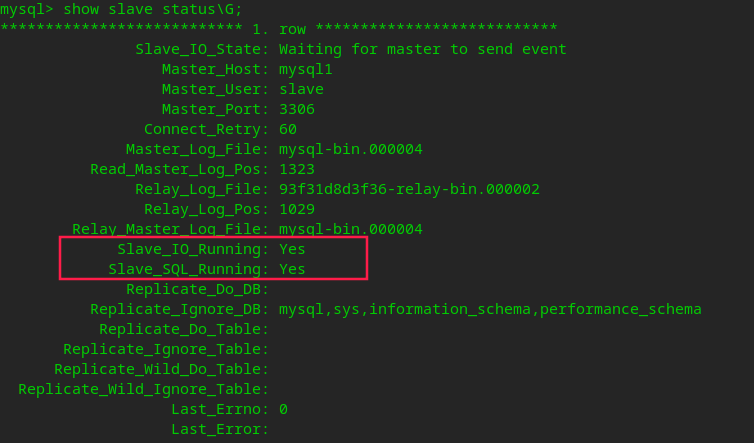

# MySQL

[TOC]

## 1. Dockerfile

<https://github.com/DockerfileX/mysql>

## 2. 创建并运行MySQL容器

### 2.1. 用于开发

```sh
docker run --name mysql -dp3306:3306 -p33060:33060 \
    -e TZ=CST-8 \
    -e MYSQL_ROOT_PASSWORD=root \
    -v mysqldata:/var/lib/mysql \
    --restart=always \
    mysql:5 \
        --default-time-zone='+8:00' \
        --character-set-client-handshake=FALSE \
        --character-set-server=utf8mb4 \
        --collation-server=utf8mb4_general_ci
```

### 2.2. 将数据映射到宿主机路径中保存

#### 2.2.1. 宿主机没有UID为999的用户

在宿主机中执行以下命令

```sh
# 如果是重新安装，/var/lib/mysql目录已然有数据，那么这一段可不用执行，直接创建并运行容器就可以了，数据不会被覆盖
mkdir /var/lib/mysql
# 添加mysql用户并指定uid为999
useradd mysql -u 999 --no-create-home
chown -R mysql:mysql /var/lib/mysql/
# 或直接
chown -R 999:999 /var/lib/mysql/

# 创建并运行MySQL的容器
docker run --name mysql -dp3306:3306 -p33060:33060 -e MYSQL_ROOT_PASSWORD=root -v /var/lib/mysql:/var/lib/mysql --restart=always nnzbz/mysql
```

- 如果要复制容器内数据库的数据到宿主机中，可使用如下命令

  ```sh
  docker cp mysql:/var/lib/mysql /var/lib
  # 注意执行完后要修改宿主机中目录的权限
  chown -R mysql:mysql /var/lib/mysql/
  ```

- -v 冒号前一个 `/var/lib/mysql` 是宿主机的路径

#### 2.2.2. 宿主机已经有UID为999的用户

999的用户是容器中使用的用户，如果在宿主机中添加999的UID会有冲突，可添加另一个没有冲突的，然后在创建容器时使用 `--user` 参数

```sh
# 如果是重新安装，/var/lib/mysql目录已然有数据，那么这一段可不用执行，直接创建并运行容器就可以了，数据不会被覆盖
mkdir /var/lib/mysql
adduser mysql --no-create-home --disabled-password
cat /etc/passwd|grep mysql # 我这里看到UID是1001
chown -R mysql:mysql /var/lib/mysql/

# 创建并运行MySQL的容器，注意1001为之前前一步
docker run --name mysql -dp3306:3306 -p33060:33060 -e MYSQL_ROOT_PASSWORD=root -v /var/lib/mysql:/var/lib/mysql --user 1001:1001 --restart=always nnzbz/mysql
```

#### 2.2.3. 改变MySQL在宿主机中的路径

按上面的方式，MySQL映射到了 `/var/lib/mysql`，但是此路径一般没有分配太大的空间，所以需要更换到有足够容量的空间

```sh
# 首先保证docker没有启动
service docker stop
# 然后移动整个/var/lib/mysql目录到目的路径
sudo mv /var/lib/mysql /usr/local/lib/mysql
# 添加软链
sudo ln -s /usr/local/lib/mysql /var/lib/mysql
```

### 2.3. ~~将数据映射到数据卷中保存~~(推荐使用上面映射到宿主机中的方式)

```sh
# 创建MySQL的数据卷
docker run --name mysql-data nnzbz/mysql echo "data-only container for MySQL"
# 创建并运行MySQL的容器
docker run -dp3306:3306 --restart=always --name mysql -e MYSQL_ROOT_PASSWORD=root --volumes-from mysql-data nnzbz/mysql
```

### 2.4. 在Swarm中安装MySQL

#### 2.4.1. 创建 secret

```sh
# 两种方式
# 创建 secret(20位随机密码)
openssl rand -base64 20 | docker secret create mysql_root_password -
# 创建 secret(自定义密码)
echo "xxxxxxxx" | docker secret create mysql_root_password -
```

- 查看密钥(在创建容器后)

```sh
# 进入容器
docker exec -it <容器id> /bin/sh
# 在容器中查看密钥
cat /run/secrets/mysql_root_password
```

#### 2.4.2. 准备 `my.cnf` 文件

- mysql1的 `my.cnf`

```sh
mkdir -p /usr/local/mysql
vi /usr/local/mysql/mysql1-my.cnf
```

```ini
[mysqld]
#为服务器分配id，可以自定义，不区分大小，起标识作用。不同数据库节点分配不同的id
server_id=1
# 打开Mysql 日志，日志格式为二进制
log-bin=mysql-bin
#当启用时，服务器通过只允许执行可以使用GTID安全地记录的语句来强制GTID一致性。
enforce-gtid-consistency=on
#启用基于GTID的复制，启用之前必须保证enforce-gtid-consistency=true
gtid_mode=on
#该选项让从库写入哪些来自于主库的更新，并把这些更新写入bin-log文件，一台服务器即做主库又做从库必须开启
log-slave-updates=on

replicate-ignore-db=mysql
replicate-ignore-db=sys
replicate-ignore-db=information_schema
replicate-ignore-db=performance_schema
```

- mysql2的 `my.cnf`

```sh
vi /usr/local/mysql/mysql2-my.cnf
```

```ini
[mysqld]
#为服务器分配id，可以自定义，不区分大小，起标识作用。不同数据库节点分配不同的id
server_id=2
# 打开Mysql 日志，日志格式为二进制
log-bin=mysql-bin
#当启用时，服务器通过只允许执行可以使用GTID安全地记录的语句来强制GTID一致性。
enforce-gtid-consistency=on
#启用基于GTID的复制，启用之前必须保证enforce-gtid-consistency=true
gtid_mode=on
#该选项让从库写入哪些来自于主库的更新，并把这些更新写入bin-log文件，一台服务器即做主库又做从库必须开启
log-slave-updates=on

replicate-ignore-db=mysql
replicate-ignore-db=sys
replicate-ignore-db=information_schema
replicate-ignore-db=performance_schema
```

#### 2.4.3. nginx反向代理的配置文件

```sh
vi /usr/local/mysql/nginx.conf
```

```ini{.line-numbers}
user  nginx;
worker_processes  auto;

error_log  /var/log/nginx/error.log notice;
pid        /var/run/nginx.pid;


events {
    worker_connections  1024;
}

stream {
  upstream mysql {
    # backup为备用mysql，当mysql1故障后自动切换mysql2，达到主备效果
    server mysql1:3306 max_fails=3 fail_timeout=30s;
    server mysql2:3306 backup;
  }

  server {
    listen                3306;
    proxy_connect_timeout 3s;
    proxy_timeout         6s;
    proxy_pass            mysql;
  }
}
```

#### 2.4.4. `Docker Compose`

```sh
vi /usr/local/mysql/stack.yml
```

```yaml{.line-numbers}
version: "3.9"
services:
  mysql1:
    image: mysql:5
#    ports:
#      - 3306:3306
#      - 33060:33060
    secrets:
      - mysql_root_password
    configs:
      - source: mysql1-my.cnf
        target: /etc/mysql/my.cnf
    volumes:
      - mysql1data:/var/lib/mysql
    environment:
      # 最好使用此设定时区，其它镜像也可以使用
      - TZ=CST-8
      - MYSQL_ROOT_PASSWORD_FILE=/run/secrets/mysql_root_password
    command: --default-time-zone='+8:00'
            --character-set-client-handshake=FALSE
            --character-set-server=utf8mb4
            --collation-server=utf8mb4_general_ci
#      deploy:
#        placement:
#          constraints:
#            #该hostname为指定容器在哪个主机启动
#            - node.hostname == ecs2d8ed9c368b9
  mysql2:
    image: mysql:5
#    ports:
#      - 3307:3306
#      - 33061:33060
    secrets:
      - mysql_root_password
    configs:
      - source: mysql2-my.cnf
        target: /etc/mysql/my.cnf
    volumes:
      - mysql2data:/var/lib/mysql
    environment:
      # 最好使用此设定时区，其它镜像也可以使用
      - TZ=CST-8
      - MYSQL_ROOT_PASSWORD_FILE=/run/secrets/mysql_root_password
    command: --default-time-zone='+8:00'
            --character-set-client-handshake=FALSE
            --character-set-server=utf8mb4
            --collation-server=utf8mb4_general_ci
#      deploy:
#        placement:
#          constraints:
#            #该hostname为指定容器在哪个主机启动
#            - node.hostname == ecseafe0d11214a
  nginx:
    image: nginx
    hostname: mysql
    ports:
      - 3306:3306
    environment:
      # 最好使用此设定时区，其它镜像也可以使用
      - TZ=CST-8
    configs:
      - source: nginx.conf
        target: /etc/nginx/nginx.conf
    deploy:
      replicas: 3

secrets:
  mysql_root_password:
    external: true
configs:
  mysql1-my.cnf:
    file: /usr/local/mysql/mysql1-my.cnf
  mysql2-my.cnf:
    file: /usr/local/mysql/mysql2-my.cnf
  nginx.conf:
    file: /usr/local/mysql/nginx.conf
volumes:
  mysql1data:
  mysql2data:
```

#### 2.4.5. 部署

```sh
docker stack deploy -c /usr/local/mysql/stack.yml mysql
```

#### 2.4.6. 开启主主同步

1. 分别对 mysql1 和 mysql2 执行下面命令

```sh
# 查看mysql的容器id
docker ps | grep mysql
# 进入mysql容器
docker exec -it <容器id> /bin/sh
# 查看密码
cat /run/secrets/mysql_root_password
# 进入 mysql
mysql -u root -p
# 创建用户并授权
GRANT REPLICATION SLAVE ON *.* to 'slave'@'%' identified by '密码';
```

2. 在 mysql2 中执行下面的命令

**注意：** 如果是重新部署的，需要先执行这个命令 `reset slave;`

```sh
# 开启IO线程监听mysql-1的binlog文件
change master to master_host='mysql1',master_user='slave',master_password='密码',master_port=3306,MASTER_AUTO_POSITION=1;
# 开启同步
start slave;
```

3. 在 mysql1 中执行下面的命令

```sh
# 开启IO线程监听mysql-1的binlog文件
change master to master_host='mysql2',master_user='slave',master_password='密码',master_port=3306,MASTER_AUTO_POSITION=1;
# 开启同步
start slave;
```

4. 分别在 mysql1 和 mysql2 中执行下面命令查看是否开启成功

```sh
show slave status\G;
```

- 如果开启成功，返回结果如下图:



#### 2.4.7. 在主主环境中创建账户并授权

分别对 mysql1 和 mysql2 执行下面命令

```sh
# 查看mysql的容器id
docker ps | grep mysql
# 进入mysql容器
docker exec -it <容器id> /bin/sh
# 查看密码
cat /run/secrets/mysql_root_password
# 进入 mysql
mysql -u root -p
# 创建用户并授权(xxx是账户名)
GRANT ALL ON xxx.* to 'xxx'@'%' identified by '密码';
```

#### 2.4.8. 在主主环境中修改账户密码

分别对 mysql1 和 mysql2 执行下面命令

```sh
# 查看mysql的容器id
docker ps | grep mysql
# 进入mysql容器
docker exec -it <容器id> /bin/sh
# 查看密码
cat /run/secrets/mysql_root_password
# 进入 mysql
mysql -u root -p
# 选择数据库
use mysql;
# 查看账户密码(密码是经过杂凑算法显示出来的)
select host,user,authentication_string from user;
# 修改账户密码(xxx是账户名)
update user set authentication_string=password('密码') where user='xxx' and host='%';
# 刷新缓存
FLUSH PRIVILEGES;
```

## 3. 其它容器连接MySQL容器

```sh
docker run --name some-app --link some-mysql:mysql -d application-that-uses-mysql
```
