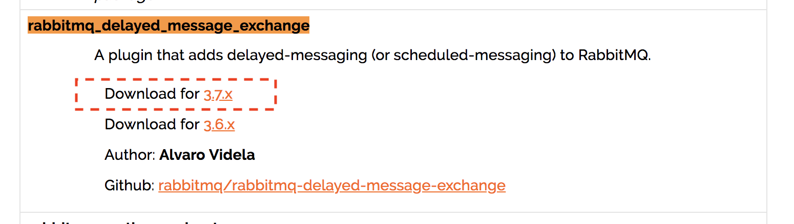

# 制作RabbitMQ的Docker容器

[TOC]

## 1. 参考

<https://hub.docker.com/_/rabbitmq>

## 2. 创建并运行容器

```sh
docker run -d --name rabbitmq -p5671:5671 -p5672:5672 -p4369:4369 -p25672:25672 -p15671:15671 -p15672:15672 --restart=always rabbitmq:management
```

## 3. ~~添加延迟插件~~

- 地址

<http://www.rabbitmq.com/community-plugins.html>

- 查找

 查找关键字```rabbitmq_delayed_message_exchange```

- 下载对应版本

**注意：版本一定不能错**



```sh
cd /tmp
wget https://dl.bintray.com/rabbitmq/community-plugins/3.7.x/rabbitmq_delayed_message_exchange/rabbitmq_delayed_message_exchange-20171201-3.7.x.zip
unzip rabbitmq_delayed_message_exchange-20171201-3.7.x.zip
```

- 复制到容器中

```sh
docker cp /tmp/rabbitmq_delayed_message_exchange-20171201-3.7.x.ez rabbitmq:/usr/lib/rabbitmq/lib/rabbitmq_server-3.7.4/plugins
```

- 进入容器

```sh
docker exec -it rabbitmq /bin/bash
```

- 安装插件

```sh
rabbitmq-plugins enable rabbitmq_delayed_message_exchange
```

如果出现下面文字，说明安装成功

```text
The following plugins have been enabled:
  rabbitmq_delayed_message_exchange
```

- 重启RabbitMQ

## 4. 使用

- 访问
  容器启动之后就可以访问web 管理端了 <http://127.0.0.1:15672> ，默认创建了一个 guest 用户，密码也是 guest。
- 修改密码
  登录后，点击右上角 `guest`，页面下方找到 `Update this user`，填写 `Password` 并 `confirm`，然后 `Update user`
