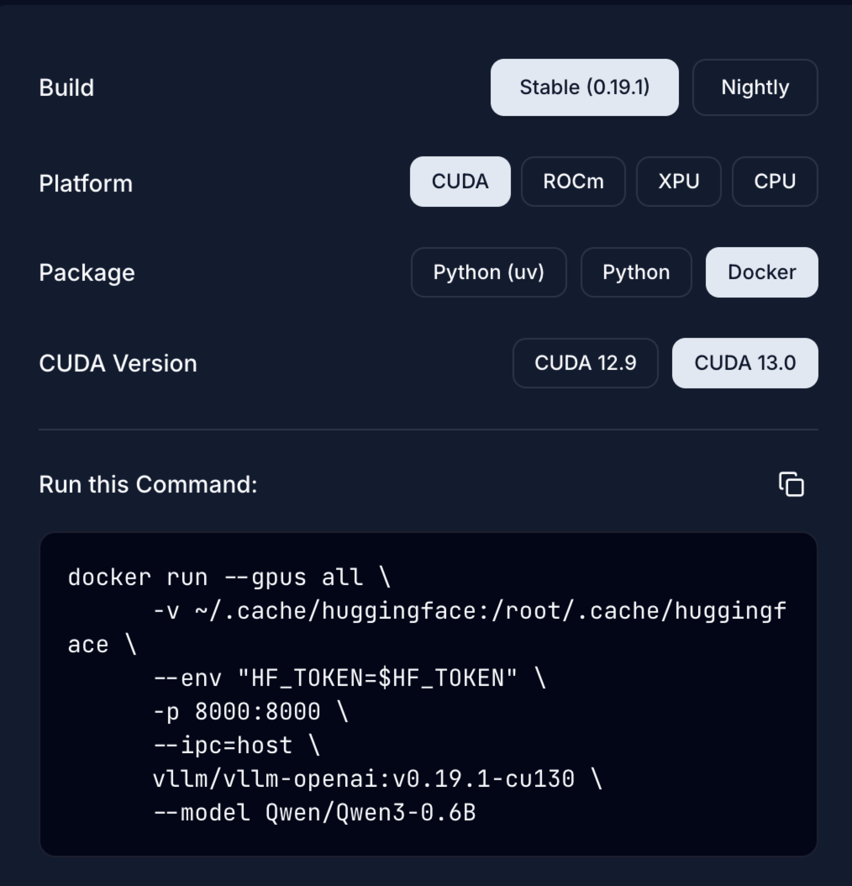

= vLLM
:scripts: cjk
:toc: left
:toclevels: 3
:toc-title: 目录
:numbered:
:sectnums:
:sectnum-depth: 3
:source-highlighter: coderay

== 网站

https://vllm.ai/[官网]

== 官网指导安装

. https://vllm.ai/#quick-start[快速开始]
+

. 官网安装docker
+
[source,shell]
----
docker run --gpus all \
      -v ~/.cache/huggingface:/root/.cache/huggingface \
      --env "HF_TOKEN=$HF_TOKEN" \
      -p 8000:8000 \
      --ipc=host \
      vllm/vllm-openai:v0.19.1-cu130 \
      --model Qwen/Qwen3-0.6B
----

== 改成docker compose

. 创建目录
+
[source,shell]
----
mkdir -p ~/opt/vllm/cache
----

. 部署文件
+
.~/opt/vllm/stack.yml
[source,yaml]
----
services:
  vllm-multi-model:
    image: vllm/vllm-openai:v0.19.1-cu130
    ports:
      - "8000:8000"
    # 核心：同时加载2个模型，对外服务名自定义
    command: >
      --model Qwen/Qwen3.5-27B --served-model-name qwen3.5-27b
      --model unsloth/GLM-4.7-Flash-GGUF --served-model-name glm4.7-30b
    volumes:
      - ~/opt/vllm/cache:/root/.cache/huggingface
    environment:
      - HF_TOKEN=${HF_TOKEN}
    ipc: host
    deploy:
      resources:
        reservations:
          devices:
            - driver: nvidia
              count: all
              capabilities: [gpu]
    restart: unless-stopped
----

. 部署
+
[source,shell]
----
docker compose -f ~/opt/vllm/stack.yml up -d
----