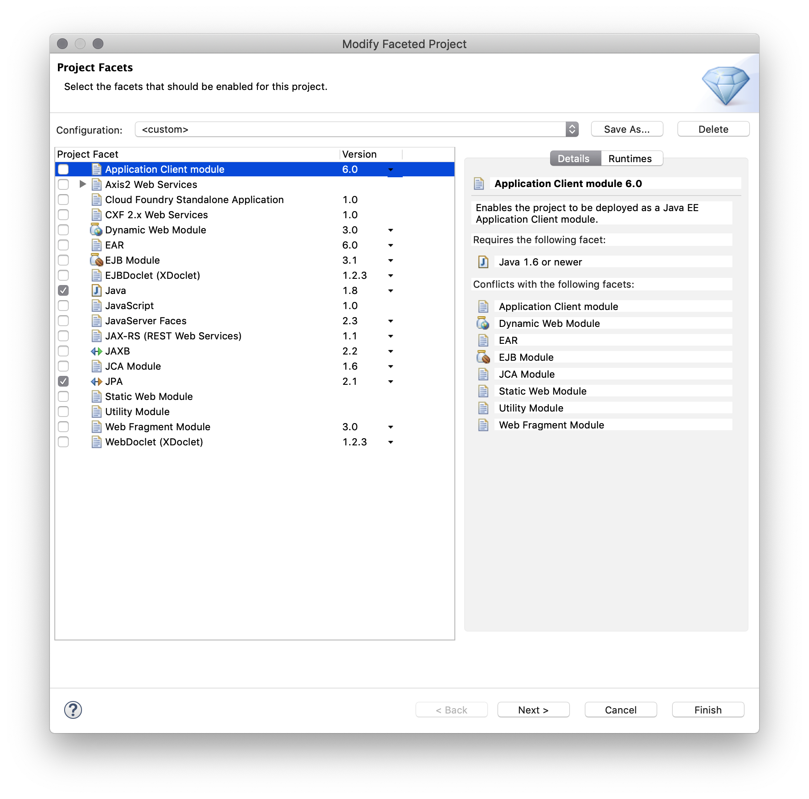
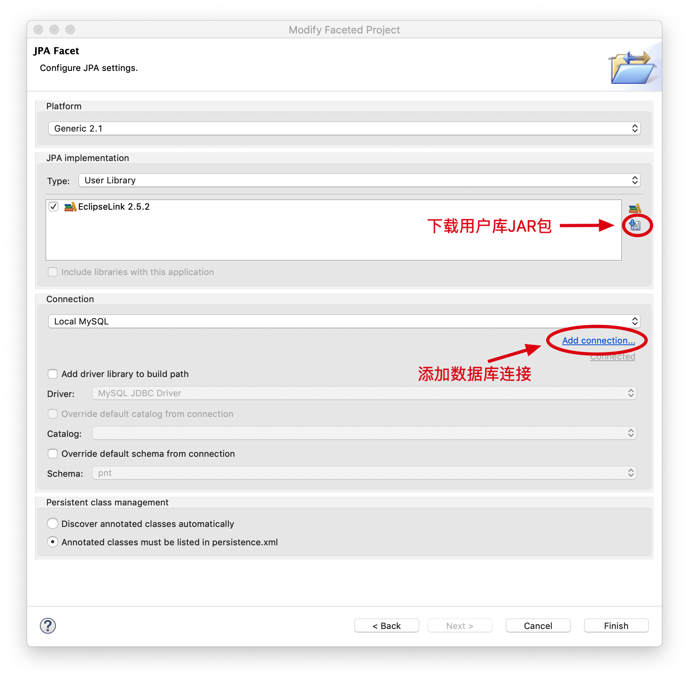
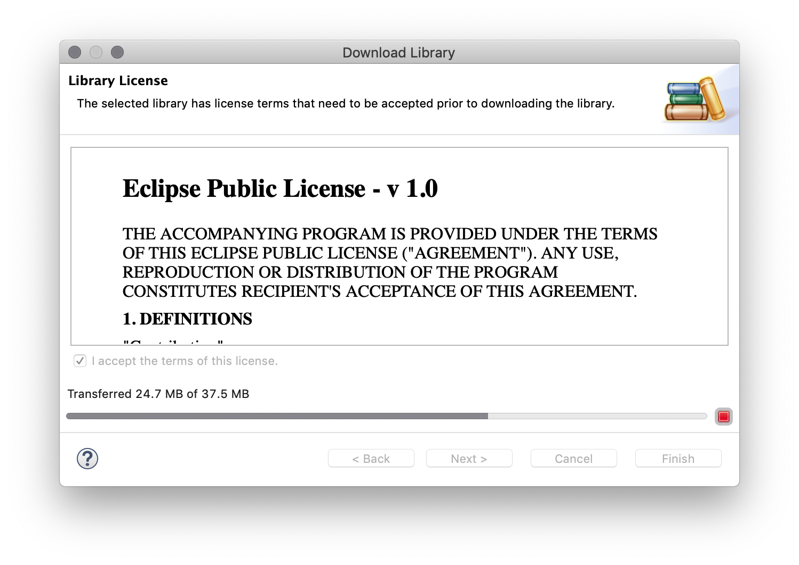
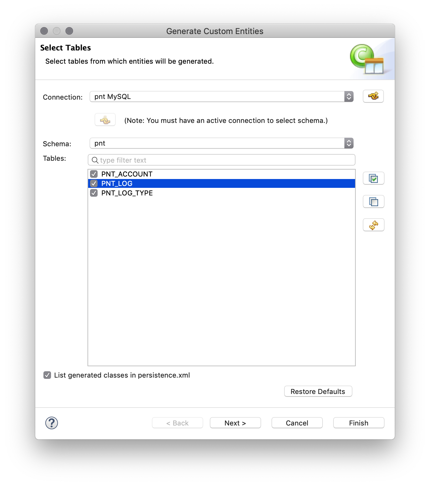
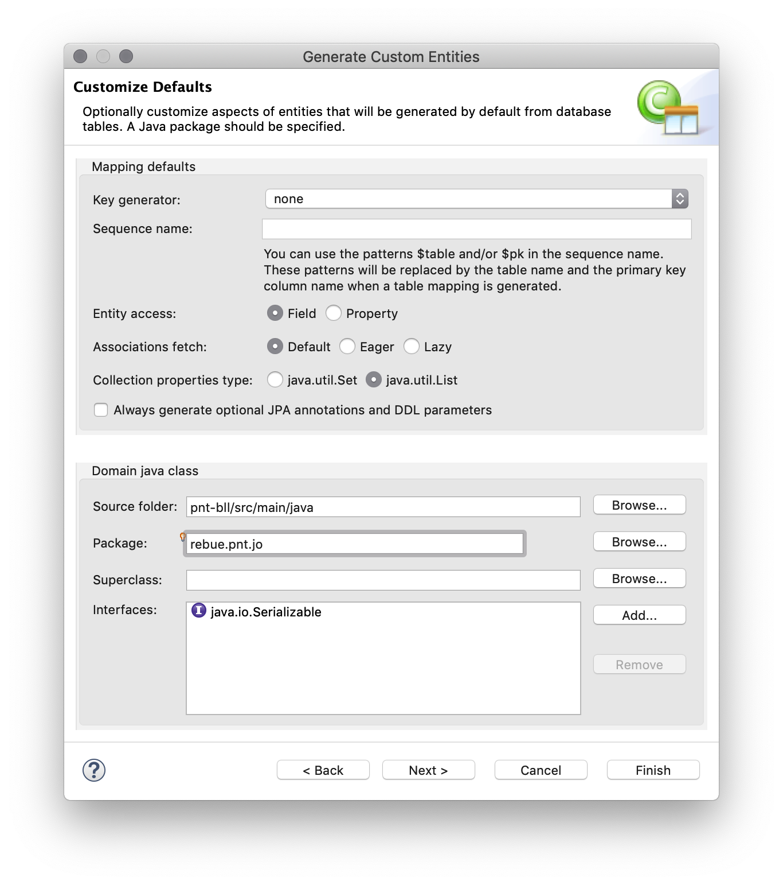

# eclipse利用JPA插件生成实体类

[TOC]

## 1. 配置JPA Tools

右键你的项目 -> Configure -> Convert to JPA Project...

- Project Facets

- 配置生成JPA

- 下载用户库的JAR包

## 2. 生成实体类

右键你的项目 -> JPA Tools -> Generate Entities from Tables...

