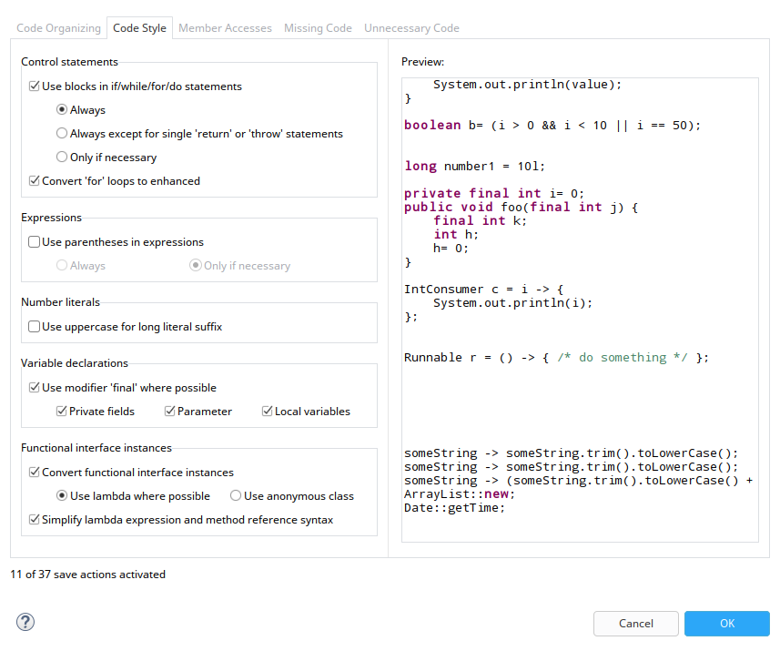
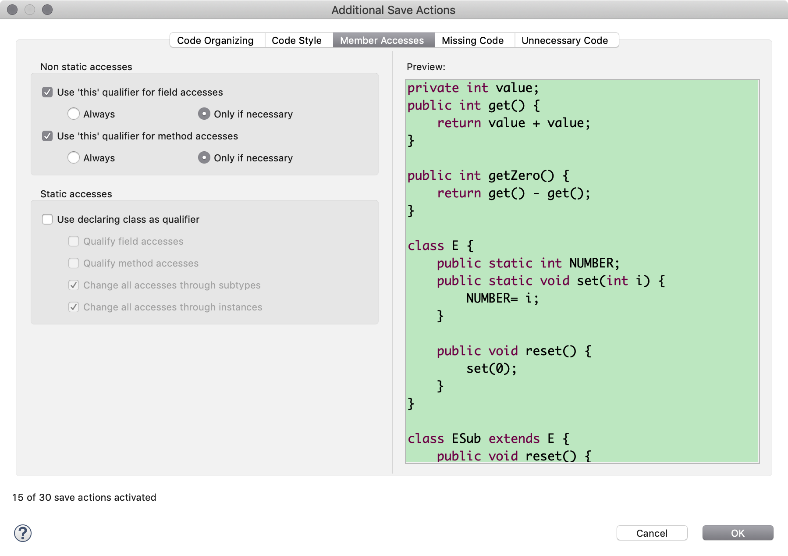
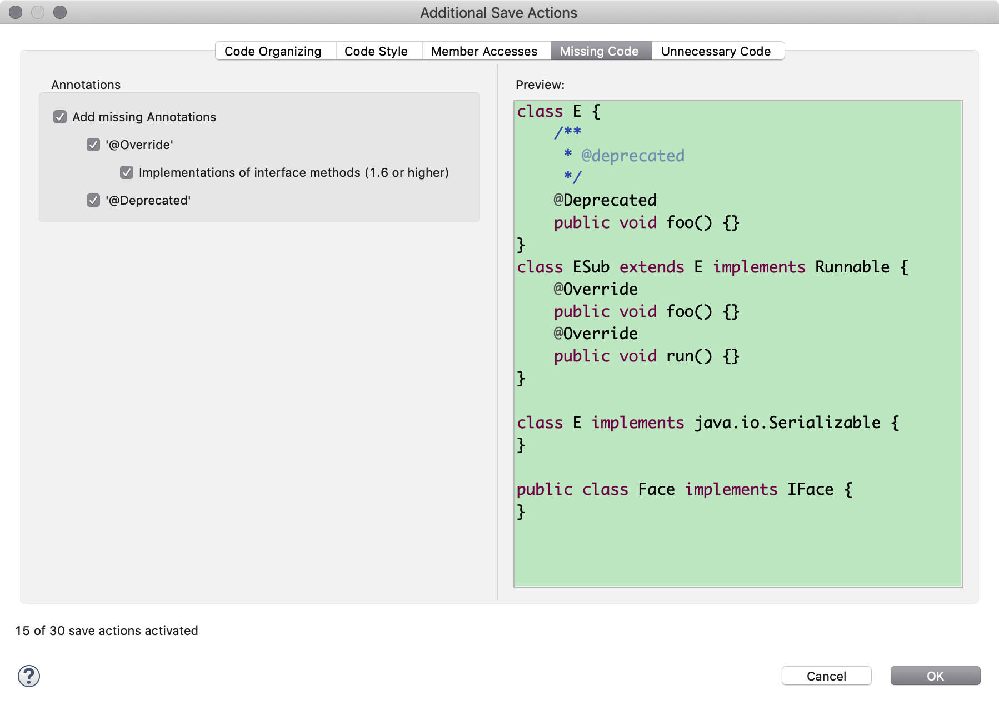
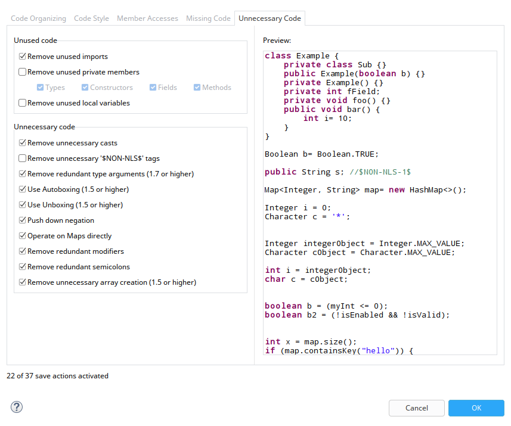
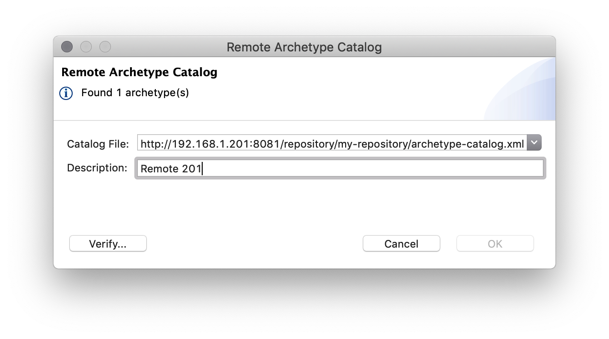

# 1. eclipse配置

[TOC]

## 1.1. 安装Java

### 1.1.1. 下载java

<https://www.oracle.com/technetwork/java/javase/downloads/jdk8-downloads-2133151.html>

### 1.1.2. 解压

- debian(ubuntu,deepin)

下载好Linux64位版本的tar.gz包并且解压。
解压到/usr/bin/java/目录下，完整路径如: `/usr/bin/java/jdk1.8.0_231/`

### 1.1.3. 配置Java环境

- linux

编辑 `/etc/profile` 文件（root/管理员权限）

```sh
sudo vi /etc/profile
```

添加内容如下：

```ini
# set java environment
JAVA_HOME=/usr/bin/java/jdk1.8.0_231
JRE_HOME=$JAVA_HOME/jre
CLASSPATH=.:$JAVA_HOME/lib/
PATH=$PATH:$JAVA_HOME/bin
```

使 `/etc/profile` 文件生效

```sh
. /etc/profile
```

## 1.2. 安装eclipse

### 1.2.1. 下载eclipse

<https://www.eclipse.org/downloads/packages/>

请下载 `Eclipse IDE for Enterprise Java Developers` 下对应的版本

### 1.2.2. 解压

- debian(ubuntu,deepin)

下载好Linux64位版本的tar.gz包并且解压。
解压到/usr/bin/eclipse/目录下，完整路径如: `/usr/bin/eclipse/eclipse201909/`

## 1.3. Preferences配置

### 1.3.1. 配置utf-8(必须配置)

Preferences -> 在左上角用于过滤关键字的输入框输入 `enc` -> 把不是UTF-8设置的改为UTF-8设置(如为空可忽略)

**注意：一定要每一项都要检查，树节点的要展开检查所有层的子节点**

### 1.3.2. 配置养眼的背景

1. 偏好设置->Preferences->General->Editor->Text Editors
2. 右边是Text Editors的面板，在下面 `Appearance color options` 选项中选 `Background color` 选择背景颜色，去掉默认勾选的System default
3. 点击Color来调整背景色：调整RGB为199，237，204(#c7edcc)

### 1.3.3. 配置字体

修改Project Explorer的字体大小

- Mac

(似乎并不起作用)

 在 `Contents/MacOS/eclipse.ini` 下把 `-Dorg.eclipse.swt.internal.carbon.smallFonts` 全部删除

 在 `应用程序` 中找到eclipse，选择 `显示包内容` ， 然后到 `Contents/Eclipse/plugins/org.eclipse.ui.themes_1.2.1.v20170809-1435/css` 目录下找到 `e4_default_mac.css` 文件，将下面的内容添加进去

```css
#org-eclipse-jdt-ui-PackageExplorer Tree,
#org-eclipse-ui-navigator-ProjectExplorer Tree,
#org-eclipse-ui-views-ContentOutline Tree,
#PerspectiveSwitcher ToolBar {
    font-size: 15px; 
    background-color: rgb(204,238,205);
}
```

### 1.3.4. 未捕获的异常直接抛出

 `Java` > `Debug` > 取消勾选 `Suspend execution on uncaught exceptions`

### 1.3.5. java格式化代码(必须配置)

 `Java` > `Code Style` > `formatter` > `Edit...`

- Tab用Space替换
 在 `Indentation` > `Tab policy` > 勾选 `Spaces only`(201909版本的是下拉框选择)
- 垂直对齐
  - 201909之前的版本是：`Indentation` > 勾选 `Indentation` 选项卡中的 `Align fields in columns` / `Blank lines separating independent groups`
  - 201909版本是： `Indentation` > `Align items in columns` > 勾选下面所有可勾选的选项
- 注释不改变原本的格式(201909版本默认就是如此)
 在 `Comments` > 取消勾选 `Formater line comments on first column`
 在 `Comments` > 勾选 `Never join lines`
- 写在语句后面的注释 `//` 对齐
 在 `Comments` > 勾选 `Preserve white space between code and line comments`

### 1.3.6. 保存时自动系统化imports以及格式化代码(必须)

菜单 `Preferences` > `Java` > `Editor` > `Save Actions`

配置如下图：







### 1.3.7. HTML与XML延长换行宽度

在 `Web` > `HTML Files` > `Editor` > Line width > 180

在 `XML` > `XML Files` > `Editor` > Line width > 180

### 1.3.8. 配置Maven(必须)

- maven通用配置


- Archetypes


填入类似<http://192.168.1.201:8081/repository/my-repository/archetype-catalog.xml>的私服仓库地址的链接



- 默认打开pom.xml文件时打开XML页面

 在 `Maven` > `User Interface` > 勾选 `Open XML page in the POM editor by default`

- Installations

### 1.3.9. 配置GIT(必须)

下面是我个人配置示范，请参考配置

- Configuration

Location: /home/zbz/.gitconfig

```ini
[user]
    name = zbz
    email = nnzbz@qq.com
[core]
    autocrlf = input
```

### 1.3.10. 关闭校验

- 关闭Validation

 在 `Validation` > 取消勾选 `Suspend all validators`

- 关闭拼写

 在 `General` > `Editors` > `Text Editors` > `Spelling` > 取消勾选 `Enable spell checking`

### 1.3.11. 去掉多余的启动项

 在 `Genaral` > `Startup and Shutdown`

### 1.3.12. 打开过多自动关闭前面的页面

 在 `General` > `Editors` > 勾选 `Close editors automatically`

## 1.4. 创建桌面快捷方式（Ubuntu）

```sh
vi ~/Desktop/eclipse.desktop
```

```ini
[Desktop Entry]
Encoding=UTF-8
Name=Eclipse
Comment=Eclipse
Exec=/usr/local/eclipse/eclipse-oxygen/eclipse
Icon=/usr/local/eclipse/eclipse-oxygen/icon.xpm
Terminal=fasle
StartupNotify=true
Type=Application
Categories=Application;Development;
```

```sh
sudo chmod u+x ~/Desktop/eclipse.desktop
```

## 1.5. 安装插件

### 1.5.1. 反编译(Enhanced Class Decompiler)

### 1.5.2. STS(Spring Tools)

**注意:**
安装STSv3.9.0之后， 与Organize Imports冲突，导致ctrl+shift+o热键失效
解决方案：

> 1. `Preferences` > `General` > `Keys` > `Filters...` > 取消选择 `Filter uncategorized commands` > `OK`
> 2. `Keys` > `"Go To Symbol in File"` > `Unbind Command` > `Apply and Close`

### 1.5.3. ~~Docker工具(Eclipse Docker Tooling)~~

管理docker的镜像及容器

或docker editor 1.0.0

### 1.5.4. ~~YEdit~~

YAML文件编辑插件

### 1.5.5. Lombok(必须)

- 下载
  <https://projectlombok.org/downloads/lombok.jar>
- 安装说明
  <https://projectlombok.org/setup/eclipse>
- 运行安装
  双击运行jar包安装，或命令行执行 `sudo java -jar ./lombok.jar`
- 勾选eclipse的目录
  如果没有可勾选的选项，可用 `Specify location...` 添加
- Install / Update
- 重启eclipse
  如果elipse.ini有参数`-vm`，那么请加入`-vmargs -javaagent:lombok.jar`
- 查看是否安装成功
  在 eclipse about 中看到文本最后一行有 Lombok.... 字样表示安装成功

## 1.6. ~~配置Tomcat~~
