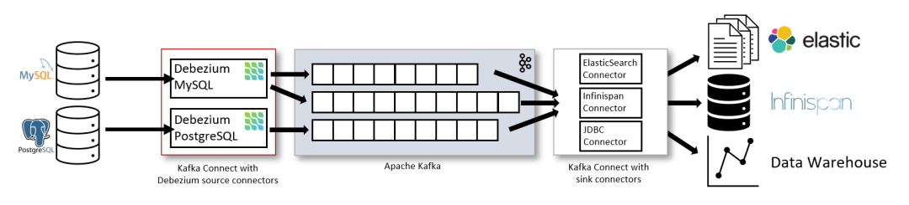
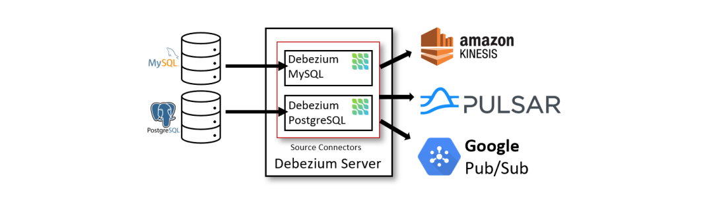

= Debezium部署3种方式

== 基于 Kafka Connect
通过 `Apache Kafka Connect` 部署 `Debezium`。

`Kafka Connect` 为在 `Kafka` 和外部存储系统之间系统数据提供了一种可靠且可伸缩性的方式。它为 `Connector` 插件提供了一组 API 和一个运行时: `Connect` 负责运行这些插件，它们则负责移动数据。

通过 `Kafka Connect` 可以快速实现 `Source Connector` 和 `Sink Connector` 进行交互构造一个低延迟的数据 Pipeline：

- `Source Connector`(例如, `Debezium`): 将记录发送到 Kafka
- `Sink Connector`: 将 `Kafka Topic` 中的记录发送到其他系统

除了 `Kafka Broker` 之外，`Kafka Connect` 也作为一个单独的服务运行。默认情况下，数据库表的变更会写入名称与表名称对应的 `Kafka Topic` 中。如果需要，您可以通过配置 `Debezium` 的 `Topic` 路由转换来调整目标 Topic 名称。例如，您可以：

- 将记录路由到名称与表名不同的 `Topic` 中
- 将多个表的变更事件记录流式传输到一个 `Topic` 中

变更事件记录在 `Apache Kafka` 中后，`Kafka Connect` 生态系统中的不同 `Sink Connector` 可以将记录流式传输到其他系统、数据库，例如 `Elasticsearch`、数据仓库、分析系统或者缓存（例如 `Infinispan`）。

== Debezium Server

另一种部署 Debezium 的方法是使用 Debezium Server。Debezium Server 是一个可配置的、随时可用的应用程序，可以将变更事件从源数据库流式传输到各种消息中间件上。

下图展示了基于 Debezium Server 的变更数据捕获 Pipeline 架构：

== 嵌入式引擎

使用 `Debezium Connector` 的另一种方法是嵌入式引擎。在这种情况下，`Debezium` 不会通过 `Kafka Connect` 运行，而是作为嵌入到您自定义 `Java` 应用程序中的库运行。这对于在您的应用程序本身内获取变更事件非常有帮助，无需部署完整的 `Kafka` 和 `Kafka Connect` 集群，也不用将变更流式传输到 `Amazon Kinesis` 等消息中间件上。