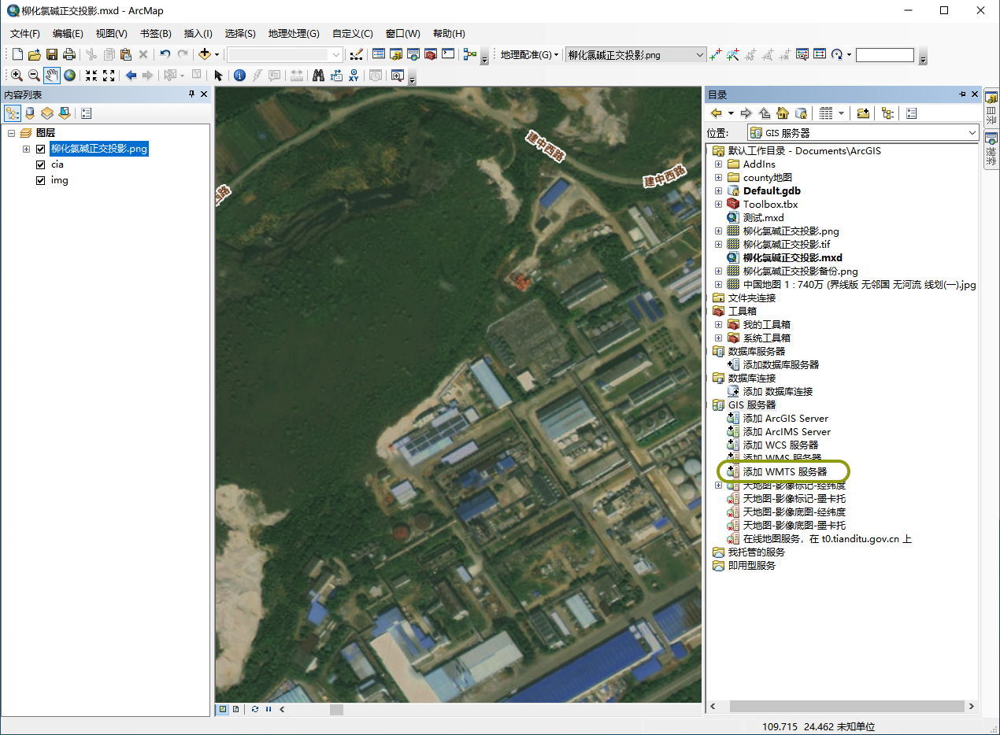
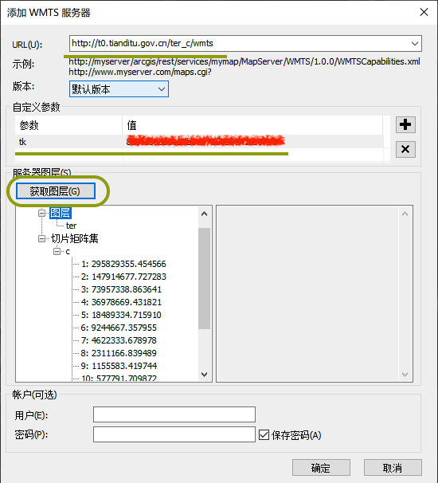

= ArcGis中引用天地图做底图
:sectnums:
:scripts: cjk
:toc:
:toc-title: 目录
:toclevels: 2
:doctype: book
:experimental:

== 天地图
=== 注册天地图开发者
https://www.tianditu.gov.cn/

=== 申请应用开发许可
创建新应用: <https://console.tianditu.gov.cn/api/key>
[NOTE]
====
应用类型要选择 `**服务端**`
====

=== 天地图API的服务列表
<http://lbs.tianditu.gov.cn/server/MapService.html>
[NOTE]
====
- 天地图特供ArcGis使用的链接，地址要在官方地址的基础上加上 `/esri/` 部分
- 天地图地图服务二级域名包括t0-t7，您可以随机选择使用，如 <http://t2.tianditu.gov.cn/vec_c/esri/wmts>
====
[cols="1,3,1",options="header"]
|===
^.^|图层名称 |服务地址 |投影类型
.2+^.^|矢量底图 |http://t0.tianditu.gov.cn/vec_c/esri/wmts |经纬度投影
|http://t0.tianditu.gov.cn/vec_w/esri/wmts |球面墨卡托投影
.2+^.^|矢量注记 |http://t0.tianditu.gov.cn/cva_c/esri/wmts |经纬度投影
|http://t0.tianditu.gov.cn/cva_w/esri/wmts |球面墨卡托投影
.2+^.^|影像底图 |http://t0.tianditu.gov.cn/img_c/esri/wmts |经纬度投影
|http://t0.tianditu.gov.cn/img_w/esri/wmts |球面墨卡托投影
.2+^.^|影像注记 |http://t0.tianditu.gov.cn/cia_c/esri/wmts |经纬度投影
|http://t0.tianditu.gov.cn/cia_w/esri/wmts |球面墨卡托投影
.2+^.^|地形晕渲 |http://t0.tianditu.gov.cn/ter_c/esri/wmts |经纬度投影
|http://t0.tianditu.gov.cn/ter_w/esri/wmts |球面墨卡托投影
.2+^.^|地形注记 |http://t0.tianditu.gov.cn/cta_c/esri/wmts |经纬度投影
|http://t0.tianditu.gov.cn/cta_w/esri/wmts |球面墨卡托投影
.2+^.^|全球境界 |http://t0.tianditu.gov.cn/ibo_c/esri/wmts |经纬度投影
|http://t0.tianditu.gov.cn/ibo_w/esri/wmts |球面墨卡托投影
|===

== ArcGis
=== 添加WMTS服务器

[NOTE]
====
- URL: 填写上面天地图API服务的地址(不要加上 `?tk=您的密钥`)
- 参数tk: 值填上申请 `**服务端**` 应用获得的 `Key`
- 获取图层: 连接成功会在下方有数据展示
====

=== 添加底图
拖动添加好的服务器的子节点到地图展示区域即可