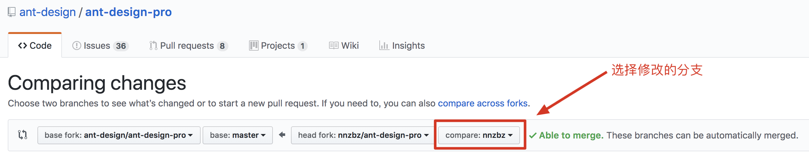

# Git入门

[TOC]

## 1. 初次配置

首先必须配置用户信息，包括用户名和邮箱地址。这两条配置信息很重要，git每次提交时都会引用用户信息，说明是谁提交的更新，并且永久保存到历史记录中。

```sh
git config --global user.name "zbz"
git config --global user.email "nnzbz@163.com"
# 查看配置信息
git config --list
```

可以使用#git config --list来查看配置信息，不过有时候会看到重复的变量名，那就说明它们来自不同的配置文件（比如/etc/gitconfig和~/.gitconfig），最终Git 实际采用的是最后一个。
也可以直接查阅某个变量#git config user.name

## 2. 常用命令简图


## 3. Git常用操作

### 3.1. 初始化

#### 3.1.1. 创建仓库

```sh
#初始化此文件夹为一个空的仓库
git --bare init
```

#### 3.1.2. 将远程已有仓库克隆到本地

```sh
git clone http://zbz@192.168.1.201:10080/wboly/wboly-suc.git
```

#### 3.1.3. 给本地仓库添加远程仓库

进入项目的根路径执行操作

```sh
git remote add origin https://github.com/nnzbz/notes.git
```

### 3.2. 检查当前状态

```sh
git status
```

### 3.3. 添加文件

```sh
git add file
```

### 3.4. 提交修改

```sh
git commit -m "提交备注"
```

- 重新提交

刚才的提交可能漏了几个文件，重新提交把最后一次的提交覆盖了

```sh
git commit --amend -m "提交备注"
```

可能操作如下

```sh
# 一次错误的提交
git commit -m 'initial commit'
# 重新加入文件
git add forgotten_file
# 重新提交
git commit --amend
```

### 3.5. 推送分支

推送分支就是把该分支上的所有本地提交推送到远程库

```sh
git push origin master
```

如果是要推送其它分支，比如dev，就改成

```sh
git push origin dev
```

 **注意：** 如果要覆盖远程分支，请加  ```-f```

### 3.6. 拉取分支

- ```git fetch```

相当于是从远程获取最新版本到本地，不会自动merge

```sh
git fetch origin master
```

- ```git pull```

相当于是从远程获取最新版本并merge到本地

```sh
git pull origin master
```

### 3.7. 删除远程仓库链接

```sh
git remote remove origin
```

### 3.8. 撤销文件的修改

其实， ```git status``` 提示了如何操作

```sh
git checkout -- <file>
```

### 3.9. .gitignore

```text
target
.project
.classpath
.settings
logs
```

## 4. 几种常见场景

### 4.1. 放弃本地修改(谨慎)

```sh
git fetch --all
git reset --hard origin/master
git fetch
```

### 4.2. 修改远程仓库地址

```sh
git remote set-url origin [url]
```

### 4.3. 将代码推送到另一个仓库

1. 给本地仓库添加新的远程仓库

```sh
git remote add origin_repo_b git@server_ip:/path/repo_b.git
```

- origin_repo_b
 远程仓库映射在本地仓库的名字(自己起的名字，只要不与现有的remote名重复即可)
- git@server_ip:/path/repo_b.git
 repo_b的远程路径

2. 将代码推送到远程repo_b

```sh
git push origin_repo_b branch_a
```

### 4.4. 将代码同时推送到多个仓库

1. 将远程repo_c配置到当前的工作的本地git仓库中

```sh
git remote set-url --add origin_repo_b git@192.168.1.101:~/project/repo_c.git
```

这句话的意思是，将远程仓库git@192.168.1.101:~/project/repo_c.git也加入到origin_repo_b这个名字下面管理

2. 将代码同时提交到远程仓库repo_b和远程仓库repo_c

```sh
git push origin_repo_b branch_a
```

### 4.5. 作者请你帮助修改代码 ```Welcome PR```

帮助他人的GitHub项目修改代码

如何 **PR(Pull Request)** ?

1. Fork
 fork他人的项目到自己Github的仓库
2. Clone
 将fork到自己仓库中的项目Clone到本地
3. 与原项目建立连接
 用 ```git remote -v``` 命令检查已有链接
 用 ```git remote add upstream https://github.com/他人仓库/原项目名称.git``` 与原项目建立连接
 再用先前命令检查与原项目是否建立连接成功
4. 新建分支并Checkout
 用 ```git checkout -b 分支名称```
5. 修改
6. Add -> Commit -> Push
 注意Push的是自己的仓库
7. 发起PR
 在自己仓库Fork的项目中，点击 ```Pull Requests``` 页面 -> 点击 ```New pull requests``` 按钮 -> 进入 ```Comparing changes```
 
8. 建立PR
 点击 ```Create pull request``` 按钮 -> 填写相关信息 -> 点击 ```Create pull request``` 按钮
9. Merge
 这就是原项目开发人员的事了

### 4.6. 在GitLab中修改仓库名称及路径

进入仓库 -> ```Settings``` -> ```General``` -> ```Advanced settings``` -> ```Expand``` -> 设置 ```Project name``` 与 ```Path``` -> ```Rename project```

## 5. Eclipse中使用Git

### 5.1. 打开 ```Git Perspective```

 工具栏右上角的 ```Open Perspective``` ，选择 ```Git``` 选项打开。

### 5.2. 从Github中克隆项目到本地

1. 在 ```Git Perspective``` 中，左边有一个 ```Git Repostories``` 的 ```View``` ，鼠标点击左上方工具栏的 ```Clone a Git Repository and add the clone to this view``` 按钮；
2. 浏览器打开Githut仓库页面，鼠标点击 ```Clone or download```按钮，复制仓库链接，并将其粘贴到上一步弹出窗口的URI中；
3. 输入Github的用户和密码，选中 ```Store in Secure Store```；
4. 点击 ```next```，再点击 ```next```，在 ```Local Destination``` 页面中，注意修改 ```Directory``` 为自己的 workspace的路径，点击 ```Finish``` 完成；
5. 导入本地已经存在的项目（略）。

## 6. 常见问题

### 6.1. 误用了pull，本地代码被产生冲突，怎么恢复？

```sh
git reset --hard
```

### 6.2. push时报 ```rejected - non-fast-forward``` 错误

简单来说，就是 ```fetch``` -> ```merge``` -> ```push``` ，详细步骤如下：

1. 打开 ```Git Repositories```，在 ```Working Directory``` 中确保可以看到要提交的工程
2. 在 ```Remotes``` 中可以看到远端分支，在分支下向左的绿色箭头图标代表 ```Fetch``` ，右键 -> ```Configure Fetch```
3. 确认 ```URI``` 和 ```Ref mappings``` 都是正确的，点击 ```Save and Fetch```，之后可以看到 Fetch Results 分支在一起，点击OK
4. 此时在 ```Branches``` 中应该可以看到 ```Remote Tracking``` 存在远端分支
5. 右键 ```Branches``` 中的 ```Local``` 中的 ```master``` ，选择 ```Merge```
6. 选择 ```Remote Tracking``` 中的 ```origin/master```，点击 ```Merge```
7. 这是合并后的反馈结果，之后就可以重新 ```push``` 代码了
