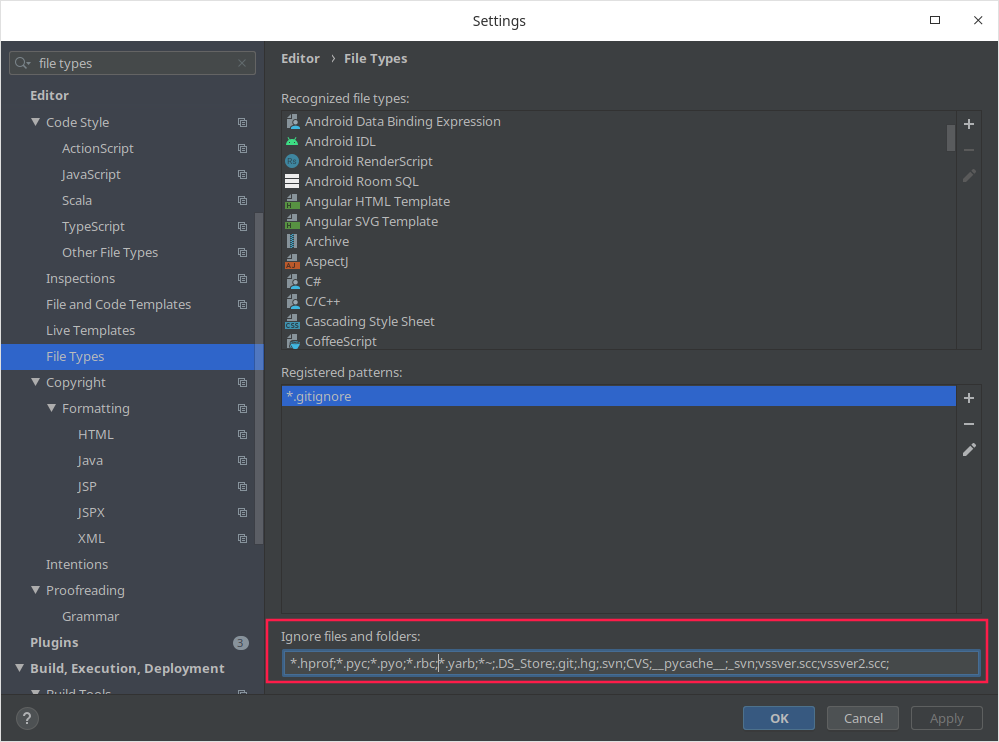

# IDEA使用汇总

[TOC]

## 1. 设置

### 1.1. 隐藏文件/目录

`[Settings...]` -> 输入 `file types` 搜索 -> `[File Types]` -> `[Ignore files and folders:]` -> 添加



### 1.2. 竖向对齐

`[Settings...]` -> `[Editor]` -> `[Code Style]` -> `[Java]` -> `[Wrapping and Braces]` -> `[Group declarations]` -> 勾选 `Align fields in columns` 和 `Align variables in columns` 

### 1.3. 格式化自动折行

`[Settings...]` -> `[Editor]` -> `[Code Style]` -> `[java]` -> `[Wrapping and Braces]` -> `Hard wrap at`，设置 `180`

`[Settings...]` -> `[Editor]` -> `[Code Style]` -> `[XML]` -> `[Other]` -> `Hard wrap at`，设置 `180`

### 1.4. 识别忽略格式化的标记

`[Settings...]` -> `[Editor]` -> `[Code Style]` -> `Formatter Control` > 勾选 `Enable formatter markers in comments`


### 1.5. 过滤不看一些无关文件

`[Settings]` -> `[Editor]` -> `[File Types]` -> `Ignore files and folders` -> 在末尾添加如下内容:

```ini
*.iml;*.idea;.project;.settings;.classpath;
```

### 1.6. 热更新

[Run] -> [Edit Configurations] -> Running Application Update Policies -> 两项全部选择 `Update classes and resources`

## 2. 插件

### 2.1. Eclipse Code Formatter

- 插件地址:
  <http://plugins.jetbrains.com/plugin/6546?pr=idea&offset=15&max=15#comments_pan>
- 安装
  [Setting] -> [Plugins] -> `Install plugin from disk`，选中下载好的安装包【EclipseFormatter.zip】安装，重启后生效
- 配置
  [Setting] -> [Eclipse Code Formatter]，勾选 `Use the Eclipse-code-formatter`，并在 `Eclipse Java Formatter config file` 选择Eclipse用的code-style.xml文件，这个选项会决定格式化代码的方式。
  同时配置Import order的From File也为Eclipse用的code-style.xml文件，这个选项会决定组织import区域的方式。
- 使用插件
  使用Intellij的格式化快捷键”Ctrl+ALT+L”即可进行格式化。如果出错会输出提示到 **Event Log** 里，如果看到 `xxx formatted sucessfully by Eclipse code formatter` 则表示格式化成功！

### 2.2. Lombok

<https://projectlombok.org/setup/intellij>

### 2.3. Maven Helper

## 3. 快捷键

### 3.1. 窗口切换

- `Alt+1` 切换到Project
- `Alt+9` 切换到Changes
- `Alt + F12` 切换到Terminal
- `ESC` 返回代码编辑窗口

### 3.2. 跨文件跳转

- `Alt + LEFT` / `Alt + RIGHT` 切换到左侧/右侧的标签页
- `Ctrl + E` 在弹窗中打开最近浏览的文件
- `Ctrl + B` 跳转到声明，再按又跳回来
- `Ctrl + Shift + I` 在弹窗中预览定义
- `Ctrl + U` 跳转到父类/父类方法
- `Ctrl + N` 跳转到指定类
- `Ctrl + Shift + N` 跳转到指定文件
- `Ctrl + Shift + Alt + N` 跳转到指定符号

### 3.3. 文件内跳转

- `Alt + UP` / `Alt + DOWN` 移动至上一个/下一个方法
- `Ctrl + G` 快速定位到指定行
- `Ctrl + F12` 在弹窗中打开文件结构视图(`Alt + 7` 则是不弹窗)
- `F2` / `Shift + F2` 下一个错误/上一个错误
- `F3` / `Shift + F3` 查找下一个/上一个

### 3.4. 编辑

- `Ctrl + Alt + Y` / `Opt + Cmd + Y` 从磁盘重新加载文件(Windows/MacOS)
- `Ctrl + Y` / `Cmd + del` 删除一行(Windows/MacOS)
- `Cmd + X` 剪切（如果没有选择则剪切一行，所以删除一行用这个比较快捷）
- `Option + Shift + Up/Down` 向上/下复制当前行
- `Cmd + W` 扩大选择
- `Cmd + P` 显示参数信息
- `Alt + Insert` / `Cmd + N` 选择生成代码(Windows/MacOS)
- `Option + Up/Down`   向上/下移动一行
- `Ctrl + Alt + 左右键` 回到上次/下次跳转的位置

### 3.5. 代码

- `Ctrl + Alt + L` 格式化
- `Ctrl + Alt + Shift + L` 格式化...
- `Ctrl + Alt + O` 优化import
- `Ctrl + Alt + Shift + C` 复制类的命名
