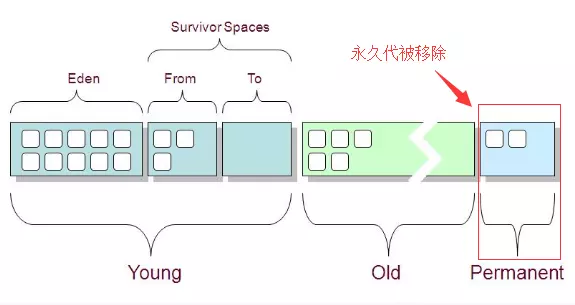
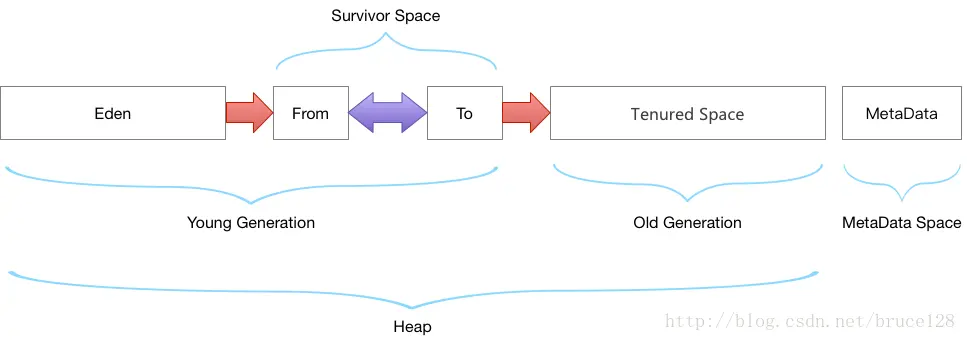
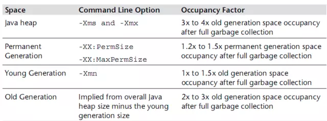

# JVM分析与调优

[TOC]

## 1. JVM空间说明

- JDK 1.7及以前
  Java 类信息、常量池、静态变量都存储在 Perm（永久代）里。类的元数据和静态变量在类加载的时候分配到 Perm，当类被卸载的时候垃圾收集器从 Perm 将其处理掉。

- JDK 1.8
  类的元数据放到本地内存中，常量池和静态变量放到 Java 堆里。HotSopt VM 将会为类的元数据明确分配和释放本地内存。
  在这种架构下，类元信息就突破了原来 -XX:MaxPermSize 的限制，所以PermSize的配置也是无效的，现在可以使用更多的本地内存。
  这样就从一定程度上解决了原来在运行时生成大量类的造成经常 Full GC 问题，如运行时使用反射、代理等

  

**干货**：可以发现最明显的一个变化是元空间从虚拟机转移到本地内存；默认情况下，元空间的大小仅受本地内存的限制。这意味着以后不会因为永久代空间不够而抛出OOM异常了。
jdk1.8以前版本的class和jar包数据存储在permGen下面 ，permGen大小是固定的，而且项目之间无法共用公有的class，所以很容易碰到OOM异常。
改成metaSpaces后，各个项目会共享同样的class内存空间，比如多个项目都引用了apache-common包，在metaSpaces中只会存储一份apache-common的class，提高了内存的利用率，垃圾回收更有效率。

## 2. JVM参数配置

- jdk1.8以前，生产环境一般有如下配置

  ```sh
  -XX:PermSize=512M -XX:MaxPermSize=1024M
  ```

  表示在JVM里存储Java类信息，常量池和静态变量的永久代区域初始大小为512M，最大为1024M。在项目启动后，这个值是固定的，如果项目class过多，很可能遇到OutOfMemoryError: PermGen异常。

- JDK1.8之后，上面的perm配置已经变成

  ```sh
  -XX:MetaspaceSize=512M XX:MaxMetaspaceSize=1024M
  ```

  MetaspaceSize如果不做配置，通过jinfo查看默认MetaspaceSize大小（约21M）,MaxMetaspaceSize很大很大，前面说过MetaSpace只受本地内存大小限制。

  ```sh
  jinfo -flag MetaspaceSize 1234  #结果为：-XX:MetaspaceSize=21807104
  jinfo -flag MaxMetaspaceSize 1234 #结果为：-XX:MaxMetaspaceSize=18446744073709547520
  ```

干货：MetaspaceSize为触发FullGC的阈值，默认约为21M，如做了配置，最小阈值为自定义配置大小。空间使用达到阈值，触发FullGC，同时对该值扩大。当然如果元空间实际使用小于阈值，在GC的时候也会对该值缩小。
MaxMetaspaceSize为元空间的最大值，如果设置太小，可能会导致频繁FullGC，甚至OOM。

## 3. GC（GarbageCollection）过程



1. 新new的对象都放在Eden区（伊甸园嘛，创造的地方）
2. Eden区满或者快满的时候进行一次清理（Minor Gc），不被引用的对象直接被干掉；还有引用的对象，但是年龄比较大的，挪到S0区
3. 下次Eden区快满的时候，会进行上一步的操作，并且将Eden和S0区的年纪大的对象放到S1区【原4理上随时保持S0和S1有一个是空的，用来存下一次的对象】
4. 下下次，Eden区快满的时候，会进行上一步操作，并且将Eden和S1区的年纪大的对象放到S0区【此时S1区就是空的】
5. 直到Eden区快满，S0或者S1也快满的时候，这时候就把这两个区的年纪大的对象放到Old区
6. 依次循环，直到Old区也快满的时候，Eden区也快满的时候，会对整个这一块内存区域进行一次大清洗（FullGC），腾出内存，为之后的对象创建，程序运行腾地方。

**备注**: 清理Eden区和Survivor区叫Minor GC；清理Old区叫Major GC；清理整个堆空间—包括年轻代和老年代叫Full GC。

## 4. JVM参数配置指南

```sh
-XX:MetaspaceSize=128M -XX:MaxMetaspaceSize=256M -Xms256m -Xmx256m
文章看下来上面这段配置的意思很简单，设置元空间的初始值和最大值，设置堆空间的初始值和最大值。
```

为什么MetaspaceSize要设置为128M？为什么堆内存初始值Xms设置为256M而不是512M？

按照Java官方的指导



Java堆大小设置，Xms 和 Xmx设置为老年代存活对象的3-4倍，即FullGC之后的老年代内存占用的3-4倍
永久代 PermSize和MaxPermSize(元空间)设置为老年代存活对象的1.2-1.5倍。
年轻代Xmn的设置为老年代存活对象的1-1.5倍。
老年代的内存大小设置为老年代存活对象的2-3倍。
可以让系统运行一段时间后查看系统的各个指标，然后在进行配置。如下用jstat工具查看jvm的情况

```sh
jstat -gc 12345
###
 S0C    S1C    S0U    S1U      EC       EU        OC         OU       MC     MU    CCSC   CCSU   YGC     YGCT    FGC    FGCT     GCT   
13824.0 22528.0 13377.0  0.0   548864.0 535257.2  113152.0   46189.3   73984.0 71119.8 9728.0 9196.2     14    0.259   3      0.287    0.546
```

OU表示老年代所占用的内存为 46189.3 K（大约45M）；那么jvm相应的配置参数应该做如下修改

```sh
-XX:MetaspaceSize=64M -XX:MaxMetaspaceSize=64M -Xms180m -Xmx180m
```
