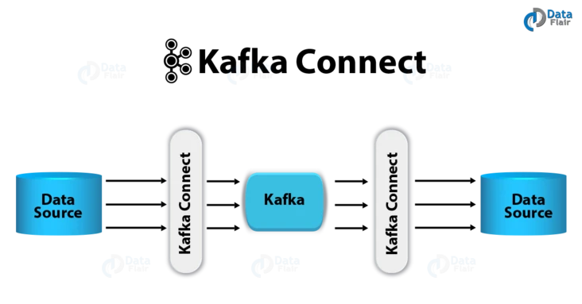
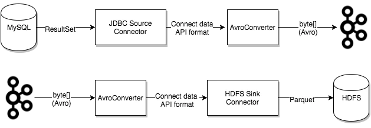

# Kafka Connect

[TOC]

## 简介

`Kafka Connect` 是一款可扩展并且可靠地在 `Apache Kafka` 和其他系统之间进行数据传输的工具。 可以很简单的定义 `connectors`（连接器） 将大量数据迁入、迁出Kafka。

工作原理如图:

基本概念:
<https://docs.confluent.io/platform/current/connect/concepts.html>

- Connectors

连接器，定义了数据将从哪里复制到哪里。分为两种 `Source`（从源数据库拉取数据写入Kafka），`Sink`（从Kafka消费数据写入目标数据）

Confluent 已经提供了许多成熟的连接器 <http://www.confluent.io/product/connectors/?_ga=2.235710721.1624459216.1651202621-127999236.1651202621>

- Tasks

连接器数据模型主要的参与者。和连接器一样同样分为 `Source` 和 `Sink`

**Tasks** 的配置和状态存储在Kafka的 `Topic` 中，`config.storage.topic` 和 `status.storage.topic`。我们可以随时启动，停止任务，以提供弹性、可扩展的数据管道

`Task Rebalancing`: 任务重新平衡

- Workers

**Connectors** 和 **Tasks** 是工作的逻辑单元，它们必须在一个进程被有计划的执行。这些进程就是 **Workers**。
**Workers** 分为 `standalone` and `distributed` 两种类型

`standalone`: 单机模式，比较简单，但是功能也受限，只有一些特殊的场景会使用到，例如收集主机的日志，通常来说更多的是使用分布式模式
`distributed`: 分布式模式，为Kafka Connect提供了可扩展和故障转移。相同group.id的Worker，会自动组成集群。当新增Worker，或者有Worker挂掉时，集群会自动协调分配所有的 Connectors 和 Tasks

- Converters

Kafka Connect 通过 Converter 将数据在Kafka（字节数组）与Tasks（Object）之间进行转换

- Transforms

连接器可以通过配置Transform 实现对单个消息（对应代码中的Record）的转换和修改，可以配置多个Transform 组成一个链。例如让所有消息的topic加一个前缀、sink无法消费source 写入的数据格式，这些场景都可以使用Transform 解决

Transform 如果配置在Source 则在Task之后执行，如果配置在Sink 则在Task之前执行

- Dead Letter Queue

与其他MQ不同，Kafka 并没有死信队列这个功能。但是Kafka Connect提供了这一功能。

当Sink Task遇到无法处理的消息，会根据errors.tolerance配置项决定如何处理，默认情况下(errors.tolerance=none) Sink 遇到无法处理的记录会直接抛出异常，Task进入Fail 状态。开发人员需要根据Worker的错误日志解决问题，然后重启Task，才能继续消费数据

设置 errors.tolerance=all，Sink Task 会忽略所有的错误，继续处理。Worker中不会有任何错误日志。可以通过配置errors.deadletterqueue.topic.name = <dead-letter-topic-name> 让无法处理的消息路由到 Dead Letter Topic
