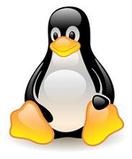
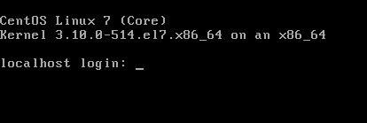
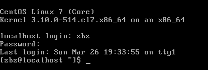
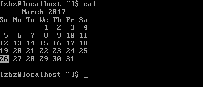
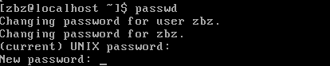

# Linux简介

[TOC]

## 1. Linux是什么

- 开源软件
- 多用户多任务的操作系统
- 兼容POSIX标准的类UNIX（Unix-like）操作系统

Linux的标志-Tux



## 2. Linux的诞生

### 2.1. UNIX与POSIX

UNIX操作系统是美国贝尔实验室的**Ken.Thompson**和**Dennis Ritchie**于**1969年**夏在DEC PDP-7 小型计算机上开发的一个分时操作系统。

为要在各种UNIX操作系统上运行软件，UNIX用户协会最早从20世纪80年代开始标准化工作，1984年颁布了试用标准。后来IEEE为此制定了POSIX标准（即IEEE1003标准）

POSIX全称为Portable Operating System Interface of UNIX，既可移植操作系统接口。

POSIX这个名称是由理查德·斯托曼应IEEE的要求而提议的一个易于记忆的名称。它基本上是Portable Operating System Interface（可移植操作系统接口）的缩写，而X则表明其对Unix API的传承。

Linux基本上逐步实现了POSIX兼容，但并没有参加正式的POSIX认证。

*微软的Windows NT声称部分实现了POSIX标准。*

### 2.2. GNU/Linux

软件产业在70年代成就了两位针锋相对的领袖人物，来自哈佛大学的比尔·盖茨和Richard M.Stallman。前者宣布了Copyright(版权)时代的到来，并构建了微软帝国的辉煌；后者于1984年创立自由软件体系GNU，拟定普遍公用版权协议（GeneralPublicLicense，简称GPL），今天Linux的成功就得益于GPL协议。

所有GPL协议下的自由软件都遵循着Richard M. Stallman的"Copyleft"(非版权)原则：即自由软件允许用户自由拷贝、修改和销售，但是对其源代码的任何修改都必须向所有用户公开。

GNU 计划和自由软件基金会FSF(the Free Software Foundation)是由Richard M. Stallman 于1984 年一手创办的。旨在开发一个类似UNIX 并且是自由软件的完整操作系统：GNU 系统（GNU 是"GNU's Not Unix"的递归缩写，它的发音为"guh-NEW"）。

各种使用Linux 作为核心的GNU 操作系统正在被广泛的使用。虽然这些系统通常被称作"Linux"，但是严格地说，它们应该被称为GNU/Linux系统。

到上世纪90 年代初，GNU 项目已经开发出许多高质量的免费软件，其中包括有名的emacs 编辑系统、bash shell 程序、gcc 系列编译程序、gdb 调试程序等等。这些软件为Linux 操作系统的开发创造了一个合适的环境。

GNU是Linux能够诞生的基础之一，以至于目前许多人都将Linux 操作系统称为“GNU/Linux”操作系统。

### 2.3. MINIX

MINIX 系统是由Andrew S. Tanenbaum（AST）开发的。AST 是在荷兰Amsterdam 的Vrije 大学数学与计算机科学系统工作，是ACM 和IEEE 的资深会员(全世界也只有很少人是两会的资深会员)。MINIX 是他1987 年编制的，主要用于学生学习操作系统原理。到1991 年时版本是1.5。

AST为了保持MINIX的小型化，能让学生在一个学期内就能学完，因而没有接纳全世界许多人（包括**Linus Torvalds**）对MINIX的扩展要求。

### 2.4. Linux出世

由于Minix是AST一人所写，所以存在一些漏洞。**Linus**发现了一些问题，然后就去建议教授完善下Minix，结果呢，教授比较固执，说：为了维持Minix的纯洁性，不需要任何外来代码。

由此，激发了**Linus Torvalds**决定自己编写一个全功能的、支持POSIX标准的、类Unix的操作系统内核。

从1991 年4 月 份开始，Linus 几乎花费了全部时间研究MINIX-386 系统(Hacking the kernel)，并且尝试着移植GNU 的软件到该系统上(GNU gcc、bash、gdb 等)。并于4 月13 日在comp.os.minix 上发布说自己已经成功地将bash 移植到了MINIX 上，而且已经爱不释手、不能离开这个shell 软件了。

第一个与Linux 有关的消息是在1991 年7 月3日 在comp.os.minix 上发布的（当然，那时还不存在Linux 这个名称，当时Linus 脑子里想的名称可能是FREAX，FREAX 的英文含义是怪诞的、怪物、异想天开等）。其中透露了他正在进行Linux 系统的开发，并且已经想到要实现与POSIX 兼容的问题了。

在Linus 另一个发布的消息中(1991 年8 月25日 comp.os.minix)，他向所有MINIX 用户询问“Whatwould you like to see in minix?”(“你最想在MINIX系统中见到什么？”)，在该消息中他首次透露出正在开发一个(免费的)386(486)操作系统，并且说只是兴趣而已，代码不会很大，也不会象GNU 的那样专业。希望大家反馈一些对于MINIX 系统中喜欢哪些特色不喜欢什么等信息，并且说明由于实际和其它一些原因，新开发的系统刚开始MINIX 很象（并且使用了MINIX的文件系统）。并且已经成功地将bash(1.08版)和gcc(1.40 版)移植到了新系统上，而且在过几个月就可以实用了。最后，Linus 申明他开发的操作系统没有使用一行MINIX 的源代码；而且由于使用了386 的任务切换特性，所以该操作系统不好移植（没有可移植性），并且只能使用AT 硬盘。对于Linux 的移植性问题，Linus当时并没有考虑。但是目前Linux 几乎可以运行在任何一种硬件体系结构上。

到了**1991年的10月5日**，Linus 在comp.os.minix 新闻组上发布消息，正式向外宣布Linux 内核系统的诞生（Free minix-like kernel sources for 386-AT）。这段消息可以称为Linux 的诞生宣言，并且一直广为流传。因此10 月5 日对Linux社区来说是一个特殊的日子，许多后来Linux 的新版本发布时都选择了这个日子。所以RedHat 公司选择这个日子发布它的新系统也不是偶然的。

## 3. Linux版本

### 3.1. 内核版本

Linux的内核版本指的是在 **Linus Torvalds** 领导下的开发小组开发出的系统内核的版本号。

Linux 的每个内核版本使用形式为 x.y.zz-www 的一组数字来表示。  
其中：
x.y：为linux的主版本号。通常y若为奇数，表示此版本为测试版，系统会有较多bug，主要用途是提供给用户测试。
zz：为次版本号。
www：代表发行号（注意，它与发行版本号无关）。

当内核功能有一个飞跃时，主版本号升级，如 Kernel2.2、2.4、2.6等。如果内核增加了少量补丁时，常常会升级次版本号，如Kernel2.6.15、2.6.20等。

### 3.2. 发行版本

一些组织或厂家将 Linux 内核与GNU软件（系统软件和工具）整合起来，并提供一些安装界面和系统设定与管理工具，这样就构成了一个发型套件，例如Ubuntu、Red Hat、CentOS、Fedora、SUSE、Debian、FreeBSD等。相对于内核版本，发行套件的版本号随着发布者的不同而不同，与系统内核的版本号是相对独立的。因此把Red Hat等直接说成是Linux是不确切的，它们是Linux的发行版本，更确切地说，应该叫做“以linux为核心的操作系统软件包”。

## 4. Linux体系结构


在所有Linux版本中，都会涉及到以下几个重要概念：

### 4.1. 内核

内核是操作系统的核心。内核直接与硬件交互，并处理大部分较低层的任务，如内存管理、进程调度、文件管理等。

### 4.2. 文件和目录

Linux系统中所有的数据都被存储到文件中，这些文件被分配到各个目录，构成文件系统。Linux的目录与Windows的文件夹是类似的概念。

### 4.3. Shell

Shell是一个处理用户请求的工具，它负责解释用户输入的命令，调用用户希望使用的程序。

用户通过Shell与Linux内核交互。

Linux下，很多工作都是通过命令完成的，学好Linux，首先要掌握常用命令。

### 4.4. 命令和工具

日常工作中，你会用到很多系统命令和工具，如cp、mv、cat和grep等。在Linux系统中，有250多个命令，每个命令都有多个选项；第三方工具也有很多，他们也扮演着重要角色。

## Linux常见目录

- /bin 用来贮存用户命令。/usr/bin 也被用来贮存用户命令。  
- /sbin 许多系统命令（例如 shutdown）的贮存位置。/usr/sbin 中也包括了许多系统命令。  
- /root 根用户（超级用户）的主目录。  
- /mnt 该目录中通常包括系统引导后被挂载的文件系统的挂载点。比如，默认的光盘挂载点是 /mnt/cdrom/。可以为U盘建一个挂载点：mkdir /mnt/usb。  
- /boot 包括内核和其它系统启动期间使用的文件，最大不超过200M。通常我为 /boot 建一个primary分区是1G。
- /lost+found 被 fsck 用来放置零散文件（没有名称的文件）。  
- /lib 包含许多被 /bin 和 /sbin 中的程序使用的库文件。目录 /usr/lib 中含有更多用于用户程序的库文件。/lib 目录下放置的是 /bin 和 /sbin 目录下程序所需的库文件。简单说，/lib 是内核级的；/usr/lib 是系统级的；/usr/local/lib 是用户级的。仅仅被 /usr 目录下的程序所使用的共享库不必放到 /lib 目录下。只有 /bin 和 /sbin 下的程序所需要的库有必要放到 /lib 目录下。  
- /dev 贮存设备文件。  
- /etc 包含许多配置文件和目录。  
- /var 用于贮存variable（或不断改变的）文件，例如日志文件和打印机假脱机文件，虚拟机镜像文件等。  
- /usr 包括与系统用户直接有关的文件和目录，例如应用程序及支持它们的库文件。  
- /proc 一个虚拟的文件系统（不是实际贮存在磁盘上的），它包括被某些程序使用的系统信息。  
- /initrd 用来在计算机启动时挂载 initrd.img 映像文件的目录以及载入所需设备模块的目录。不要删除 /initrd 目录。如果你删除了该目录后再重新引导 Red Hat Linux 时，你将无法引导你的计算机。  
- /tmp 用户和程序的临时目录。 /tmp 给予所有系统用户读写权。  
- /home 用户主目录的默认位置。  
- /opt 可选文件和程序的贮存目录。该目录主要被第三方开发者用来简易地安装和卸装他们的软件包。

## 5. Linux常用操作

### 5.1. 登录Linux



登录步骤：

输入正确的登录名和和密码（输入的密码在界面上是看不到的）进行登录。

如果用户名和密码正确，那么会成功登录，并看到上次登录信息。



然后会出现命令提示符($)，你可以输入任何命令。下面通过 cal 命令来查看日历：



### 5.2. 修改密码

你可以通过以下方法来修改密码：

1. 输入 `passwd` 命令
2. 输入新密码
3. 重复新密码

*注意：  
密码不要过于简单。  
输入的密码是看不到的，只会看到一个占位符(\*)*



### 5.3. 查看目录和文件

在Linux中，所有的数据都被保存在文件中，所有的文件又被分配到不同的目录；目录是一种类似树的结构，称为文件系统。

你可以使用 ls 命令来查看当前目录下的文件和目录。

注意：以 d* 开头的为目录，如 uml、univ、urlspedia等；其他的都是文件。

> 提问：ls -l和ls -al的区别是什么？

### 5.4. 查看当前用户信息

```sh
$ whoami
zbz
```

如果你希望了解更多关于当前用户的信息，可以使用 who am i 命令

```sh
$ who am i
zbz  tty1 2017-03-26 20:57
```

### 5.5. 查看当前在线用户

如果你希望知道当前在线的用户（同时登录到系统的用户），可以使用 users、who 和 w 命令：
w 命令可以看到在线用户的更多信息。

```sh
$ users
root zbz

$ who
zbz  tty1 2017-03-26 20:57
root tty2 2017-03-26 22:16

$ w
 22:19:48 up 2:46, 2 users, load average: 0.00, 0.01, 0.05
USER TTY  FROM LOGIN@           IDLE  JCPU  PCPU  WHAT
zbz  tty1      2017-03-26 20:57 4.00s 0.21s 0.02s w
root tty2      2017-03-26 22:16 3:16  0.01s 0.01s -bash
```

### 5.6. 搜索历史命令

```Ctrl + R```

### 6.6. 退出登录

使用 logout 或 exit 命令即可退出登录，系统会清理有关信息并断开连接。

### 6.7. 关闭系统（关机）

关系Linux系统可以使用下列命令：

| 命令     | 说明                                                                                                                                           |
| -------- | ---------------------------------------------------------------------------------------------------------------------------------------------- |
| halt     | 直接关闭系统                                                                                                                                   |
| init 0   | 使用预先定义的脚本关闭系统，关闭前可以清理和更新有关信息                                                                                       |
| init 6   | 重新启动系统                                                                                                                                   |
| poweroff | 通过断电来关闭系统                                                                                                                             |
| reboot   | 重新启动系统                                                                                                                                   |
| shutdown | 安全关闭系统

*注意：一般情况下只有超级用户和root用户（Linux系统中的最高特权用户）才有关闭系统的权限，但是给普通用户赋予相应权限也可以关闭系统。*