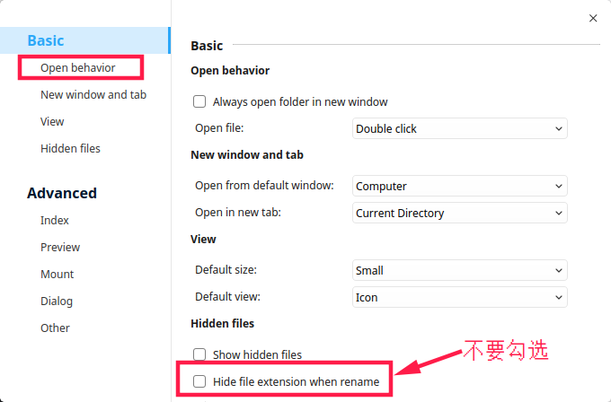

# Deepin实用技巧

[TOC]

## 1. 加入staff组

因为一般要将软件安装在 `/usr/local` 下并运行，所以要先将当前用户加入 `staff` 组。

```sh
sudo usermod -a -G staff `whoami`
```

## 2. 自动登录

`Control Center` > `Accounts` > 点击账户右边的 `>` > 打开 `Auto Login` 开关

## 3. 使用左手鼠标

1. `Control Center` > `Mouse` > 打开 `Left Hand`
2. 下载左手光标
   <https://www.gnome-look.org/content/show.php/Obsidian+(left+handed+version)?content=121197>
   或
   <https://raw.githubusercontent.com/nnzbz/notes/master/linux/deepin/121197-Obsidian_L.tar.gz>(需要翻墙)
3. 解压目录到 `~/.icons` 或 `/usr/share/icons/`
4. 在Deepin的外观设置界面看到这个光标主题，切换过去
   `Control Center` > `Personalization` > `Theme` > 选择 `Obsidian`

## 4. 安装五笔输入法

- 删除 `fcitx-table-wbpy` 的简繁转换快捷键
  `Fcitx Configuration` > 选择 `Addon` Tab页 > 双击 `Simplified Chiness To Tradiional Chinese` > 清空快捷键

- ~~安装 `ibus-wubi` (不稳定)~~

```sh
# 删除当前系统所有fcitx包
sudo apt remove fcitx* -y
# 自动清理所有孤立的包
sudo apt autoremove
# sudo apt install fcitx fcitx-table-wbpy fcitx-config-gtk fcitx-frontend-all  fcitx-ui-classic fcitx-tools fcitx-ui-kimpanel
sudo apt-get install ibus ibus-table ibus-table-wubi
# 这一步不做似乎也可以
echo -e "\n# 支持ibus启动\nexport GTK_IM_MODULE=ibus\nexport XMODIFIERS=@im=ibus\nexport QT_IM_MODULE=ibus" >> ~/.bashrc
# 清理一下冗余文件(这一步关键，否则下面im-config设置识别不了ibus)
sudo rm -f /usr/share/im-config/data/23_ibus.*
# 设定默认的输入法为ibus
im-config
....
```

如果安装命令出现提示没有依赖的错误，请运行下面的指令

```sh
sudo apt --fix-broken install -f
```

最后注销再重新进来，配置输入法(`Fcitx Configuration`)即可

## 5. 在文件管理器中修改后缀名

菜单 -> Settings -> Basic -> Open behavior -> 不要勾选 "Hide file extension when rename"

设置如下图



## 6. 解决deepin中vim无法复制文本到系统剪切板的问题

```sh
sudo apt-get install vim-gtk
```

然后使用 `"+y` 三个键就可以复制了

## 7. 添加ll命令

```sh
sudo vim ~/.bashrc
```

打开下面三行的注释

```txt
....
#alias ll='ls -l'
#alias la='ls -A'
#alias l='ls -CF'
....
```

执行

```sh
. ~/.bashrc
```

## 8. 字体

### 8.1. 更纱字体

<https://github.com/be5invis/Sarasa-Gothic/releases>

### 8.2. Deepin中使用Windows字体

- 只需要把Windows下 `/Windows/Fonts` 文件夹复制到 Deepin下 `/usr/share/fonts/`，再把Fonts改名为winfonts 即可
- 可以使用 `Gnome Tweak Tool` 来设置默认字体

## 9. 添加快捷方式

```sh
sudo vi /usr/share/applications/{文件名}.desktop
```

添加如下内容

```txt
[Desktop Entry]
Encoding=UTF-8
Name=eclipse  
Comment=Eclipse IDE  
Exec=/opt/eclipse/eclipse  
Icon=/opt/eclipse/icon.xpm  
Terminal=false  
StartupNotify=true  
Type=Application  
Categories=Application;Development;
```

- Exec
  代表应用程序的位置(如果要加参数要在前后空格再加)
- Icon
  代表应用程序图标的位置
- Terminal
  为false表示启动时不启动命令行窗口，值为true表示启动命令行窗口（建议false）
- Categories
  决定创建出的起动器在应用程序菜单中的位置

## 10. 微信不能打开

```sh
rm -rf ~/.deepinwine/Deepin-WeChat/*
```
