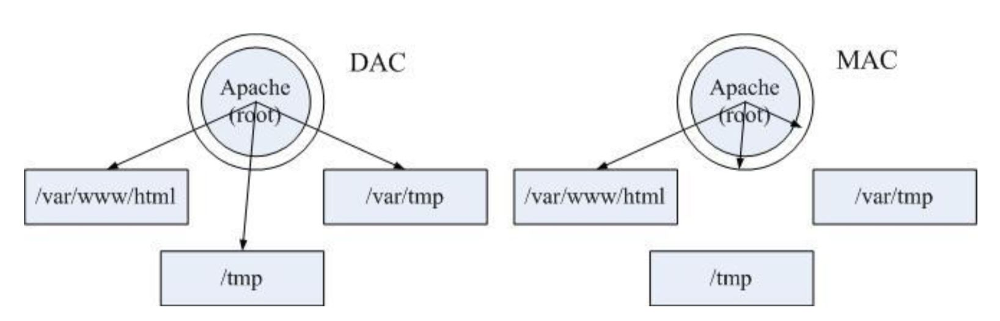

# SELinux入门

[TOC]

## 1. 简介

- SELinux 是什么
  `Security-Enhanced Linux` 简称 SELinux，它是一个 Linux 内核模块，也是 Linux 的一个安全子系统
- 来源
  由美国国家安全局开发。2.6 及以上版本的 Linux 内核都已经集成了 SELinux 模块
- 作用
  就是最大限度地减小系统中服务进程可访问的资源（最小权限原则）

## 2. SELinux的运行模式

### 2.1. SELinux的三种模式

- enforcing
  强制模式。违反 SELinux 规则的行为将被阻止并记录到日志中
- permissive
  宽容模式。违反 SELinux 规则的行为只会记录到日志中。一般为调试用
- disabled
  禁用

### 2.2. 开启和禁用

先安装工具包

```sh
yum install setools-console -y
```

```sh
vi /etc/selinux/config
```

默认情况下会看到

```ini
....
SELINUX=disabled
....
```

将 `disabled` 修改为  `enforcing` 或 `permissive`，`reboot` **重启操作系统**

**注意**:

- 如果模式从 `enforcing` / `permissive` 改变为 `disabled` 需要重新启动才能生效，反之亦然

为什么要重启操作系统?
因为 SELinux 是整合到内核中的，启用和禁用必须重启操作系统才能生效

### 2.3. 切换  `enforcing` / `permissive` 模式

```sh
# 从permissive切换到enforcing
setenforce 1
# 从enforcing切换到permissive
setenforce 0
```

## 3. 权限

### 3.1. DAC

传统控制权限的机制是：用户是否对某个资源拥有对应权限（**读、写、执行**）
这种机制的主体是 **用户** ，被称为自主访问控制（**DAC**）

缺点:

- 只要访问这个资源的进程符合以上的条件就可以被访问
- 更致命的是，root 用户不受任何管制，系统上任何资源都可以无限制地访问

### 3.2. MAC

启用了 SELinux 后，除了需要拥有传统的权限外，还需要判断进程的类型是否拥有对资源的访问权限
这种机制的主体是 **进程**，也称为强制访问控制（**MAC**）

MAC 分为两种模式

- 类别安全（MCS）模式
- 多级安全（MLS）模式

### 3.3. DAC 和 MAC 对比



可以看到，在 DAC 模式下，只要相应目录有相应用户的权限，就可以被访问。而在 MAC 模式下，还要受进程允许访问目录范围的限制

## 4. MAC中的概念

### 4.1. 主体（Subject）

在MAC中，主体就是进程。

### 4.2. 目标（Object）

被主体访问的资源。可以是文件、目录、端口、设备等。

### 4.3. 策略和规则（Policy & Rule）

- 策略可以在 `/etc/selinux/config` 中设定
- 策略决定哪些进程需要管制、要怎么管制
- 一套策略里面有多个规则
- 规则是模块化、可扩展的。在安装新的应用程序时，应用程序可通过添加新的模块来添加规则。用户也可以手动地增减规则
- 部分规则可以按照需求启用或禁用（这种类型的规则称为布尔型规则）

### 4.4. 安全上下文（Security Context）

主体要存取目标，经过策略规则判断后，还需要主体与目标的安全上下文一致才行

## 5. 策略与规则

### 5.1. CentOS中的策略

CentOS 7 系统中，有三套策略，分别是：

- targeted(**默认**)
  对大部分网络服务进程进行管制
- minimum
  以 `targeted` 为基础，仅对选定的网络服务进程进行管制。一般不用
- mls
  多级安全保护。对所有的进程进行管制。这是最严格的策略，配置难度非常大。一般不用，除非对安全性有极高的要求

### 5.2. 查看布尔型规则

- 用法

```sh
getsebool -a
```

- 示例

```sh
#查询与 httpd 有关的布尔型规则。
getsebool -a | grep httpd
```

### 5.3. 开关一个布尔型规则

- 用法

```sh
setsebool [选项] <规则名称> <on|off>
```

- 示例

```sh
# 开启 httpd_anon_write 规则。
setsebool -P httpd_anon_write on
```

**注意: 最好记得一定要加上 `-P` 的选项，这样才能将此设置写入配置文件，否则重启后失效**

## 6. Security Context(安全上下文)格式

### 6.1. 格式

安全上下文为一个**字符串**，用3个 `:` 隔开，分为 **4** 个部分，例如: `system_u:object_r:admin_home_t:s0`

| Identify | Role | Domain/Type | Range |
| :------- | ---- | ----------- | ----- |
| 身份识别 | 角色 | 领域/类型   | 范围  |

### 6.2. Identify(身份识别)

从Linux user映射而来，带上后缀 `_u`

两者之间的最大不同是，Linux user可以通过 `su/sudo` 改变权限，而SELinux user永远不能，除非系统重启。

查看全部SELinux users（需要安装 `setools-console` 软件包）

```sh
seinfo -u
```

其中主要有下面两个用户:

- unconfined_u
  不受限的用户，也就是说，该文件来自于不受限的程序所产生的！一般来说，我们使用可登陆帐号来取得 bash 之后， 默认的 bash 环境是不受 SELinux 管制的～因为 bash 并不是什么特别的网络服务！因此，在这个不受 SELinux 所限制的 bash 程序所产生的文件， 其身份识别大多就是 unconfined_u 这个“不受限”用户
- system_u
  系统用户，大部分就是系统自己产生的文件

查看Linux/SELinu user之间的映射关系（需要安装policycoreutils-python软件包），可以执行如下命令：

```sh
$semanage login -l

Login Name           SELinux User         MLS/MCS Range        Service
 
__default__          unconfined_u         s0-s0:c0.c1023       *
root                 unconfined_u         s0-s0:c0.c1023       *
system_u             system_u             s0-s0:c0.c1023       *
```

由此可知如下:

- 非root用户默认被映射为SELinux unconfined_u，即不受限制
- Linux root默认被映射为SELinux unconfined_u，即不受限制
- system_u是个特殊的SELinux用户标识符，专用于系统进程和系统对象，永远不要将其与Linux用户关联。

### 6.3. Role(角色)

- 一个SELinux user可能拥有多个roles
- SELinux  role的名称都以_r后缀
- 任何一个系统资源都默认拥有一个名为object_r的role

查看全部SELinux roles（需要安装 `setools-console` 软件包）

```sh
seinfo -r
```

注意下面两种

- object_r：说明是目标
- system_r: 说明是进程或使用者

### 6.4. Domain/Type(领域/类型)

在默认的 `targeted` 策略中， `Identify` 与 `Role` 字段基本上是不重要的！重要的在于这个类型 （type） 字段！

- domain：在主体上称为领域 （domain）
- type：在目标上称为类型 （type）

`Domain` 需要与 `Type` 搭配，则该主体才能存取目标

查看全部SELinux types（需要安装 `setools-console` 软件包）

```sh
seinfo -t
```

SELinux type的命名以_t结尾。示例如下：

- Web server(如Apache、 Nginx、 Tomcat)的type为httpd_t
- Web server的端口的type为http_port_t
- Web server的docroot目录/var/www/html/的type为httpd_sys_content_t
- /tmp或/var/tmp目录的type为tmp_t
- MySQL的type为mysqld_db_t

### 6.5. Range(范围)

可选的，也被称为 `MLS/MCS security range`，或者 `MLS/MCS security level`
  
## 7. 安全上下文相关操作

### 7.1. 查看

```sh
# 查看主体的安全上下文
ps -eZ
# 查看目标的安全上下文
ls -Z
```

### 7.2. 修改文件的安全上下文

- 用法

```sh
chcon <选项> 文件1> [<文件2> ...]
```

- 选项
  - -R
    含子目录及文件
  - -u
    后面接身份识别，例如 system_u（不重要）
  - -r
    后面接角色，例如 system_r（不重要）
  - -t
    后面接类型！例如 httpd_sys_content_t
  - -v
    若有变化成功，请将变动的结果列出来
  - --reference=范例档
    拿某个文件当范例来修改后续接的文件的类型

- 示例

```sh
# 修改 test 的安全上下文为 aaa_u:bbb_r:ccc_t:s0
chcon -u aaa_u -r bbb_r -t ccc_t test
```

### 7.3. 把文件的安全上下文恢复到默认值

- 用法

```sh
restorecon [选项] <文件1> [<文件2> ...]
```

- 选项
  - -R 含子目录及文件
  - -v 显示结果

- 示例

```sh
#添加一些网页文件到 Nginx 服务器的目录之后，为这些新文件设置正确的安全上下文。
restorecon -R /usr/share/nginx/html/
```

### 7.4. 管理文件的默认安全上下文

#### 7.4.1. 查询

- 用法

```sh
# semanage的查看各项目的命令格式
semanage {login|user|port|interface|fcontext|translation} -l
# 用fcontext来查询默认类型
semanage fcontext -l
```

- 选项
  - -l
    为查询的意思；
  - fcontext
    要用在安全性本文方面的用途
- 示例

```sh
# 查询一下 /etc /etc/cron.d 的默认 SELinux type 
semanage fcontext -l | grep -E '^/etc |^/etc/cron'
```

#### 7.4.2. 修改

```sh
semanage fcontext -{a|d|m} [-frst] file_spec
```

- 选项
  - -a
    增加
  - -m
    修改
  - -d
    删除
- 示例

```sh
# 将 mycron 默认值改为 system_cron_spool_t
semanage fcontext -a -t system_cron_spool_t "/srv/mycron（/.*）?"
```

### 7.5. 允许进程访问端口

- 用法

```sh
semanage port -a -t <服务类型> -p <协议> <端口号>
```

> tips: 可以通过 `semanage port -l | grep xxx` 查看允许进程访问的端口号

- 示例

```sh
为 Nginx 需要使用 80 的端口用于 HTTP 服务。
semanage port -a -t http_port_t -p tcp 80
```

## 8. 错误分析和解决

### 8.1. 日志默认的存储路径

 `/var/log/audit/audit.log`

### 8.2. 前面准备

发现一些服务器查不到日志，是因为没有启动 `auditd` 服务，先把它启动起来

```sh
systemctl enable auditd
systemctl start auditd
```

以防日志太多，先清空一下日志

```sh
cat /dev/null > /var/log/audit/audit.log
```

有时候，一些错误日志仍然看不到，是因为SELinux默认加载了一个拒绝记录的模块，如果要加载比较全面的日志，把它禁用

```sh
semodule --disable_dontaudit --build
# 或
semodule -DB
```

> 注意: 上面的命令在清空日志后失效，清空日志后一定要再执行一遍

调试完后要改回来请执行

```sh
semodule --build
# 或
semodule -B
```

### 8.3. 使用工具分析错误

```sh
# 查看原因
audit2why -a
# 查看解决方案
audit2allow -a
```

### 8.4. 使用工具解决错误

`audit2allow` 可以根据selinux日志文件中的denied信息生成allow的策略文件，然后再将策略模块加载进内核即可生效

```sh
# 生成含解决方案的文件
audit2allow -a -M <模块名>
# 将模块加载进内核
semodule -i <模块名>.pp
```

### 8.5. 解决思路

1. 先检查日志中是否有该服务进程名称的错误
2. 查看分析报告中的违规原因
3. 查看分析报告中的解决方案
4. 优先选择修改布尔值、设置默认安全上下文之类操作简单、容易理解的解决方案
5. 如果没有简单，能理解的方案，先Google一下
6. 一定要详细理解透彻解决方案中的命令
7. 谨慎使用 `audit2allow` 这个命令，过于简单粗暴
