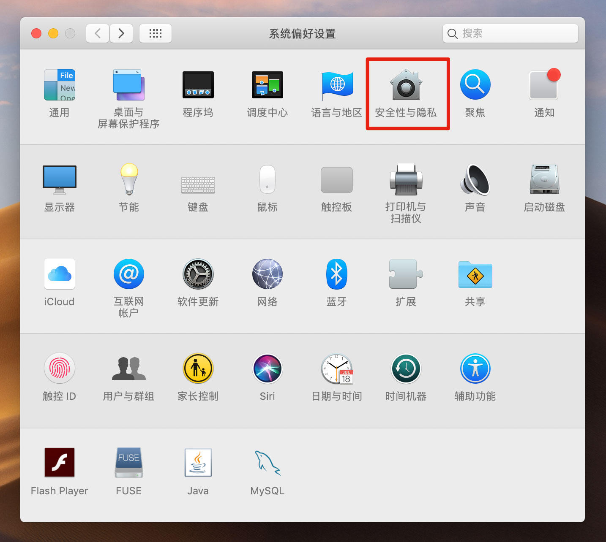
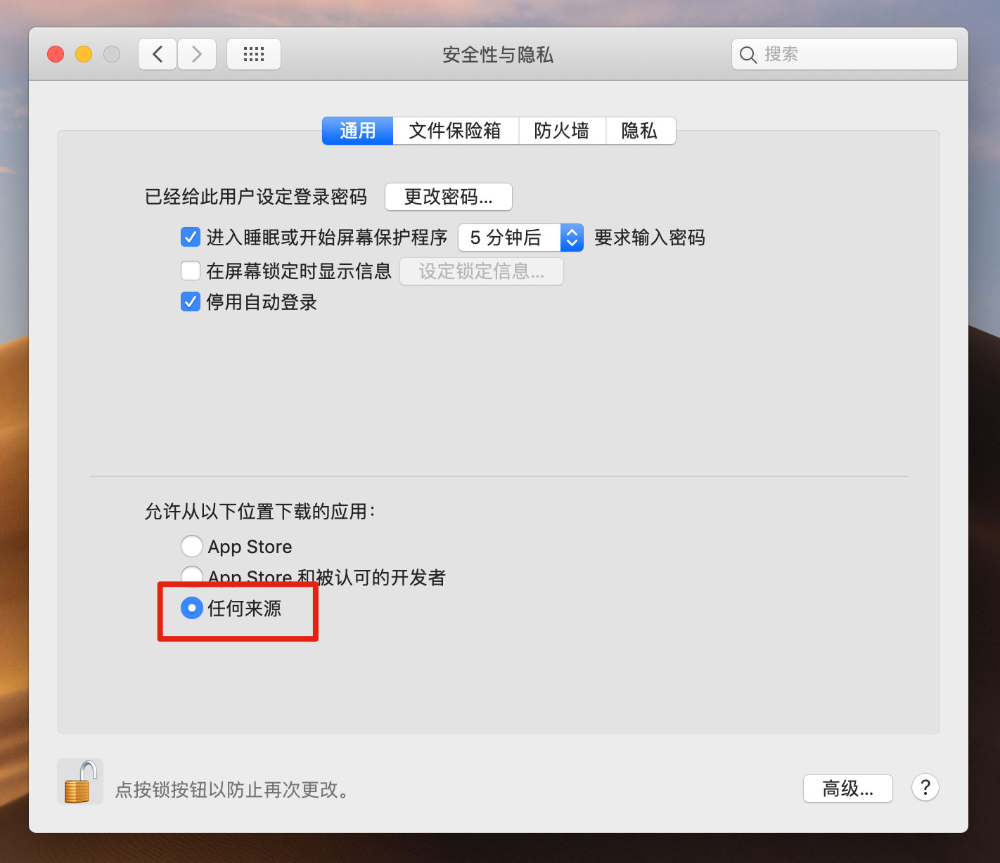

# MAC常用技巧

[TOC]

## 1. 设置开机默认启动MacOS

`系统偏好设置` > `启动磁盘` > 选择 `Macintosh HD` > 点击 `重新启动`

## 2. 自动登录

## 3. 启用 ```root``` 用户

1. 选取苹果菜单 () >“系统偏好设置”，然后点按“用户与群组”（或“帐户”）。
2. 点按 锁形图标，然后输入管理员名称和密码。
3. 点按“登录选项”。
4. 点按“加入”。
5. 点按“打开目录实用工具”。
6. 点按“目录实用工具”窗口中的 锁形图标，然后输入管理员名称和密码。
7. 从“目录实用工具”的菜单栏中：
 选取“编辑”>“启用 Root 用户”，然后输入要用于 ```root``` 用户的密码。

## 4. 创建ll命令

```sh
vi ~/.bash_rc
```

```sh
alias ll='ls -alF'
alias vi='vim'
alias rm='rm -i'
```

```sh
. ~/.bashrc
```

## 5. 设置dock靠左显示


## 6. 设置默认不启用fn功能

## 在Finder中将文件夹加入favorites

选择文件夹 > ```control-command-T```

## 7. 在Finder中快速进入当前目录的命令行

从 ```Finder``` > ```Services``` > ```Services Preferences``` > 选中 ```New Terminal at Folder``` 和 ```New Terminal Tab at Folder```

## 8. 复制/移动大于2G的文件到FAT32格式的U盘中

```sh
cp/mv DQ11.cia /Volumes/UNTITLED/
```

## 9. 设置hosts

```sh
sudo vim /etc/hosts
```

## 10. 常见问题

1. xxx已损坏，打不开，您应该将它移到废纸篓以及来自身份不明的开发者

最简单的方式：按住键盘上的control键，点击或者右键应用图标，再点击打开即可，但是此方法无疑是麻烦的。

那我们也可以通过修改系统配置来进行设置，我们打开 `系统偏好设置` -> `安全性与隐私` -> `通用`，然后选中 `任何来源`，如下图：





如果没有这个选项的话，打开终端，输入

```sh
sudo spctl --master-disable
```

好了，现在回到 系统偏好设置 -> 安全性与隐私 -> 通用 里，就看见任何来源选项了，勾选它！

再去打开应用看看是不是可以啦！

最后
如果您嫌麻烦，您也可以下载 macwk.com 编写的 macOS工具箱，可以快速执行命令操作：

下载完成后，打开dmg文件，按住键盘上的control键，然后单击或者右键点击macOS小助手应用图标，再点击打开即可！

注意: 应用闪退问题解决方法
如果打开应用一闪就退出了，这时候就需要考虑是不是SIP没有关闭的原因了，大家可以参照这篇文章来处理：

[关闭SIP](https://www.macwk.com/article/sipmac)
