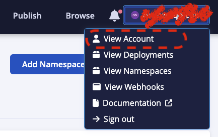
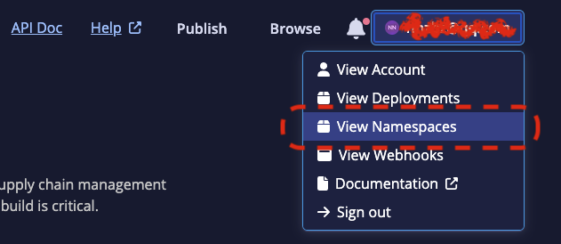
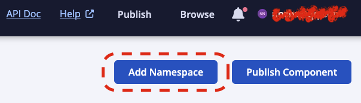
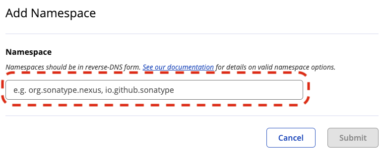
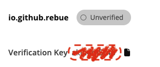
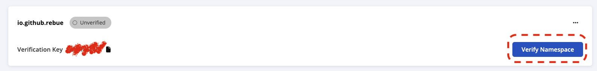
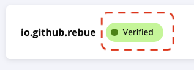
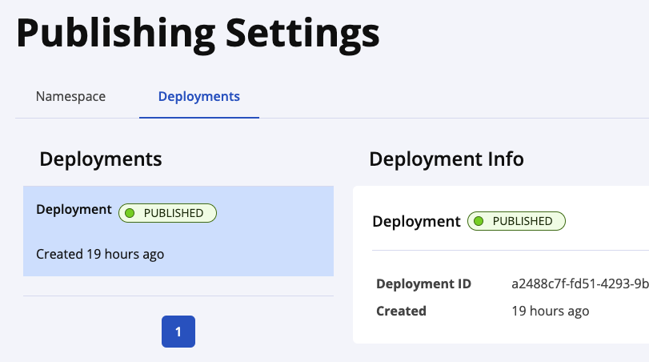

= 发布中央仓库(新)
:scripts: cjk
:toc: left
:toc-title: 目录
:toclevels: 2
:doctype: book

== Sonatype
说到中央仓库，不得不说 Sonatype 这家公司，因为中央仓库就是这家公司砸钱搞的，并且免费向全球所有的 Java 开发者提供构件托管服务。

- Sonatype中央仓库搜索地址: <https://central.sonatype.com/>

== 登录
<https://central.sonatype.com/> -> 点击右上角的 `Sign In`

== 注册
如果没有注册，需要注册才能登录

点击登录后的页面 `Continue` 按钮的下方，点击 `Sign Up`

== 生成用户Token并配置到Maven
. 登录后进入首页，点击右上角头像
. 点击 `View Account`
+

. 点击 `Generate User Token`
+
image::点击GenerateUserToken.png[点击GenerateUserToken]
. 复制配置到 `settings.xml` 的 `servers` 节点下
+
====
**注意 `${server}` 替换为一个实际的名字，与其它 `server` 项不重复即可**
====

== 生成GPG密钥对
* 生成密钥对
+
[,source]
----
gpg --gen-key
----
* 查询已生成的密钥
+
[,source]
----
gpg --list-keys
----
* 上传密钥到公钥服务器
+
[,source]
----
gpg --keyserver keyserver.ubuntu.com --send-keys <秘钥ID>
----

== 新增Namespace
. 登录后进入首页，点击右上角头像
. 点击 `View Namespaces`
+

. 点击 `Add Namespaces`
+

. 输入Namaspace并提交
+

- 如果是Github地址：github.com/xxxxx，那么命名空间就是：io.github.xxxxx
- 如果是Gitee地址：gitee.com/xxxxx，那么命名空间就应该是：io.gitee.xxxxx
+
====
**注意：命名空间第一级是io，而不是com**
====

== 校验Namespace
. 还是在 `View Namespaces` 的页面
.. <https://central.sonatype.com/publishing/namespaces>
. 复制 `Verification Key`
+

. 在 `github.com/xxxxx` 组织中添加 **公共** 仓库，名字为复制的 `Verification Key`
. 点击 `Verify Namespace`
+

. 点击 `Confirm` 确认
. 等待一会后可看到 `Verified`
+

== 配置项目的pom.xml文件
[,xml]
----
....

<groupId>xxxxx</groupId>
<artifactId>xxxxx</artifactId>
<version>xxxxx</version>
<packaging>pom</packaging>
<name>xxxxx</name>
<description>xxxxx</description>

<url>https://github.com/xxxxx/xxxxx</url>
<developers>
    <developer>
        <name>xxxxx</name>
        <email>xxxxx@qq.com</email>
    </developer>
</developers>
<licenses>
    <license>
        <name>MIT License</name>
        <url>https://www.opensource.org/licenses/mit-license.php</url>
    </license>
</licenses>
<scm>
    <connection>scm:git:https://github.com/xxxxx/xxxxx</connection>
    <developerConnection>scm:git:https://github.com/xxxxx/xxxxx.git</developerConnection>
    <url>https://github.com/xxxxx/xxxxx.git</url>
</scm>

....

<profiles>
    <profile>
        <!-- 部署到中央仓库 -->
        <id>deploy-public</id>
        <build>
            <plugins>
                <!-- Sonatype中央仓库发布插件 -->
                <plugin>
                    <groupId>org.sonatype.central</groupId>
                    <artifactId>central-publishing-maven-plugin</artifactId>
                    <version>0.4.0</version>
                    <extensions>true</extensions>
                    <configuration>
                        <publishingServerId>oss-new</publishingServerId>
                        <tokenAuth>true</tokenAuth>
                    </configuration>
                </plugin>

                <!-- 创建源码包 -->
                <plugin>
                    <groupId>org.apache.maven.plugins</groupId>
                    <artifactId>maven-source-plugin</artifactId>
                    <version>3.3.0</version>
                    <executions>
                        <execution>
                            <phase>package</phase>
                            <goals>
                                <goal>jar-no-fork</goal>
                            </goals>
                        </execution>
                    </executions>
                </plugin>
                <!-- 创建文档包 -->
                <plugin>
                    <groupId>org.apache.maven.plugins</groupId>
                    <artifactId>maven-javadoc-plugin</artifactId>
                    <version>3.6.3</version>
                    <executions>
                        <execution>
                            <phase>package</phase>
                            <goals>
                                <goal>jar</goal>
                            </goals>
                        </execution>
                    </executions>
                </plugin>
                <!-- 部署时用GPG数字签名 -->
                <plugin>
                    <groupId>org.apache.maven.plugins</groupId>
                    <artifactId>maven-gpg-plugin</artifactId>
                    <version>3.1.0</version>
                    <executions>
                        <execution>
                            <id>sign-artifacts</id>
                            <phase>verify</phase>
                            <goals>
                                <goal>sign</goal>
                            </goals>
                            <configuration>
                                <!-- 指定密钥的名称(可能会有多个生成的密钥) -->
                                <keyname>${gpg.keyname}</keyname>
                                <!-- 如果gpg服务有密钥，在settings.xml文件中配置 -->
                                <passphraseServerId>${gpg.keyname}</passphraseServerId>
                            </configuration>
                        </execution>
                    </executions>
                </plugin>
            </plugins>
        </build>
    </profile>
</profiles>
----

== Maven部署项目
[,shell]
----
mvn clean deploy -P deploy-public -f pom.xml
----

== 发布
. 登录后进入首页，点击右上角头像
. 点击 `View Deployments`
. 点击 `Publish`
. 过一会刷新，看到 `PUBLISHED` 就可以了
+

