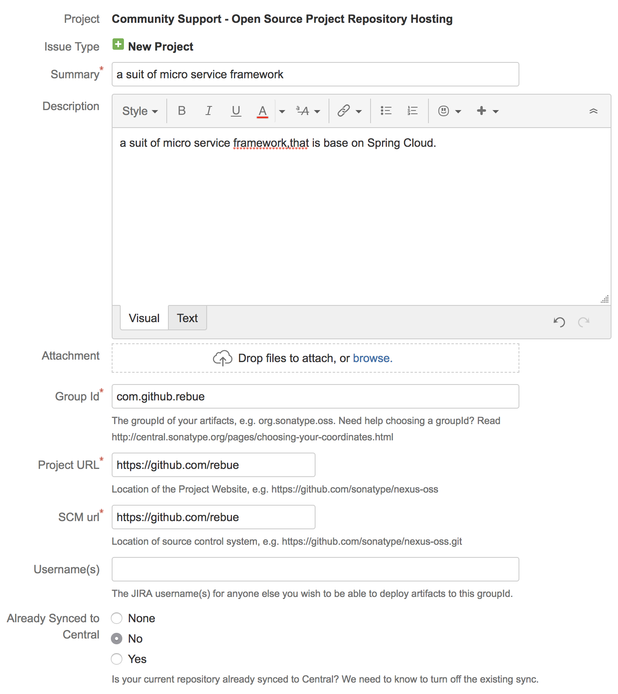
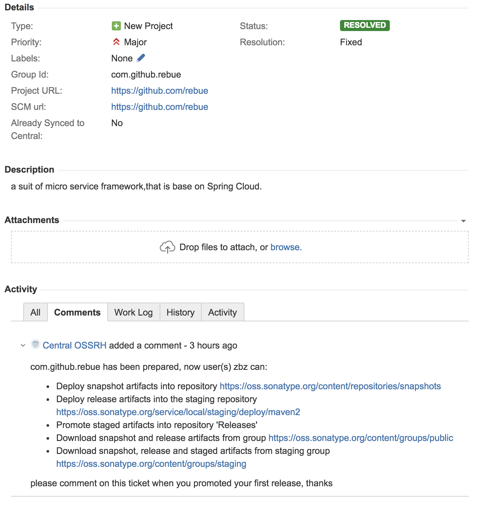
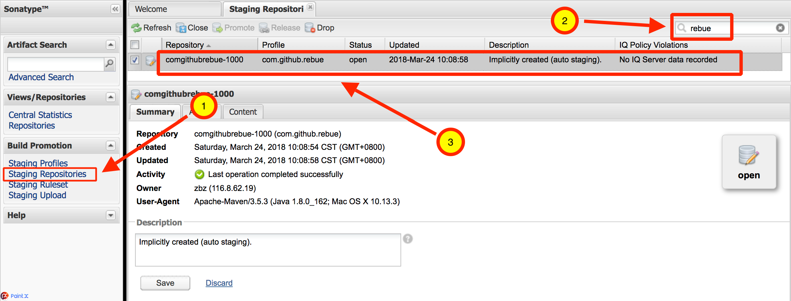

# 发布中央仓库

[TOC]

## 1. Sonatype

说到中央仓库，不得不说 Sonatype 这家公司，因为中央仓库就是这家公司砸钱搞的，并且免费向全球所有的 Java 开发者提供构件托管服务。

Sonatype官网: <http://www.sonatype.org/>
issue地址: <https://issues.sonatype.org/>
查询及管理地址: <https://oss.sonatype.org/>

## 2. 注册

注册地址：<https://issues.sonatype.org/secure/Signup!default.jspa>

## 3. 创建一个Issue

Project: Community Support - Open Source Project Repository Hosting (OSSRH)
Issue Type: New Project

申请表单填写示例如下：v



这时的Status为 ```OPEN```

## 4. 等待 Issue 审批通过

我是在下午18:00提交的，两个小时后就通过了，审批通过Status就会变为 ```RESOLVED```



## 5. 使用gpg生成密钥对

### 5.1. 下载地址

官网: <https://gpgtools.org/>

Mac下载地址: <https://releases.gpgtools.org/GPG_Suite-2018.1.dmg>

### 5.2. 生成新的密钥对

Generate new pair key

姓名:
电子邮件:
Password:

### 5.3. 上传公钥到GPG密钥服务器

Upload Public Key

## 6. 管理 ```User Token``` 用于上传服务器的凭证

1. 访问管理地址并登录：<https://oss.sonatype.org/>
2. 右上角 ```zbz``` -> Profile -> 下拉 ```Summary``` 并选到 ```User Token```
3. 点击 ```Access User Token``` 按钮，输入 ```Username``` 和 ```Password```，查看 ```User Token```内容

```xml
<server>
  <id>${server}</id>
  <username>abc</username>
  <password>123456</password>
</server>
```

## 7. 修改Maven配置文件

### 7.1. settings.xml

**注意: 这里的用户名和密码是上节获取的 ```User Token``` ，而不是注册登录时的用户名和密码。**

```xml
<servers>
    ....
    <!-- Maven中央仓库 -->
    <server>
        <id>oss</id>
        <username>User Token中的username</username>
        <password>User Token中的password</password>
    </server>
</servers>
```

### 7.2. pom.xml

- 必须包括：name、description、url、licenses、developers、scm 等基本信息

```xml
....
<name>common-pom</name>
<description>常用的pom.xml文件</description>
<url>https://github.com/rebue/common-pom</url>

<licenses>
    <license>
        <name>MIT License</name>
        <url>http://www.opensource.org/licenses/mit-license.php</url>
    </license>
</licenses>

<developers>
    <developer>
        <name>zhangbaizi</name>
        <email>nnzbz@163.com</email>
    </developer>
</developers>

<scm>
    <connection>scm:git:https://github.com/rebue/common-pom.git</connection>
    <developerConnection>scm:git:https://github.com/rebue/common-pom.git</developerConnection>
    <url>https://github.com/rebue/common-pom.git</url>
</scm>
....
```

- profile
 只有在 release 的时候，创建源码包、创建文档包、使用 GPG 进行数字签名。

```xml
....
<profiles>
    <profile>
        <id>release</id>
        <build>
            <plugins>
                <!-- 创建源码包 -->
                <plugin>
                    <groupId>org.apache.maven.plugins</groupId>
                    <artifactId>maven-source-plugin</artifactId>
                    <executions>
                        <execution>
                            <phase>package</phase>
                            <goals>
                                <goal>jar-no-fork</goal>
                            </goals>
                        </execution>
                    </executions>
                </plugin>
                <!-- 创建文档包 -->
                <plugin>
                    <groupId>org.apache.maven.plugins</groupId>
                    <artifactId>maven-javadoc-plugin</artifactId>
                    <executions>
                        <execution>
                            <phase>package</phase>
                            <goals>
                                <goal>jar</goal>
                            </goals>
                        </execution>
                    </executions>
                </plugin>
                <!-- 部署时用GPG数字签名 -->
                <plugin>
                    <groupId>org.apache.maven.plugins</groupId>
                    <artifactId>maven-gpg-plugin</artifactId>
                    <executions>
                        <execution>
                            <phase>verify</phase>
                            <goals>
                                <goal>sign</goal>
                            </goals>
                        </execution>
                    </executions>
                </plugin>
            </plugins>
        </build>
        <!-- 配置部署的中央仓库 -->
        <distributionManagement>
            <snapshotRepository>
                <id>oss</id>
                <url>https://oss.sonatype.org/content/repositories/snapshots/</url>
            </snapshotRepository>
            <repository>
                <id>oss</id>
                <url>https://oss.sonatype.org/service/local/staging/deploy/maven2/</url>
            </repository>
        </distributionManagement>
    </profile>
</profiles>
....
```

## 8. 上传构件到 OSS 中

```sh
mvn clean deploy -P release
```

## 9. 在 OSS 中查看和发布上传的构件

### 9.1. 登录地址

<https://oss.sonatype.org/>

### 9.2. 查看



### 9.3. 发布

此时，该构件的状态为 ```Open``` ，需要勾选它，然后点击 ```Close``` 按钮。接下来系统会自动验证该构件是否满足指定要求，当验证完毕后，状态会变为 ```Closed``` ，最后，点击 ```Release``` 按钮来发布该构件。

## 10. 通知工作人员已发布

<https://issues.sonatype.org/>

回复以下内容：

```text
rebue components was released, and id is comgithubrebue-1007, thanks
```

## 11. 完成

等待工作人员审核通过既完成，网上说要1~2天，我实际上等了4天。

## 12. 重新发布

重新发布同一组的组件时，只要下面3步就可以了

1. 重新deploy
2. close and release
3. 等待同步

**注意：**

- 如果上次deploy时，close没有成功，修正问题后，请先drop掉，再重新deploy