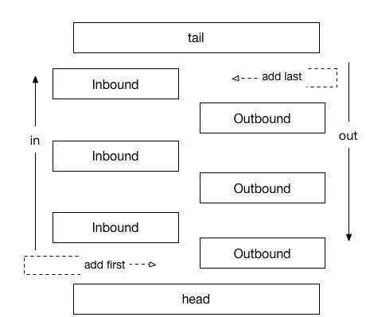

# handler

[TOC]

## 1. handler简介

- Netty中的所有 `handler` 都实现自 `ChannelHandler` 接口。
- 按照输入输出来分，分为 `ChannelInboundHandler` 、`ChannelOutboundHandler` 两大类。
- `ChannelInboundHandler` 对从客户端发往服务器的报文进行处理，一般用来执行解码、读取客户端数据、进行业务处理等； `ChannelOutboundHandler` 对从服务器发往客户端的报文进行处理，一般用来进行编码、发送报文到客户端。

## 2. handler执行顺序

- `ChannelInboundHandler` 按照队列的先后顺序执行；
- `ChannelOutboundHandler` 按照队列的先后顺序逆序执行。



例如:

```java
  pipeline.addLast(idleHandler, decoder, encoder, handler);
```

- 如果是输入: `decoder` ---> `handler`
- 如果是输出: `encoder` ---> `idleHandler`
