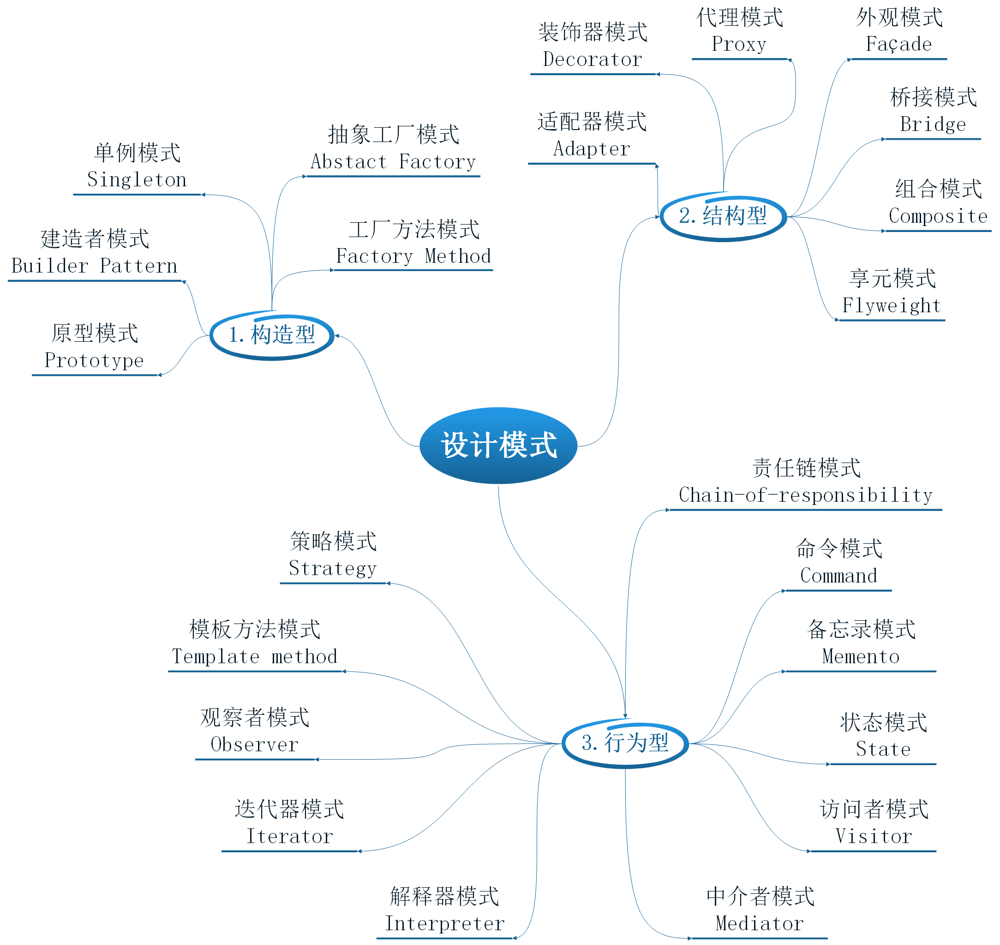

# 设计模式简介

<!-- TOC -->

- [1. GoF](#1-gof)
- [2. 什么是设计模式？](#2-什么是设计模式)
- [3. 不要误解设计模式](#3-不要误解设计模式)
- [4. 为什么要学习设计模式？](#4-为什么要学习设计模式)
- [5. 设计模式的分类](#5-设计模式的分类)
- [6. 设计模式总图](#6-设计模式总图)

<!-- /TOC -->

---

## 1. GoF

说到设计模式，就不得不提到GoF及他们在1994年论著的《Design Patterns: Elements of Reusable Object-Oriented Software》

GoF：Gang of Four，四人帮，Erich Gamma, Richard Helm, Ralph Johnson，John Vlissides软件设计领域的四位大师级人物。

《Design Patterns: Elements of Reusable Object-Oriented Software》

这是软件工程领域有关软件设计的一本书，提出和总结了对于一些常见软件设计问题的标准解决方案。

当时软件设计仍以C++与Smalltalk为主流，Java尚在襁褓之中，而时至二十年后的今天，此书所涉及的内容仍被人们引为经典，广泛的学习和研究。

---

## 2. 什么是设计模式？

从上面那本书的英文书名就可以明白设计模式的定义，**设计模式：面向对象软件设计中可复用的要素**

我们可以反复仔细的思考这句话的每一个字就可以理解它的意思，我在这里给出一个简单直白，能让大家对它的理解

> 所谓的模式也就是套路，在面向对象的编程中遇到同类的问题或场景，按套路出牌来解决问题或实现需求，往往使编码达到简洁高效的结果。

---

## 3. 不要误解设计模式

GoF从一开始就将设计模式视为一种艺术/科学，很多人因此认为设计模式多么的高不可攀、遥不可及

但我认为这是一种工匠的艺术、工匠的科学，它来源于实践，根生于底层，不是纯粹的理论，而是实际经验的不断总结，广泛应用于面向对象的各个场景设计中。

---

## 4. 为什么要学习设计模式？

- 加深理解和掌握面向对象的思维方法
- 提高自己的编码能力，开发更简洁高效，提高代码的健壮性和安全性
- 帮助我们阅读很多优秀的源码
- 和小伙伴沟通更顺畅，更能摩擦出火花（不要误解，这里的火花指的是思想的火花）

---

## 5. 设计模式的分类

- 创建型模式

这组模式帮助我们更好地组织创建实例的代码。

- 结构型模式

这组模式帮助我们更好定义类之间的复杂关系。

- 行为型模式

这组模式帮助我们更好处理对象之间的协作关系。

---

## 6. 设计模式总图

