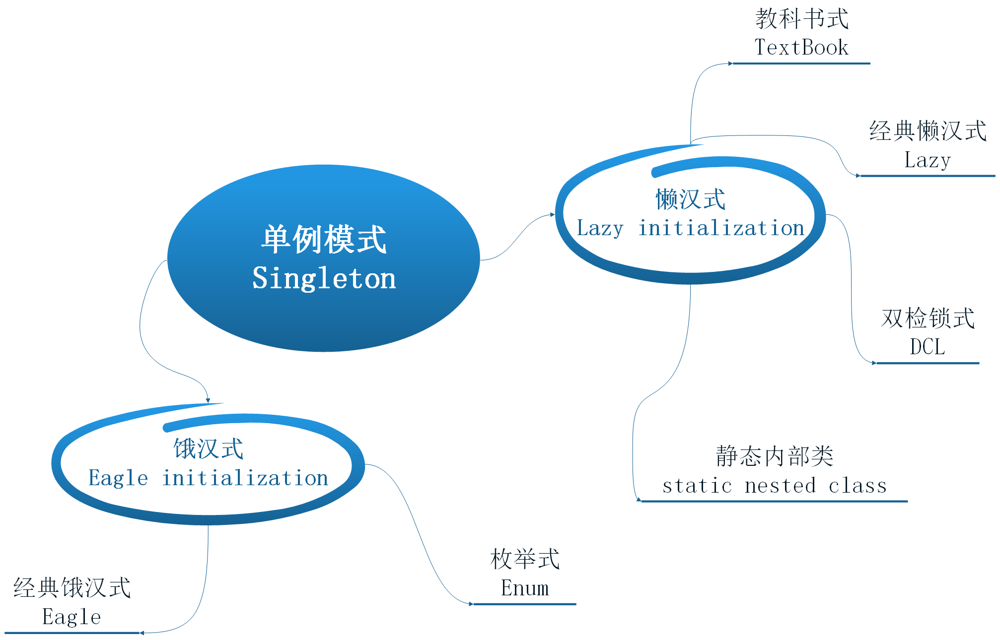

# 单例模式(Singleton)

[TOC]

## 1. 定义

> 唯一：确保一个类只有一个实例

## 2. 生活场景

- 一个就够了
- 多个反而会乱

投影仪：教室里只用一个投影仪就够了，如果装了多个投影仪到处投影会闪瞎你的眼

老师上课：同一个教室只有一个老师在上课，如果有多个老师同时在一个教室上课，学生如何听课？

## 3. 应用场景

代码中有一些对象正是如此：线程池、缓存、对话框、全局配置，以及Servlet、Spring的Bean等等，这类对象只需要一个实例，如果制造出多个实例就会浪费资源、影响效率及并发异常。

## 4. 模式的优点和缺点

- 节约系统资源
- 减少频繁创建与销毁对象
- 避免并发的场景下发生行为异常

## 5. 饿汉式和懒汉式

单例模式按实例创建的时机可分为饿汉式和懒汉式：

1. 饿汉式：在类加载的时候就初始化并创建实例
2. 懒汉式：在第一次使用的时候才创建实例



## 6. 实现案例

### 6.1. 经典饿汉式(简单)

> 这是我最喜欢的一种方式，是最直接的实现方式。

```java
/**
 * XXX Pattern:Singleton:饿汉式(最简单)
 *
 * @author 张柏子
 *
 */
public class EagerSingleton {
    /**
     * 类加载时就初始化静态实例
     */
    private static final EagerSingleton INSTANCE = new EagerSingleton();

    /**
     * 私有的构造函数(表明这个类不可能通过外部调用创建实例)
     */
    private EagerSingleton() {
        System.out.println("create instance");
    }

    /**
     * 获取实例（只能通过此方法创建实例）
     */
    public static EagerSingleton getInstance() {
        return INSTANCE;
    }

    public void printHello() {
        System.out.println("Hello, World!");
    }

    public static void main(String[] args) {
        EagerSingleton.getInstance().printHello();
    }
}
```

这种写法如果完美的话，就不会再BB后面那么多内容了，因为它需要注意下面3个问题：

(1) 它不是一种懒加载模式（lazy initialization）

单例会在加载类的时候就被创建，即使客户端没有调用 getInstance()方法。

在一些场景中将无法使用：譬如 Singleton 实例的创建是依赖参数或者配置文件的，在 getInstance() 之前必须调用某个方法设置参数给它，那样这种单例写法就无法使用了。

(2) （Java特有的）当实现了Serializable接口后，反序列化时单例会被破坏

实现Serializable接口需要重写readResolve，才能保证其反序列化依旧是单例：

```java
public class EagerSingleton implements Serializable {

    ......
    ......
    ......

    /**
     * 如果实现了Serializable, 必须重写这个方法
     */
    private Object readResolve() throws ObjectStreamException {
        return INSTANCE;
    }
}
```

(3) 不能防止通过Java的反射机制来创建实例

```java
public static void main(String[] args) throws NoSuchMethodException, SecurityException, InstantiationException,
        IllegalAccessException, IllegalArgumentException, InvocationTargetException {
    Class<?> clazz = EagerSingleton.class;
    Constructor<?> constructor = clazz.getDeclaredConstructor(clazz);
    constructor.setAccessible(true);
    EagerSingleton e1 = (EagerSingleton) constructor.newInstance();
    EagerSingleton e2 = EagerSingleton.getInstance();
    System.out.println(e1 == e2);
}
```

添加如下代码防止通过Java的反射机制来破坏单例

```java
/**
  * 创建实例的标识，默认为false，如果已经创建过会设为true，这样就可以判断实例是否已经被创建过<br>
  * 注意此字段要写在INSTANCE声明的上面
  */
private static boolean createFlag = false;

/**
    * 私有的构造函数(表明这个类不可能通过外部调用创建实例)
    */
private EagerSingleton() {
    System.out.println("create instance");
    // 如果已经创建过实例则抛出异常，防止通过Java的反射机制来破坏单例
    synchronized (EagerSingleton.class) {
        if (createFlag == false) {
            createFlag = !createFlag;
        } else {
            throw new RuntimeException("单例模式被侵犯！");
        }
    }
}
```

> 对于上面饿汉式的第2和第3点，可以简单的用枚举式来解决。

### 6.2. 饿汉式之枚举式（优雅）

其实枚举式也是属于饿汉式的一种，利用了Java的枚举类的特点来解决反序列化和反射的问题。

```java
/**
 * XXX Pattern:Singleton:枚举(优雅)
 * 
 * @author 张柏子
 */
public enum EnumSingleton implements Serializable {
    INSTANCE;

    private EnumSingleton() {
        System.out.println("create instance");
    }

    public void printHello() {
        System.out.println("Hello, World!");
    }

    public static void main(String[] args) {
        EnumSingleton.INSTANCE.printHello();
    }
}
```

对于饿汉式不能延迟加载的缺点，下面介绍几个解决方式，都属于懒汉式。

### 6.3. 懒汉式之教科书式

当要实现懒加载的单例模式时，很多人的第一反应是写出如下的代码，包括教科书上也是这样教我们的。

```java
/**
 * XXX Pattern:Singleton:教科书式（线程不安全）
 * 
 * @author 张柏子
 *
 */
public class TextBookSingleton {
    private static TextBookSingleton INSTANCE = null;

    /**
     * 私有的构造函数(表明这个类不可能通过外部调用创建实例)
     */
    private TextBookSingleton() {
        System.out.println("create instance");
    }

    /**
     * 获取实例（只能通过此方法创建实例）
     */
    public static TextBookSingleton getInstance() {
        if (INSTANCE == null) {
            INSTANCE = new TextBookSingleton();
        }
        return INSTANCE;
    }

    public void printHello() {
        System.out.println("Hello, World!");
    }

    public static void main(String[] args) {
        TextBookSingleton.getInstance().printHello();
    }
}
```

> 这段代码简单明了，而且使用了懒加载模式，但是在多个线程并行调用 getInstance() 的时候，就会创建多个实例，也就是说是非线程安全的。

### 6.4. 经典懒汉式

> 为了解决教科书式的问题，最简单的方法是将整个 getInstance() 方法设为synchronized（同步）。

```java
/**
    * 获取实例（只能通过此方法创建实例）<br>
    * 将整个 getInstance() 方法设为synchronized（同步）
    */
public static synchronized LazySingleton getInstance() {
    if (INSTANCE == null) {
        INSTANCE = new LazySingleton();
    }
    return INSTANCE;
}
```

> 懒汉式简单粗暴的同步整个方法，导致同一时间内只有一个线程能够调用getInstance方法，这样又出现了性能问题。

### 6.5. 双检锁DCL（最复杂）

```java
/**
    * 获取实例（只能通过此方法创建实例）<br>
    * 这里不再用同步synchronized加在整个方法上
    */
public static DclSingleton getInstance() {
    // 第一次检验
    if (INSTANCE == null) {
        synchronized (DclSingleton.class) {
            // 第二次检验
            if (INSTANCE == null) {
                INSTANCE = new DclSingleton();
            }
        }
    }
    return INSTANCE;
}
```

这段代码看起来很完美，很可惜，它是有问题的。主要在于INSTANCE = new DclSingleton()这句，这并非是一个原子操作，事实上在 JVM 中这句话大概做了下面 3 件事情。

1. 给 INSTANCE 分配内存
2. 调用 Singleton 的构造函数来初始化成员变量
3. 将INSTANCE对象指向分配的内存空间（执行完这步 INSTANCE 就为非 null 了）

但是在 JVM 的即时编译器中存在指令重排序的优化。也就是说上面的第二步和第三步的顺序是不能保证的，最终的执行顺序可能是 1-2-3 也可能是 1-3-2。如果是后者，则在 3 执行完毕、2 未执行之前，被线程二抢占了，这时 instance 已经是非 null 了（但却没有初始化），所以线程二会直接返回 instance，然后使用，然后顺理成章地报错。

这时只需要将 INSTANCE 变量声明成 volatile 就可以了。

```java
/**
 * volatile的两个特性 <br>
 * 1. 可见性<br>
 * 可以保证线程在本地不会存有 INSTANCE的副本，每次都是去主内存中读取<br>
 * 2. 禁止指令重排序优化<br>
 * 在 volatile 变量的赋值操作后面会有一个内存屏障（生成的汇编代码上）<br>
 * 读操作不会被重排序到内存屏障之前
 */
private volatile static DclSingleton INSTANCE = null;
```

### 6.6. 静态内部类 static nested class(推荐)

```java
/**
 * XXX Pattern:Singleton:静态内部类(Static-Nested-Class)
 * 
 * @author 张柏子
 *
 */
public class SncSingleton {
    private static class SncSingletonHolder {
        private static final SncSingleton INSTANCE = new SncSingleton();
    }

    /**
     * 私有的构造函数(表明这个类不可能通过外部调用创建实例)
     */
    private SncSingleton() {
        System.out.println("create instance");
    }

    /**
     * 获取实例（只能通过此方法创建实例）<br>
     * 这里不再用同步synchronized加在整个方法上
     */
    public static SncSingleton getInstance() {
        return SncSingletonHolder.INSTANCE;
    }

    public void printHello() {
        System.out.println("Hello, World!");
    }

    public static void main(String[] args) {
        SncSingleton.getInstance().printHello();
    }
}
```

## 7. 案例小结

- 单例模式根据创建实例的时机不同，分为饿汉式和懒汉式两种。
- 饿汉式的枚举式默认没有反序列化和反射的问题，写起来优雅，推荐。
- 懒汉式的静态内部类在并发下没有性能问题，推荐。
- 枚举式虽然在这里推荐使用，但是在Android平台上却是不被推荐的。
> 在这篇[《Manage Your App's Memory》](https://developer.android.com/topic/performance/memory.html)文章中明确指出：
> *Enums often require more than twice as much memory as static constants. You should strictly avoid using enums on Android.*

## 8. Spring的单例（TODO）