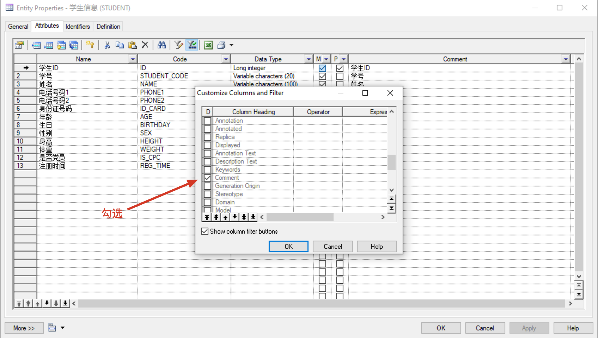
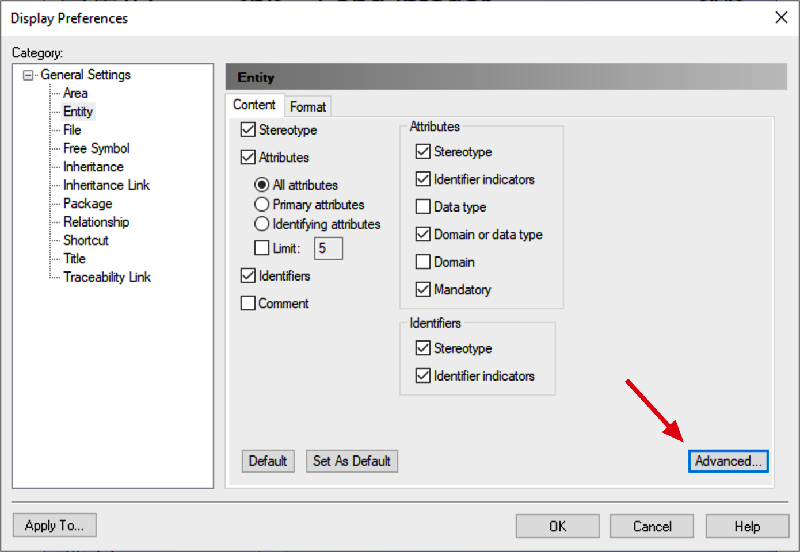
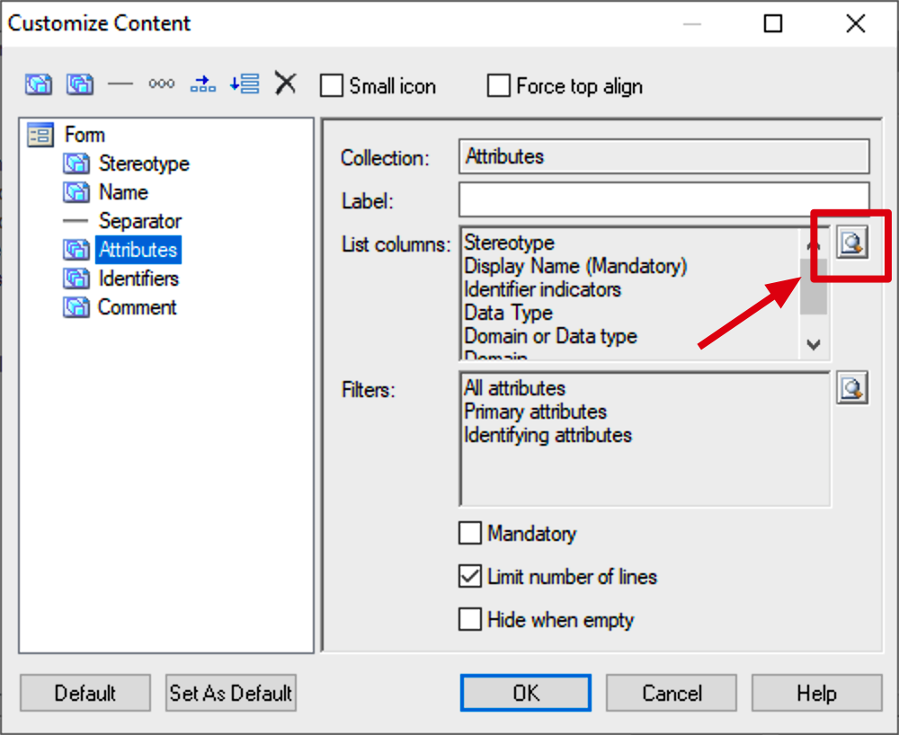
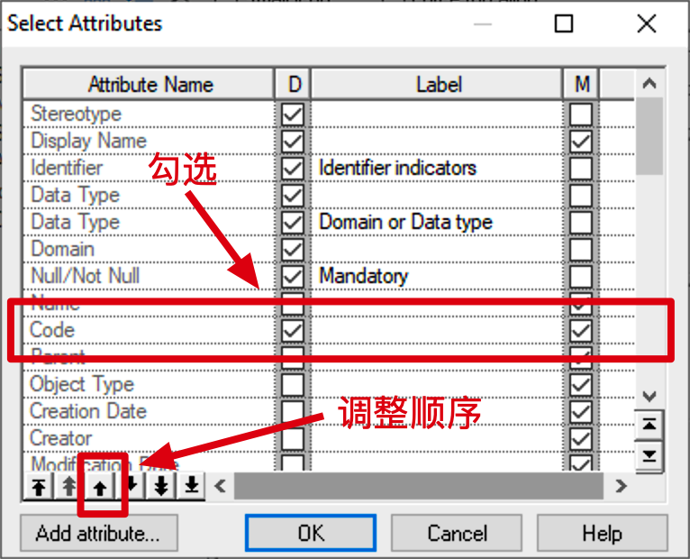

# PowerDesigner使用技巧

[TOC]

## 1. 设置字段显示comment注释

右键点击Entity ->`【Properties】`->`【Columns】`->`【Customize Columns and Filter】`->`【Comment】`->`【OK】`

## 2. Entity同时显示Code和Name

`【Tools】` -> `【Display Preference】`

