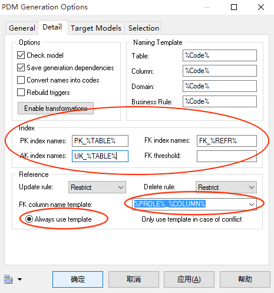
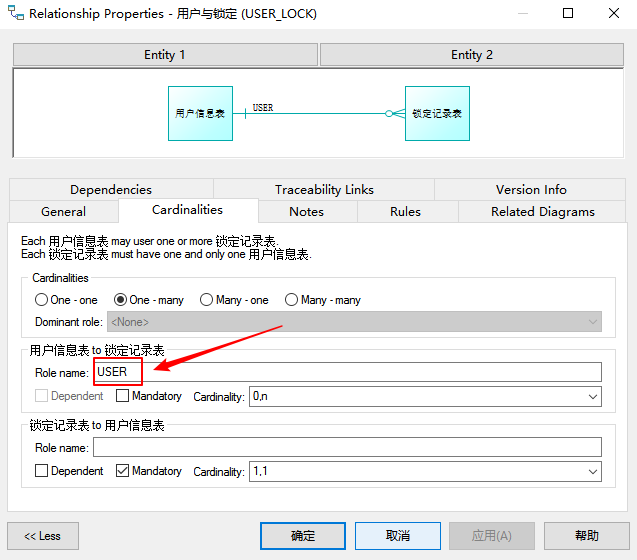
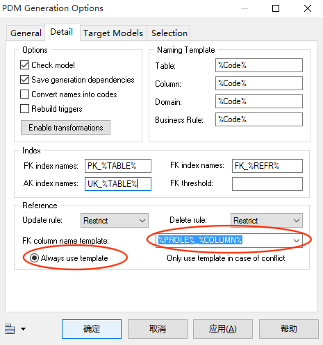
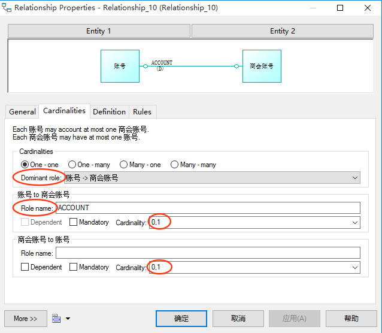
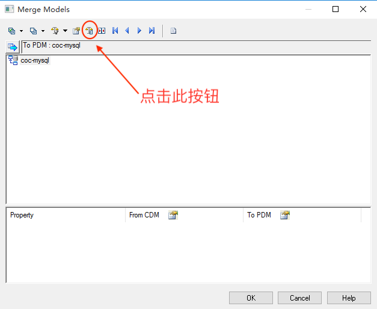
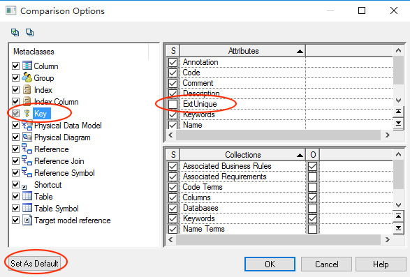

# 1. PowerDesigner入门

[TOC]

---

## 1. PowerDesigner简介

> 图形化的建模工具

---

## 2. PowerDesigner安装(见附录A)

---

## 3. PowerDesignr配置

### 3.1. 配置实体的属性名可以重复


---

## 4. 模型种类

一般在建立数据库模型时，会涉及到几种模型种类：概念模型、逻辑模型、物理模型。数据库设计中概念模型和逻辑模型区别比较模糊，所以在数据库设计工具ERWIN中只提供了逻辑模型和物理模型，而在PowerDesigner早期版本中也只提供了概念模型和物理模型两种模型，只是在PowerDesigner15版本中提供了三种模型：概念模型、逻辑模型、物理模型。

### 4.1. 概念模型

> 概念模型是对真实世界中问题域内的事物的描述，不是对软件设计的描述。

表示概念模型最常用的是"实体-关系"图(ER图)。

E-R图主要是由**实体**、**属性**和**关系**三个要素构成的。


### 4.2. 逻辑模型

> 逻辑数据模型反映的是系统分析设计人员对数据存储的观点，是对概念数据模型进一步的分解和细化。

### 4.3. 物理模型

> 物理模型是对真实数据库的描述。

数据库中的一些对象如下：表，视图，字段，数据类型、长度、主键、外键、索引、是否可为空，默认值。

### 4.4. 模型对比

- 设计E/R元素的对比

| ER元素         | 概念模型 | 逻辑模型 | 物理模型 |
| -------------- | -------- | -------- | -------- |
| 实体           | 实体     | 实体     | 表       |
| 属性           | 属性     | 属性     | 字段     |
| 关系(1:1;1:n)  | 关系     | 关系     | 外键     |
| 关系(m:n)      | 关系     | 实体     | 表       |
| 关系(1:n包含)* | 关系     | 实体     | 表       |
---

*关系(1:n包含)：例如订单和产品的关系是一对多，这种关系确定为订单产品明细表.*

> 最主要的区别：可以看到在m:n和1:n包含的关系中，概念模型还是描述的是关系，而逻辑模型和物理模型就描述成实体和表了。

---

- **物理模型**与**概念模型**/**逻辑模型**的区别

**物理模型**要确定unique，而**概念模型**/**逻辑模型**无法确定

## 5. 概念模型建模

### 5.1. 设置1:n的关系

1、 选择 ```Toolbox``` > ```Conceptual Diagram``` > ```Relationship```
2、 先点击1关系的表，再点击n关系的表，这里已画好关系


## 6. 逻辑模型建模

## 7. 物理模型建模

## 8. 常见设计技巧

### 8.1. 概念模型生成物理模型配置生成主键、外键、索引的规则



### 8.2. 概念模型生成物理模型配置1:n关系生成的外键字段

双击关系箭头，设置主表的Role name



生成时设置规则



### 8.3. 概念模型配置1:1关系

- 首先副表不要创建ID
- 从主表拖动关联到副表，具体设置如下：(Role name可不设置，而第二个关系可设为Dependent,Mandatory)



### 8.4. 设置unique字段

概念模型中，设置Identifiers，添加属性

MySQL物理模型中，设置Keys，修改属性 -> MySQL -> Unique key

**注意: 再次生成物理模型时不要选中unique的项，以免被覆盖又得重新在物理模型中设置**

- 生成物理模型时不覆盖unique的设置



