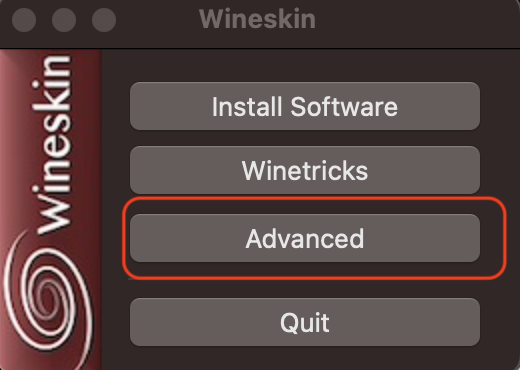

= Mac系统安装PowerDesigner
:scripts: cjk
:toc:
:toc-title: 目录
:toclevels: 4

== 安装Wineskin Winery
. 卸载旧的版本
+
[,shell]
----
brew update
brew upgrade
brew uninstall --force --zap wineskin
brew uninstall --force --zap gstreamer-runtime
----
. 安装
+
[,shell]
----
brew install --cask --no-quarantine gcenx/wine/wineskin
----

== 创建 `PowerDesigner` 的应用
. 运行 `Wineskin Winery`
. 添加引擎
+
鼠标点击 `*+*` 号
+

+
鼠标点击 `*Download and Install*`
+

+
鼠标点击 `*Update Wrapper*`
+

+
鼠标点击`*OK*`
+

. 创建 `PowerDesigner` 的应用
+
鼠标点击`*Create New Blank Wrapper*`
+

. 输入应用名称为 `PowerDesigner`，并点击 `OK`
+

. 应用被创建在 `Applications/Wineskin/` 下
+

== 安装 `PowerDesigner`
. 双击运行 `PowerDesigner` 应用
. 鼠标点击 `Install Software`
+

. 鼠标点击 `Choose Setup Executable`
+
image::选择安装文件.png[]
. 开始安装 `PowerDesigner`，具体过程略
. 安装完后选择可执行程序，并点击 `OK`
+

. 鼠标点击 `Advanced`
+

. 复制 `PowerDesigner` 的破解文件到应用
+
显示包内容: 右键点击 `PowerDesigner` 应用，选择 `Show Package Contents`
+

+
复制 `PowerDesigner` 的破解文件到 `drive_c` 目录内的 `PowerDesigner` 的安装目录，并覆盖原文件
. 鼠标点击 `Test Run`

