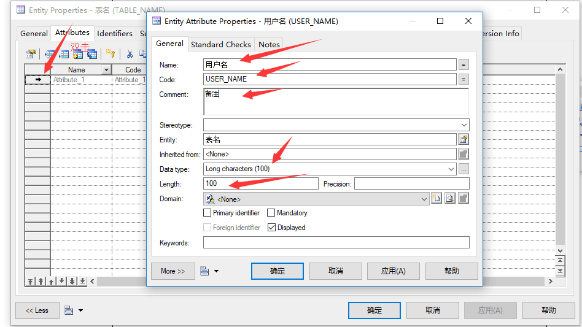
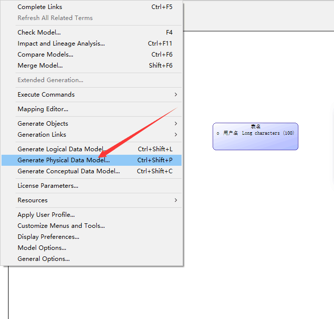
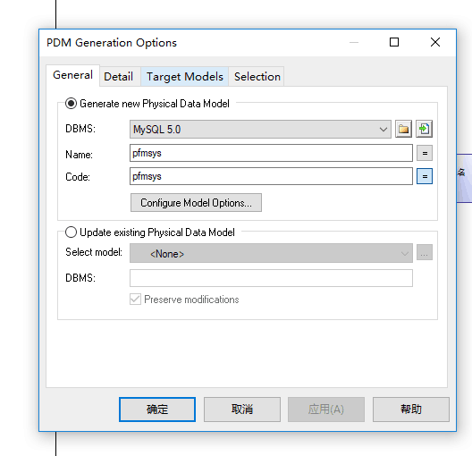
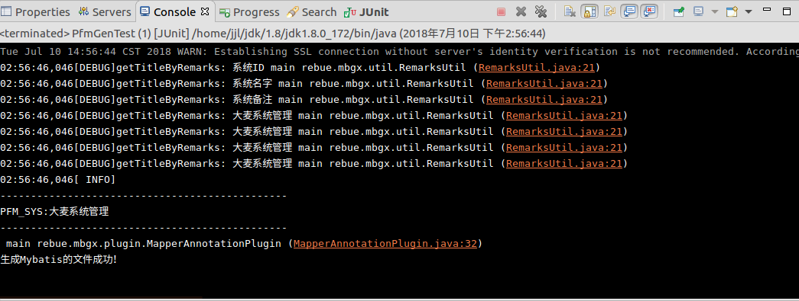

# 创建一个项目过程

## 先创建一个远程仓库

## 再创建一个本地maven项目，名字于远程仓库一致

## 在前面创建的maven项目中依次创建以下几个maven子项目（创建完成后按照前辈已经完成的项目配置基本的pom.xml,要从父项目开始配置）

### (1)gen

#### 代码生成器

###  (2)api

#### 存放接口来定义规范，还有mo与ro实体。

### (3)bll

#### 业务逻辑层，实现类等会放在里面

### (4)svr

#### 微服务启动类，控制层会放在里面

### (5)feign

#### 一个声明式的Web服务客户端，使用Feign可使得Web服务客户端的写入更加方便，可以轻松的访问远程的URL，不依赖其他服务。

## 在maven父项目中创建普通目录

#### db

##### 存放sql和powerdesigner的概念模型

#### doc

##### 对本项目的业务逻辑以及开发文件

## 在maven父项目中创建普通文件

#### README.md

##### 对本项目的备注

## 项目创建完成后右键创建本地仓库

##### team -> share project

###### 点击create repository 再点击finish

# 将本地仓库项目上传到远程仓库

## 看git笔记，先cd切换到要上传项目的根路径再进行git命令的操作。

# 使用PowerDesigner创建模型

## 先创建逻辑模型logical(LDM)

### file -> new model -> logical data model ->修改model name 再ok，这时候可能工具栏没有出来，

### （version：16.5）toos -> customize Menus and tools -> toolbars ->将palette打勾。

######  》双击表

###### 》选中表，点击tools 再选择物理模型

### 将各个模型保存，直到页面出现这三个文件

# 在服务器创建一个新的数据库和表，再创建一个用户（用项目名当作登录名和密码，将刚刚创建的数据库权限赋予该用户），之后开始在eclipse生成代码。

## 首先先将前辈写好的项目中将gen项目中的所有文件拷贝过来即将要写的项目的gen里面

### （1）先将要改的配置文件名，如（mbg-old.properties）改成（mbg-new.properties）(可能不止一个文件名要改)

###  (2) 仔细检查每个文件里面要改的字段，如（model.target=../old-api/src/main/java）改成（model.target=../new-api/src/main/java）

## 注意事项以及会报的错。

### 1：修改后每个考过来的文件都需要和原来的文件对比是否只有该改的地方改了，改的地方是否有错，生成时候出错绝大部分是代码写错了。

### 2：生成代码后会报错找不到jar，这时候就要对比前辈相对应的pom.xml,将所有第三方(mysql等)或者是工具类(前辈封装的工具等)或者是当前子项目要依赖其他子项目(如bll依赖api)的依赖加进来。

### 3：(切记)将参考项目的OldApplication.java改成NewApplication.java，应该还不需要远程调用，所有将有关feigin的删掉。

###### 成功后的控制台显示为 

