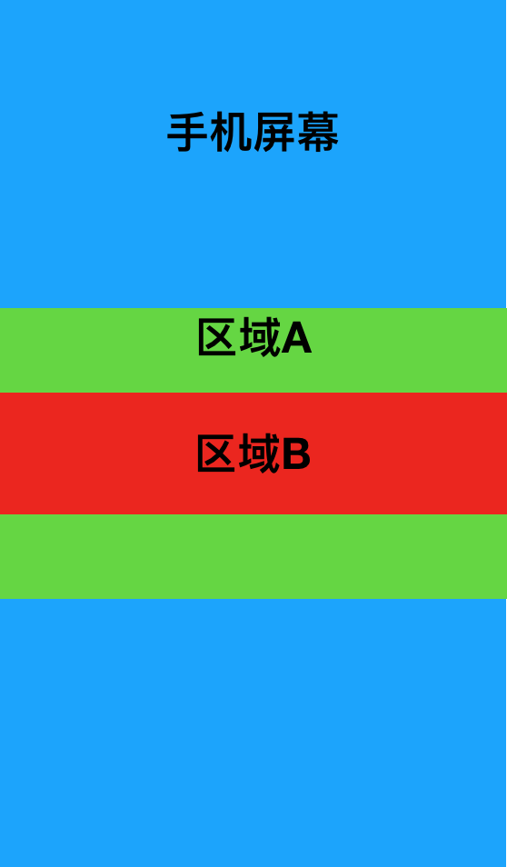

# FlatList

[TOC]

## 1. 需求

在区域A中显示区域B的FlatList，如果内容少就居中显示在区域A中，如果内容多就再区域A中滚动显示

## 2. FlatList内容样式问题

如果要设置FlatList内容的样式需要在contentContainerStyle中设置

## 3. 设置FlatList高度问题

1. FlatList等类似容器类的空间，默认是有flex:1属性的,再次设置flex是不起作用的。
2. FlatList contentContainerStyle不能设置flex:1和固定高度，否则不能滑动。
3. 如果父容器flex-direction为column时想要设置FlatList高度必须在外层包裹一层View，设置View的高度

## 4. FlatList内容少时，居中问题

需要在FlatList外再包一层View包裹FlatList高度，因为flex是0，所以View的高度是FlatList的内容高度

## 5. FlatList宽度占满屏幕问题

想要设置宽度需要设置View的alighSelf为stretch。水平情况也是同样的道理
