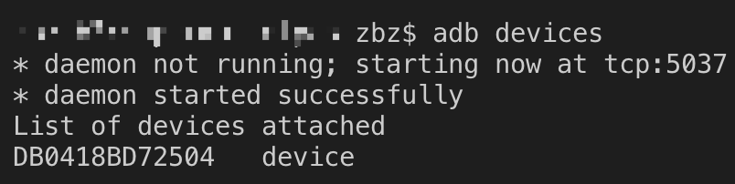

#  React Native安装与调试
  
[TOC]
  
## 1. 网站
  
官网
<https://facebook.github.io/react-native/docs/getting-started>
  
中文翻译
<https://reactnavigation.org/docs/zh-Hans/getting-started.html>
  
## 2. 初始化安装与创建项目
  
### 2.1. Expo CLI Quickstart
  
#### 2.1.1. 官网地址
  
官网有详细介绍，请跳转 <https://facebook.github.io/react-native/docs/getting-started>，然后选择 `Expo CLI Quickstart` 标签页。
  
### 2.2. React Native CLI Quickstart方式
  
#### 2.2.1. 官网地址
  
官网有详细介绍，请跳转 <https://facebook.github.io/react-native/docs/getting-started>，然后选择 `React Native CLI Quickstart` 标签页。
  
#### 2.2.2. ~~安装卡在安装 `CocoaPods` 的地方~~(没试成功)
  
`info Installing required CocoaPods dependencies`
  
1. 开始安装Cocoapods
  
```sh
sudo gem install cocoapods
```
  
2. 切换 镜像cocoapods镜像
  
```sh
cd ~/.cocoapods/repos
pod repo remove master
# ???
git clone https://mirrors.tuna.tsinghua.edu.cn/git/CocoaPods/Specs.git master
# 应为???
git clone https://mirrors.tuna.tsinghua.edu.cn/git/CocoaPods/Specs.git edu-git-cocoapods-specs
```
  
3. 初始化你的项目
  
```sh
react-native init MyApp
```
  
项目初始化还是会卡住。
  
4. 修改 `Podfile` 文件
  
`Podfile` 文件位于项目的 `ios` 目录下，打开文件，在 **第一行** 加上
  
```text
source 'https://mirrors.tuna.tsinghua.edu.cn/git/CocoaPods/Specs.git'
```
  
5. 按照提示 执行：
  
进入项目的 `ios` 目录下，执行
  
```sh
cd ./MyApp/ios && pod install
```
  
#### 2.2.3. 安装完成后，直接运行后报错
  
- 提示错误: unable to load script from assets
  
  选择 `macOS` 及 `Android` 开发，安装完成运行 ```react-native run-android``` ，移动端出现提示
 `unable to load script from assets` 的错误
  
1. 在 `android/app/src/main` 目录下创建一个 `assets` 空文件夹
  
2. 运行下面命令
  
```sh
react-native bundle --platform android --dev false --entry-file index.js --bundle-output android/app/src/main/assets/index.android.bundle --assets-dest android/app/src/main/res
```
  
## 3. 调试
  
### 3.1. expo
  
#### 3.1.1. Android本机调试
  
### 3.2. React Native CLI
  
#### 3.2.1. 真机环境调试
  
##### USB调试
  
1. 手机通过USB线连上电脑(手机端必须打开USB调试)
2. 在电脑端运行 `adb devices`，列出设备详情列表，记录好设备（必须确认有且只有一个设备，否则不好调试）
  
3. 在电脑端项目根目录下运行 `react-native run-android --port=13080` ，13080是端口号
4. 如果只有一个设备此步骤可以不用，`adb -s <device name> reverse tcp:13080 tcp:13080`
5. 如何在运行的App中调出开发者菜单？
  手机摇一摇，或在电脑端执行 `adb shell input keyevent 82`，即可调出 `Developer menu` 开发者菜单
6. 按上面的方法调出开发者菜单，设置启用下面的功能：
  `Enable Live Reload`
  `Enable Hot Reloading`
  
##### Wi-Fi调试
  
1. 先按之前介绍USB调试的方法运行
2. 按之前介绍的方法，在运行的App中调出开发者菜单 -> `Dev Settings` -> `Debug server host & port for device` -> 设置连接的电脑的地址(如:192.168.1.54:13080，**这里一定要注意冒号必须是英文输入法的，我掉到这个坑里差一点爬不出来**) -> 返回 -> 再按上面的方法调出开发者菜单 -> `Reload`
3. 拔掉USB线检验
  