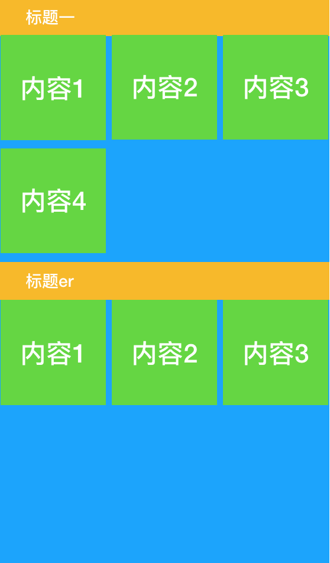

# SectionList

[TOC]

## 1. 需求

实现类似微信钱包这种带标题的横向列表，

默认SectionList不支持，这里介绍三种方式

### 1.1. 方案一

**缺点：有警告 flex-wrap is not support with the virtualizedlist. 目前github issues未解决**

设置contenContainerStyle flex-direction: row flex-wrap: wrap
设置sectionHeader宽度为屏幕宽度
如需子元素等宽，设置子元素宽度

### 1.2. 方案二

renderItem void
renderSectionHeader 用FlatList，设置FlatList header numColumns

### 1.3. 方案三

更改数据源，item数据为List
renderItem 用FlatList，设置FlatList header numColumns