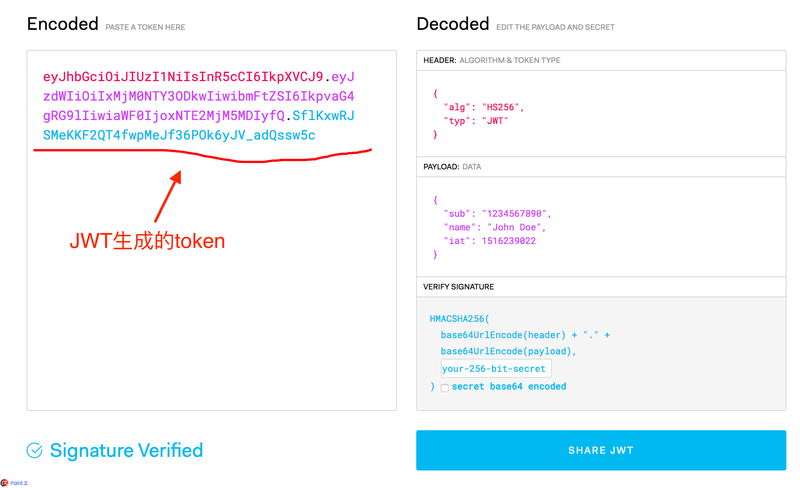

= JWT入门
:scripts: cjk
:toc:
:toc-title: 目录
:toclevels: 4

== JWT简介

JWT（JSON Web Token）, 是为了在网络应用环境间传递声明而执行的一种基于JSON的开放标准（(RFC 7519).
该token被设计为紧凑且安全的，特别适用于分布式站点的单点登录（SSO）场景。
JWT的声明一般被用来在身份提供者和服务提供者间传递被认证的用户身份信息，以便于从资源服务器获取资源，也可以增加一些额外的其它业务逻辑所必须的声明信息，该token也可直接被用于认证，也可被加密。

JWT 的一些名词解释

* JWS
+
*Signed JWT*，签名过的jwt
* JWE
+
*Encrypted JWT*，加密payload的jwt，目前加密payload的操作不是很普及
* JWK
+
JWT的密钥，也就是我们常说的 secret；
* JWKset
+
*JWT key set*，在非对称加密中，需要的是密钥对而非单独的密钥
* JWA
+
当前JWT所用到的密码学算法
* nonsecure JWT
+
当头部的签名算法被设定为none的时候，因为签名的部分空缺，所有人都可以修改，所以该JWT是不安全的

== JWT生成器

https://jwt.io/

== JWT组成

一个JWT实际上就是一个字符串，它由三部分组成：Header(头部)、Payload(载荷)、Signature(签名)



=== Header(头部)

Header部分是经过 ```Base64Url``` 编码的，解码的 ```header``` 中通常包含了两部分：

. alg: 采用的加密算法
. typ: token类型
+
[,json]
----
{
    "alg": "HS256",
    "typ": "JWT"
}
----

=== Payload(载荷)
存放有效信息的地方。这个名字像是特指飞机上承载的货品，也是需要经过 ```Base64Url``` 编码的。

* 示例
+
[,json]
----
{
    "iss": "JWT Builder",
    "iat": 1416797419,
    "exp": 1448333419,
    "aud": "www.battcn.com",
    "sub": "1837307557@qq.com",
    "GivenName": "Levin",
    "Surname": "Levin",
    "Email": "1837307557@qq.com",
    "Role": [
        "ADMIN",
        "MEMBER"
    ]
}
----


* 这些有效信息包含三个部分
.. 标准中注册的声明
.. 公共的声明
.. 私有的声明


* 详细说明
** 标准中注册的声明(建议但不强制使用)
+
[%header]
|===
| 参数            | 说明
| iss             | 该JWT的签发者
| sub             | 该JWT所面向的用户
| aud             | 接收该JWT的一方
| exp(expires)    | 什么时候过期，这里是一个Unix时间戳
| iat(issued at)  | 在什么时候签发的(UNIX时间)
| nbf(Not Before) | 如果当前时间在nbf时间之前，则不被接受；一般都会留一些余地，比如几分钟
|===

** 公共的声明
+
公共的声明可以添加任何的信息，一般添加用户的相关信息或其他业务需要的必要信息.但不建议添加敏感信息，因为该部分在客户端可解密.
** 私有的声明
+
私有声明是提供者和消费者所共同定义的声明，一般不建议存放敏感信息，因为base64是对称解密的，意味着该部分信息可以归类为明文信息。

=== Signature(签名)
签证信息，这个签证信息由三步生成：

[,js]
----
key = 'secretkey'
unsignedToken = encodeBase64(header) + '.' + encodeBase64(payload)
signature = HMAC-SHA256(key, unsignedToken)
----
