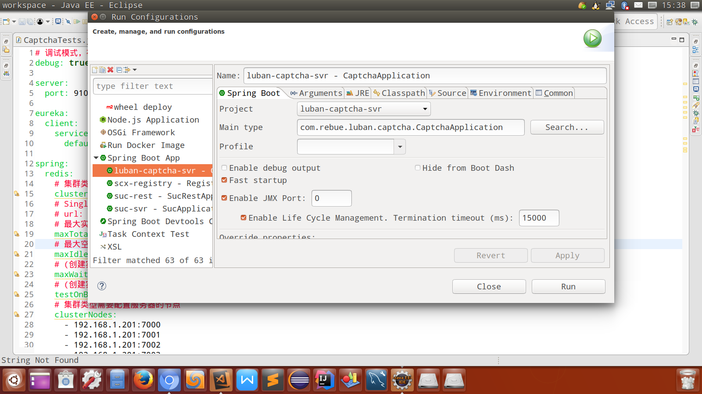

# SpringBoot常见问题

[TOC]

## 1. ClassCastException异常

同一个类的对象强转居然会报强转的异常，这是用了Spring boot devtools热加载器，类加载到了不同的ClassLoader下造成的。

https://docs.spring.io/spring-boot/docs/current/reference/htmlsingle/#using-boot-devtools-customizing-classload

在 ```src/main/resources``` 目录下创建 ```META-INF/spring-devtools.properties```

```text
restart.exclude.companycommonlibs=/mycorp-common-[\\w-]+\.jar
restart.include.projectcommon=/mycorp-myproj-[\\w-]+\.jar
```

按上面的格式填写include就可以了，jar包为强转报错代码所在的jar包

## 2. 读取debug属性值为null

不要勾选 ```Enable debug output``` ，它和配置文件里的debug有冲突



## 3. 阻止自动注入连接数据库

> If you want an embedded database please put a supported one on the classpath. If you have database settings to be loaded from a particular profile you may need to active it (no profiles are currently active).

这是因为spring boot默认会加载 ```org.springframework.boot.autoconfigure.jdbc.DataSourceAutoConfiguration``` 类， ```DataSourceAutoConfiguration``` 类使用了 ```@Configuration``` 注解向spring注入了dataSource bean。因为工程中没有关于dataSource相关的配置信息，当spring创建dataSource bean因缺少相关的信息就会报错。

如果应用不需要访问数据库，可以在Application类上增加下面的注解

```java
// 阻止spring boot自动注入dataSource bean
@EnableAutoConfiguration(exclude={DataSourceAutoConfiguration.class})
```
