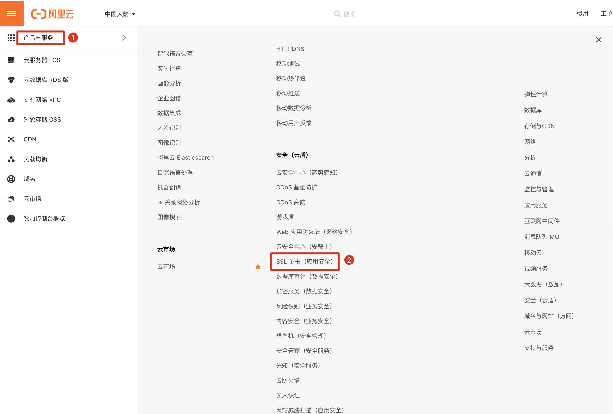

# 使用Undertow及https

[TOC]

## 1. 购买与下载证书

- 阿里云购买免费证书
 去阿里云购买证书（免费版），并提交审核资料


- 阿里云下载证书




## 2. 导出pfx证书

如果不想生成新的证书，可跳过本步骤，密码见 ```pfx-password.txt```。

```sh
openssl pkcs12 -export -out 214717098860811.pfx -inkey 214717098860811.key -in 214717098860811.pem
```

- 注意：这里要输入pfx的密码，要牢记。

## 3. 将pfx证书转换为jks证书

```sh
keytool -importkeystore -srckeystore xxx.pfx -destkeystore your-name.jks -srcstoretype PKCS12 -deststoretype JKS
```

- 注意：这里输入的目标密钥库口令就是jks密码，而源密钥库口令为上一步设置的pfx密码，建议两个密码相同，否则可能会导致Tomcat启动失败。

## 4. 部署jks证书

将 ```xxx.jks``` 文件复制到 ```spring boot``` 应用的目录下

## 5. 修改Spring Boot的配置文件

```yml
server:
  port: 443
  ssl:
    key-store: xxx.jks
    key-password: ********
```

## 将http的80端口重定向https的433端口

```java
@Configuration
public class SslConfig {

    @Bean
    public UndertowServletWebServerFactory servletContainer() {
        UndertowServletWebServerFactory undertowFactory = new UndertowServletWebServerFactory();
        // 监听80端口
        undertowFactory.addBuilderCustomizers((builder) -> {
            builder.addHttpListener(80, "0.0.0.0");
        });
        // 将http的80端口重定向到https的443端口上
        undertowFactory.addDeploymentInfoCustomizers(deploymentInfo -> {
            deploymentInfo
                    .addSecurityConstraint(new SecurityConstraint().addWebResourceCollection(new WebResourceCollection().addUrlPattern("/*"))
                            .setTransportGuaranteeType(TransportGuaranteeType.CONFIDENTIAL).setEmptyRoleSemantic(SecurityInfo.EmptyRoleSemantic.PERMIT))
                    .setConfidentialPortManager(exchange -> 443);
        });
        return undertowFactory;
    }

}
```

## 6. 重启微服务