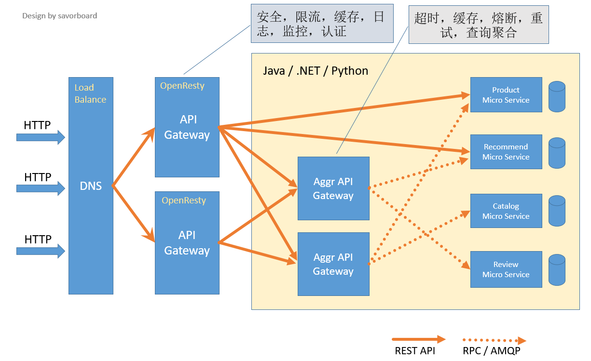

# Spring Cloud Gateway

[TOC]

## 1. API 网关

### 1.1. 网关简介

API网关是一个服务器，是系统的唯一入口。从面向对象设计的角度看，它与外观模式类似。API网关封装了系统内部架构，为每个客户端提供一个定制的API。它可能还具有其它职责，如身份验证、监控、负载均衡、缓存、请求分片与管理、静态响应处理。API网关方式的核心要点是，所有的客户端和消费端都通过统一的网关接入微服务，在网关层处理所有的非业务功能。通常，网关也是提供REST/HTTP的访问API。

### 1.2. 网关应当具备的功能

- 性能：API高可用，负载均衡，容错机制。
- 安全：权限身份认证、脱敏，流量清洗，后端签名（保证全链路可信调用）,黑名单（非法调用的限制）。
- 日志：日志记录（spainid,traceid）一旦涉及分布式，全链路跟踪必不可少。
- 缓存：数据缓存。
- 监控：记录请求响应数据，api耗时分析，性能监控。
- 限流：流量控制，错峰流控，可以定义多种限流规则。
- 灰度：线上灰度部署，可以减小风险。
- 路由：动态路由规则。

### 1.3. 常见网关及与SpringCloudGateway的对比

目前，比较流行的网关有：Nginx 、 Kong 、Orange等等，还有微服务网关Zuul 、Spring Cloud Gateway等等

对于 API Gateway，常见的选型有基于 Openresty 的 Kong、基于 Go 的 Tyk 和基于 Java 的 Zuul。这三个选型本身没有什么明显的区别，主要还是看技术栈是否能满足快速应用和二次开发。

Spring Cloud Gateway与这些网关(Zuul在这里就不比了)对比有什么优势呢？

- 像Nginx这类网关，性能肯定是没得说，它适合做那种门户网关，是作为整个全局的网关，是对外的，处于最外层的；而Gateway这种，更像是业务网关，主要用来对应不同的客户端提供服务的，用于聚合业务的。各个微服务独立部署，职责单一，对外提供服务的时候需要有一个东西把业务聚合起来。
- 像Nginx这类网关，都是用不同的语言编写的，不易于扩展；而Gateway就不同，它是用Java写的，易于扩展和维护
- Gateway这类网关可以实现熔断、重试等功能，这是Nginx不具备的

### 1.4. 合理的网关组织架构



## 2. Spring Cloud Gateway 简介

### 2.1. 特性

- 基于Spring Framework 5、Project Reactor和Spring Boot 2.0构建
能够在任意请求属性上匹配路由
- predicates（谓词） 和 filters（过滤器）是特定于路由的
- 集成了Hystrix断路器
- 集成了Spring Cloud DiscoveryClient
- 易于编写谓词和过滤器
- 请求速率限制
- 路径重写

### 2.2. 术语

- Route
  路由是网关的基本组件。它由ID、目标URI、谓词集合和过滤器集合定义。如果聚合断言为true，则匹配路由
- Predicate
  断言，Java 8 Function Predicate，根据断言来判断是否匹配路由
- Filter
  过滤器

### 2.3. 原理图


## 3. Spring Cloud Gateway 详细介绍

### 3.1. Predicate

- Spring Cloud Gateway 包含许多内置的 **Route Predicate Factories**
- 所有这些predicates用于匹配HTTP请求的不同 **属性**
- 多个 Route Predicate Factories 可以通过 **逻辑与（and）** 结合起来一起使用

#### 3.1.1. After

```yaml
spring:
  cloud:
    gateway:
      routes:
      - id: after_route
        uri: https://example.org
        predicates:
        - After=2017-01-20T17:42:47.789-07:00[America/Denver]
```

这个路由匹配“美国丹佛时间2017-01-20 17:42”之后的任意请求

#### 3.1.2. Header

```yaml
spring:
  cloud:
    gateway:
      routes:
      - id: header_route
        uri: https://example.org
        predicates:
        - Header=X-Request-Id, \d+
```

这个路由匹配“请求头包含X-Request-Id并且其值匹配正则表达式\d+”的任意请求

#### 3.1.3. Method

```yaml
spring:
  cloud:
    gateway:
      routes:
      - id: method_route
        uri: https://example.org
        predicates:
        - Method=GET
```

这个路由匹配任意GET请求

#### 3.1.4. Path

```yaml
spring:
  cloud:
    gateway:
      routes:
      - id: host_route
        uri: https://example.org
        predicates:
        - Path=/foo/{segment},/bar/{segment}
```

这个路由匹配这样路径的请求，比如：/foo/1 或 /foo/bar 或 /bar/baz

#### 3.1.5. Query

这个Predicate有两个参数：一个必须的参数名和一个可选的正则表达式

```yaml
spring:
  cloud:
    gateway:
      routes:
      - id: query_route
        uri: https://example.org
        predicates:
        - Query=baz
```

这个路由匹配“查询参数中包含baz”的请求

```yaml
spring:
  cloud:
    gateway:
      routes:
      - id: query_route
        uri: https://example.org
        predicates:
        - Query=foo, ba.
```

这个路由匹配“查询参数中包含foo，并且其参数值满足正则表达式ba.”的请求，比如：bar，baz

#### 3.1.6. RemoteAddr

这个路由接受一个IP（IPv4或IPv6）地址字符串。例如：192.168.0.1/16，其中192.168.0.1，16是子网掩码

```yaml
spring:
  cloud:
    gateway:
      routes:
      - id: remoteaddr_route
        uri: https://example.org
        predicates:
        - RemoteAddr=192.168.1.1/24
```

这里路由匹配远程地址是这样的请求，例如：192.168.1.10

### 3.2. GatewayFilter

路由过滤器允许以某种方式修改传入的HTTP请求或传出HTTP响应。路由过滤器的作用域是特定的路由。Spring Cloud Gateway包含许多内置的网关过滤器工厂。

#### 3.2.1. AddRequestHeader

```yaml
spring:
  cloud:
    gateway:
      routes:
      - id: add_request_header_route
        uri: https://example.org
        filters:
        - AddRequestHeader=X-Request-Foo, Bar
```

对于所有匹配的请求，将会给传给下游的请求添加一个请求头 X-Request-Foo:Bar

#### 3.2.2. AddRequestParameter

```yaml
spring:
  cloud:
    gateway:
      routes:
      - id: add_request_parameter_route
        uri: https://example.org
        filters:
        - AddRequestParameter=foo, bar
```

对于所有匹配的请求，将给传给下游的请求添加一个查询参数 foo=bar

#### 3.2.3. AddResponseHeader

```yaml
spring:
  cloud:
    gateway:
      routes:
      - id: add_response_header_route
        uri: https://example.org
        filters:
        - AddResponseHeader=X-Response-Foo, Bar
```

对于所有匹配的请求，添加一个响应头 X-Response-Foo:Bar

#### 3.2.4. Hystrix

Hystrix网关过滤器允许你将断路器引入网关路由，保护你的服务免受级联失败的影响，并在下游发生故障时提供预备响应。

为了启用Hystrix网关过滤器，你需要引入 spring-cloud-starter-netflix-hystrix

Hystrix网关过滤器需要一个name参数，这个name是HystrixCommand的名字

```yaml
spring:
  cloud:
    gateway:
      routes:
      - id: hystrix_route
        uri: https://example.org
        filters:
        - Hystrix=myCommandName
```

给这个过滤器包装一个名字叫myCommandName的HystrixCommand

Hystrix网关过滤器也接受一个可选的参数fallbackUri，但是目前只支持forward:前缀的URL。也就是说，如果这个fallback被调用，请求将被重定向到匹配的这个URL。

```yaml
spring:
  cloud:
    gateway:
      routes:
      - id: hystrix_route
        uri: lb://backing-service:8088
        predicates:
        - Path=/consumingserviceendpoint
        filters:
        - name: Hystrix
          args:
            name: fallbackcmd
            fallbackUri: forward:/incaseoffailureusethis
        - RewritePath=/consumingserviceendpoint, /backingserviceendpoint
```

当fallback被调用的时候，请求将被重定向到/incaseoffailureusethis

```yaml
spring:
  cloud:
    gateway:
      routes:
      - id: ingredients
        uri: lb://ingredients
        predicates:
        - Path=//ingredients/**
        filters:
        - name: Hystrix
          args:
            name: fetchIngredients
            fallbackUri: forward:/fallback
      - id: ingredients-fallback
        uri: http://localhost:9994
        predicates:
        - Path=/fallback
```

在这个例子中，专门定义了一个端点来处理/fallback请求，它在localhost:9994上。也就是说，当fallback被调用的时候将重定向到 <http://localhost:9994/fallback>

#### 3.2.5. PrefixPath

```yaml
spring:
  cloud:
    gateway:
      routes:
      - id: prefixpath_route
        uri: https://example.org
        filters:
        - PrefixPath=/mypath
```

所有匹配的请求都将加上前缀/mypath。例如，如果请求是/hello，那么经过这个过滤器后，发出去的请求变成/mypath/hello

#### 3.2.6. RequestRateLimiter

RequestRateLimiter网关过滤器使用一个RateLimiter实现来决定是否当前请求可以继续往下走。如果不能，默认将返回HTTP 429 - Too Many Requests

这个过滤器接受一个可选的参数keyResolver，这个参数是一个特定的rate limiter

keyResolver是实现了KeyResolver接口的一个Bean。

在配置的时候，使用SpEL按名称引用Bean。#{@myKeyResolver}是一个SpEL表达式，表示引用名字叫myKeyResolver的Bean。

KeyResolver.java 

```java
public interface KeyResolver {
    Mono<String> resolve(ServerWebExchange exchange);
}
```

KeyResolver默认的实现是PrincipalNameKeyResolver，它从ServerWebExchange中检索Principal，并调用Principal.getName()方法。

默认情况下，如果KeyResolver没有找到一个key，那么请求将会被denied（译：否认，拒绝）。这种行为可以通过spring.cloud.gateway.filter.request-rate-limiter.deny-empty-key (true or false) 和 spring.cloud.gateway.filter.request-rate-limiter.empty-key-status-code 属性来进行调整.

**Redis RateLimiter**

需要引用 `spring-boot-starter-data-redis-reactive`

这个逻辑使用令牌桶算法

- redis-rate-limiter.replenishRate
  允许用户每秒处理多少个请求。这是令牌桶被填充的速率。
- redis-rate-limiter.burstCapacity
  用户在一秒钟内允许执行的最大请求数。这是令牌桶可以容纳的令牌数量。将此值设置为0将阻塞所有请求。

一个稳定的速率是通过将replenishRate 和 burstCapacity设为相同的值来实现的。也可以将burstCapacity设得比replenishRate大，以应对临时爆发的流量。在这种情况下，需要允许速率限制器在突发事件之间间隔一段时间，因为连续两次突发事件将导致丢弃请求（HTTP 429 - Too Many Requests）

```yaml
spring:
  cloud:
    gateway:
      routes:
      - id: requestratelimiter_route
        uri: https://example.org
        filters:
        - name: RequestRateLimiter
          args:
            redis-rate-limiter.replenishRate: 10
            redis-rate-limiter.burstCapacity: 20
```

Config.java

```java
@Bean
KeyResolver userKeyResolver() {
    return exchange -> Mono.just(exchange.getRequest().getQueryParams().getFirst("user"));
}
```

这里定义了每个用户的请求速率限制为10。允许使用20个请求，但是在接下来的一秒中，只有10个请求可用。

这个例子中只是简单地从请求参数中获取"user"，在实际生产环境中不建议这么做。

我们也可以通过实现RateLimiter接口来自定义，这个时候，在配置中我们就需要引用这个Bean，例如：#{@myRateLimiter} 

```yaml
spring:
  cloud:
    gateway:
      routes:
      - id: requestratelimiter_route
        uri: https://example.org
        filters:
        - name: RequestRateLimiter
          args:
            rate-limiter: "#{@myRateLimiter}"
            key-resolver: "#{@userKeyResolver}"
```

#### 3.2.7. Default Filters

如果你想要添加一个过滤器并且把它应用于所有路由的话，你可以用spring.cloud.gateway.default-filters。这个属性接受一个过滤器列表。

```yaml
spring:
  cloud:
    gateway:
      default-filters:
      - AddResponseHeader=X-Response-Default-Foo, Default-Bar
      - PrefixPath=/httpbin
```

### 3.3. GlobalFilters

GlobalFilter接口的方法签名和GatewayFilter相同。这些是有条件地应用于所有路由的特殊过滤器。

**GlobalFilter和GatewayFilter的顺序**

当一个请求过来的时候，将会添加所有的GatewayFilter实例和所有特定的GatewayFilter实例到过滤器链上。过滤器链按照 `org.springframework.core.Ordered` 接口对该链路上的过滤器进行排序。你可以通过实现接口中的 `getOrder()` 方法或者使用 `@Order` 注解。

Spring Cloud Gateway将过滤器执行逻辑分为 `pre` 和 `post` 阶段。优先级最高的过滤器将会是 `pre` 阶段中的第一个过滤器，同时它也将是 `post` 阶段中的最后一个过滤器。

ExampleConfiguration.java

```java
@Bean
@Order(-1)
public GlobalFilter a() {
    return (exchange, chain) -> {
        log.info("first pre filter");
        return chain.filter(exchange).then(Mono.fromRunnable(() -> {
             log.info("third post filter");
        }));
    };
}

@Bean
@Order(0)
public GlobalFilter b() {
    return (exchange, chain) -> {
        log.info("second pre filter");
        return chain.filter(exchange).then(Mono.fromRunnable(() -> {
            log.info("second post filter");
        }));
    };
}

@Bean
@Order(1)
public GlobalFilter c() {
    return (exchange, chain) -> {
        log.info("third pre filter");
        return chain.filter(exchange).then(Mono.fromRunnable(() -> {
            log.info("first post filter");
        }));
    };
}
```

### 3.4. LoadBalancerClient

LoadBalancerClientFilter查找exchange属性中查找 `ServerWebExchangeUtils.GATEWAY_REQUEST_URL_ATTR` 一个URI。如果url符合lb schema（例如：`lb://myservice`），那么它将使用Spring Cloud LoadBalancerClient 来解析这个名字到一个实际的主机和端口，并替换URI中相同的属性。原始url中未被修改的部分被附加到 `ServerWebExchangeUtils.GATEWAY_ORIGINAL_REQUEST_URL_ATTR` 属性列表中。

```yaml
spring:
  cloud:
    gateway:
      routes:
      - id: myRoute
        uri: lb://service
        predicates:
        - Path=/service/**
```

默认情况下，当一个服务实例在LoadBalancer中没有找到时，将返回503。你可以通过配置 `spring.cloud.gateway.loadbalancer.use404=true` 来让它返回404。

### 3.5. 配置

RouteDefinitionLocator.java 

```java
public interface RouteDefinitionLocator {
    Flux<RouteDefinition> getRouteDefinitions();
}
```

默认情况下，`PropertiesRouteDefinitionLocator` 通过 `@ConfigurationProperties` 机制加载属性

```yaml
spring:
  cloud:
    gateway:
      routes:
      - id: setstatus_route
        uri: https://example.org
        filters:
        - name: SetStatus
          args:
            status: 401
      - id: setstatusshortcut_route
        uri: https://example.org
        filters:
        - SetStatus=401
```

下面用Java配置

GatewaySampleApplication.java

```java
// static imports from GatewayFilters and RoutePredicates
@Bean
public RouteLocator customRouteLocator(RouteLocatorBuilder builder, ThrottleGatewayFilterFactory throttle) {
    return builder.routes()
            .route(r -> r.host("**.abc.org").and().path("/image/png")
                .filters(f ->
                        f.addResponseHeader("X-TestHeader", "foobar"))
                .uri("http://httpbin.org:80")
            )
            .route(r -> r.path("/image/webp")
                .filters(f ->
                        f.addResponseHeader("X-AnotherHeader", "baz"))
                .uri("http://httpbin.org:80")
            )
            .route(r -> r.order(-1)
                .host("**.throttle.org").and().path("/get")
                .filters(f -> f.filter(throttle.apply(1,
                        1,
                        10,
                        TimeUnit.SECONDS)))
                .uri("http://httpbin.org:80")
            )
            .build();
}
```

这种风格允许自定义更多的断言，默认是逻辑与（and）。你也可以用and() ， or() ， negate()

再来一个例子

```java
@SpringBootApplication
public class DemogatewayApplication {
    @Bean
    public RouteLocator customRouteLocator(RouteLocatorBuilder builder) {
        return builder.routes()
            .route("path_route", r -> r.path("/get")
                .uri("http://httpbin.org"))
            .route("host_route", r -> r.host("*.myhost.org")
                .uri("http://httpbin.org"))
            .route("hystrix_route", r -> r.host("*.hystrix.org")
                .filters(f -> f.hystrix(c -> c.setName("slowcmd")))
                .uri("http://httpbin.org"))
            .route("hystrix_fallback_route", r -> r.host("*.hystrixfallback.org")
                .filters(f -> f.hystrix(c -> c.setName("slowcmd").setFallbackUri("forward:/hystrixfallback")))
                .uri("http://httpbin.org"))
            .route("limit_route", r -> r
                .host("*.limited.org").and().path("/anything/**")
                .filters(f -> f.requestRateLimiter(c -> c.setRateLimiter(redisRateLimiter())))
                .uri("http://httpbin.org"))
            .build();
    }
}
```

### 3.6. CORS配置

```yaml
spring:
  cloud:
    gateway:
      globalcors:
        corsConfigurations:
          '[/**]':
            allowedOrigins: "https://docs.spring.io"
            allowedMethods:
            - GET
```

上面的例子中，所有原始为docs.spring.io的GET请求均被允许跨域请求。

## 4. 参考文档

- <https://spring.io/projects/spring-cloud-gateway>
- <https://spring.io/guides/gs/gateway/>
- <https://www.cnblogs.com/cjsblog/p/11099234.html>