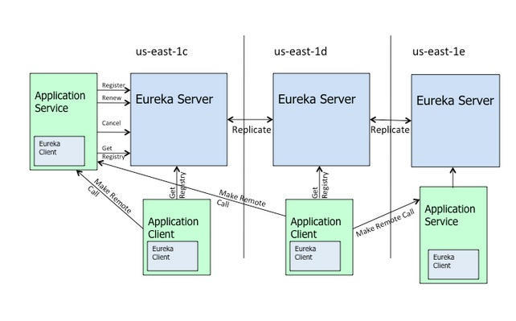

# eureka

[TOC]

## 1. eureka架构



- 处于不同节点的eureka通过Replicate进行数据同步
- Application Service为服务提供者
- Application Client为服务消费者
- Make Remote Call完成一次服务调用

服务启动后向Eureka注册，Eureka Server会将注册信息向其他Eureka Server进行同步，当服务消费者要调用服务提供者，则向服务注册中心获取服务提供者地址，然后会将服务提供者地址缓存在本地，下次再调用时，则直接从本地缓存中取，完成一次调用。

当服务注册中心Eureka Server检测到服务提供者因为宕机、网络原因不可用时，则在服务注册中心将服务置为DOWN状态，并把当前服务提供者状态向订阅者发布，订阅过的服务消费者更新本地缓存。

服务提供者在启动后，周期性（默认30秒）向Eureka Server发送心跳，以证明当前服务是可用状态。Eureka Server在一定的时间（默认90秒）未收到客户端的心跳，则认为服务宕机，注销该实例。

## 2. Eureka的自我保护机制

在默认配置中，Eureka Server在默认90s没有得到客户端的心跳，则注销该实例，但是往往因为微服务跨进程调用，网络通信往往会面临着各种问题，比如微服务状态正常，但是因为网络分区故障时，Eureka Server注销服务实例则会让大部分微服务不可用，这很危险，因为服务明明没有问题。

为了解决这个问题，Eureka 有自我保护机制，通过在Eureka Server配置如下参数，可启动保护机制

```ini
eureka.server.enable-self-preservation=true
```

它的原理是，当Eureka Server节点在短时间内丢失过多的客户端时（可能发送了网络故障），那么这个节点将进入自我保护模式，不再注销任何微服务，当网络故障回复后，该节点会自动退出自我保护模式。

自我保护模式的架构哲学是**宁可放过一个，决不可错杀一千**

## 3. Eureka Server高可用集群

在分布式系统中，任何的地方存在单点，整个体系就不是高可用的，Eureka 也一样，在上面的架构图中Eureka Server不是以单点存在的，而是以集群的方式对外提供服务。