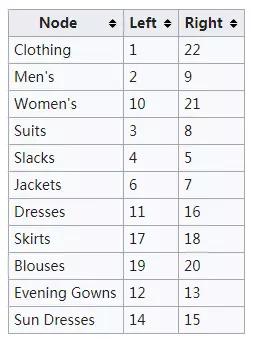
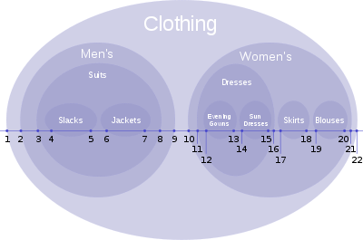
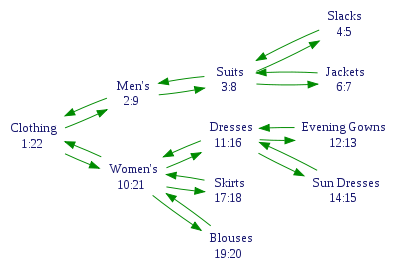

# Nested Sets

[TOC]

## 1. 概述

目前常见的树形结构数据库存储方案有以下五种

|算法|说明|优缺点|
|:-|-|-|
|Adjacency List|记录父节点|优点是简单，缺点是访问子树需要遍历，性能差|
|Path Enumerations|用一个字符串记录整个路径|优点是查询方便，缺点是受限于长度，不支持无限层级|
|Closure Table|专门一张表维护所有祖孙关系|缺点是占用空间大|
|Nested Sets|记录左值和右值|缺点是复杂难操作|
|朱氏深度树V2.0法|使用line和level记录树结构|比较民科，有机会玩玩|

## 2. 简介

嵌套集模型是根据树遍历来对节点进行编号，遍历会访问每个节点两次，按访问顺序分配数字，并在两次访问中都分配。这将为每个节点留下两个数字，它们作为节点两个属性存储。这使得查询变得高效：通过比较这些数字来获得层级结构关系。但是更新数据将需要给节点重新分配数字，因此变得低效。尽管很复杂但是可以通过不使用整数而是用有理数来改进更新速度。

## 3. 示例

衣服分类

## 4. 衍生增强版

使用上面方法在一些特定的树遍历操作上有性能限制。比如根据父节点查找直接子节点。

为了突破限制和简化遍历树，引入 `Adjacency List` 算法，在模型上增加一个额外的字段来记录节点的父节点(pId)
