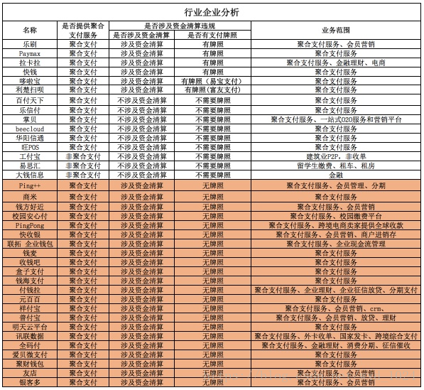

# 聚合支付简介

## 1. 什么是聚合支付
聚合支付：也称“融合支付”，是指只从事“支付、结算、清算”服务之外的“支付服务”，依托银行、非银机构或清算组织，借助银行、非银机构或清算组织的支付通道与清结算能力，利用自身的技术与服务集成能力，将一个以上的银行、非银机构或清算组织的支付服务，整合到一起，为商户提供包括但不限于“支付通道服务”、“集合对账服务”、“技术对接服务”、“差错处理服务”、“金融服务引导”、“会员账户服务”、“作业流程软件服务”、“运行维护服务”、“终端提供与维护”等服务内容，以此减少商户接入、维护支付结算服务时面临的成本支出，提高商户支付结算系统运行效率的，并收取增值收益的支付服务。

聚合支付是一款各类型商户多种支付渠道便利收款、对账的需求，整合市面上多种支付渠道，如支付宝、微信、银联、京东，支持多种终端，如PC端、移动端、智能终端等的统一支付产品，不仅如此，无论企业使用哪种支付渠道，只要通过聚合支付接入，即可使用聚合支付对账单及数据统计， 实现收款、结算、数据统计全面聚合，解决商户在不同渠道重复对账，独立统计的弊端。

## 2. 聚合支付的发展背景
聚合支付是相对第三方支付而言的，作为对第三方支付平台服务的拓展。第三方支付介于银行和商户之间，而聚合支付是介于第三方支付和商户之间，通过聚合各种第三方支付平台包括银联体系第三方支付公司的刷卡和芯片卡方式、微信和支付宝的二维码支付方式以及其他类似的翼支付、百度钱包和京东钱包等支付方式，通过统一的软硬件平台来承载。
聚合支付不进行资金清算，因此无需支付牌照，其只是完成支付环节的信息流转和商户操作的承载，其在集合包括银联、支付宝、微信等主流支付方式的基础上，帮助商户降低接入成本，提高运营效率，具有中立性、灵活性、便捷性等特点。

据CNNIC发布的《中国互联网络发展状况统计报告》表明，截止到2016年6月，我国使用手机支付的用户规模增长迅速，达到4.24亿，半年增长率为18.7%，移动支付市场空间很大，已成为大势所趋。

当前正是移动支付行业的迅猛发展时期，第三方支付已经难以满足多种支付场景同时使用的需要，无法一一提供高效的精细化服务。此时，为商户提供聚合支付业务的公司应运而生，这是商户经营的迫切需求，也是技术创新驱动下时代发展的必然进程。

## 3. 支付产业链详解

支付行业涉及的业务环节数量多且繁复，因此不少人会混淆其中的一些概念和业务。在此，我们对整个支付行业产业链进行一个结构大梳理，帮助大家理解市面上涉及支付业务的这些公司，哪些在做资金清算、哪些需要支付牌照、哪些又涉嫌违规操作。

从上图我们可以看到，实际上支付产业链包括：商户、聚合支付服务商、第三方支付、官方清算中心（银联和未来的网联）、消费者五大环节。央行要查处整顿的，并不是市面上的聚合支付企业，而是在做聚合支付的同时，又插足支付清算，却不具备合法支付牌照的公司（即行业所说的“二清”企业）。

从图中我们也可以看出，目前主要是通过微信和支付宝连接手机端的消费者，因此原本属于第三方支付机构的微信和支付宝（财付通与支付宝均持有央行支付牌照），具备了银联的清算能力，而央行即将成立的网联（线上支付统一清算平台）统一规范化线上清算，将支付业务和清算业务分开。可见，未来的网联与银联将双分天下。
“聚合支付”公司本质是技术服务类公司，并不具备“支付牌照”，而违规的“聚合支付”公司碰了资金结算，公司有了资金沉淀，那么央行就不得不处理，不得不进一步监管了。一位央行人士透露，“如果纯粹是技术整合，不涉及资金沉淀和客户敏感信息，就属于比较规范的聚合支付;但一旦涉及资金沉淀，必须马上叫停，监管要及时介入，不能重蹈此前对第三方支付机构的监管被动局面。”

## 4. 支付市场的现状分析

根据产业链分析，我们再来看看支付行业主要的企业目前涉及的业务情况及支付牌照情况。

从表格中可以看出，乐刷、Paymax、拉卡拉等企业有央行牌照，属于合法的资金清算；百付天下、乐信付、掌贝、beecloud等不涉及资金清算，也无需支付牌照；另外表中红色部分无牌照并做资金清算，是央行重点监管和整治对象。

另外，我们也可以看到，如之前亿欧网调研所分析的那样，部分提供聚合支付的服务商，已经在此基础上衍生出其它的服务，包括消费金融、现金贷，以及广告、SaaS软件、大数据分析、营销等企业服务

## 聚合支付市场的未来走向

对于国家和央行在政策上的走向，可以确定的是：首先，打着聚合支付旗号从事“二清”业务的公司必然会成为整顿对象。“二清”公司未获得央行支付业务许可，却从事支付清算业务。这种行业乱象不但蕴涵着巨额套现的金融风险，且清算环节难受监管，容易导致商户和消费者利益受损。打击“二清”违规行为是央行一直以来的政策，聚合支付领域里的“二清”公司也难逃此命运。

其次，政府将会加大支持合法合规的聚合支付公司，剔除掉违规的、钻漏洞的企业，鼓励更多优秀的企业做强做大。考虑到聚合支付技术在商户端发挥的实际价值和整个行业发展的大趋势，合法合规的聚合支付企业必定会受到政策更多的支持和鼓励。

当下，中国正处在实体经济全面复苏的产业转型过程中，聚合支付技术在大势中应运而生，帮助转型中的线下实体店更好地提升生产效率，帮助消费者更好地提升服务体验。在此基础上，国家鼓励并支持基于聚合支付业务的企业向商户服务，包括消费大数据服务商发展转型，紧密配合国家发展实体经济的战略，为线下消费市场提供更多革新的技术及优质的服务。