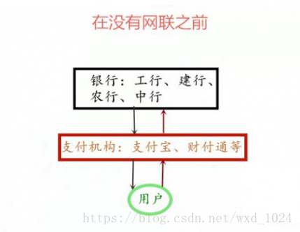
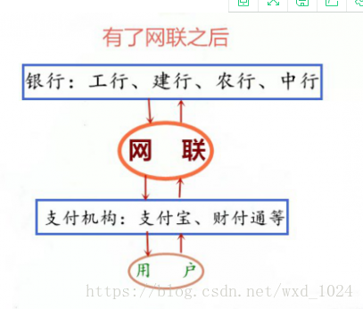

# 银联和网联的区别

[TOC]

银联，它是线下刷银行卡时的清算平台。清算，主要涉及在各个金融机构之间调拨资金、划拨支付的结算款项，以及偿还由这些行为引起的资金欠款。

网联的全称叫：非银行支付机构网络支付清算平台，简称“网联”。网联和银联类似，只不过服务对象是如微信、支付宝这类第三方支付机构。清算领域也是线上的网络支付。

## 1. 银联

在网联出台以前，第三方支付平台其实并没有像银联这样“半监管半抱团”性质的组织。除了在技术上麻烦一些之外，在与银行和银联的竞争上也处处受到打压：

2012年，银联曾下发通知要求各家银行停止各自与第三方平台的直连服务。（后来被人行驳回了）

2013年，银联要求POS机不得在接入银行直连通道的同时接入第三方支付。（这就是你在收银台会看到好几个POS机的原因）

2014年，银联推出云闪付业务，试图用NFC改变已被支付宝、微信们占领的二维码支付。

2016年，银联推出二维码支付标准，要求旗下银行使用符合其标准的二维码进行线下支付（与第三方支付不兼容）。

你可能发现了，银联尽管对第三方支付恨得咬牙切齿，但银联其实没有权限管理第三方支付公司。因为银联的身份是各大商业银行与中国人民银行之间的一个半官方组织，它并不具备行政管理的权限，只能通过制裁等手段去约束内部的成员。

举个例子，如果没有银联，那么每个银行要想把自己的线下支付业务铺到全国，就需要自己做一台专属自己的POS机，然后还要把这台POS机推广到每个商家的手里。有了银联之后，一家新的银行只需要加入银联，就可以让自己的储户使用银联的POS机来进行支付。

而如果一家银行不听话，那么银联最多做到的也只能是“把它踢出自己的联盟”——一旦被踢出，那么在所有的银联POS机上就都不能用了。这对于银行来说是十分有力的制裁，但对本就不在联盟内的“外部第三方支付公司”却没有半点威慑。

反过来说，银联上述的这些决策也反映了其对银行业利益的代表——尽管有时候商业银行也觉得银联有点霸道，但在面对共同的敌人第三方支付的情况下，他们也都寄希望于银联能够团结全行业的力量来进行反制。

在网联出现之前，第三方支付机构拥有类似银联的业务模式，但它们并不是清算机构，也不具备清算资质。而且纯商业的联盟，也没有银联“半官方”的性质来的那么有底气。

## 2. 网联

网联取代之前第三方支付机构直连银行的模式，网联仅作为清算平台，一端连接持牌支付机构，另一端对接银行系统

网联的建成，也划清了和中国银联的“楚河汉界”——银联转接线下支付，“网联”转接线上支付，第三方支付平台可任意选择接入其中的一种，但不得再继续直连银行的模式。

网联的目的在于针对网络支付建立统一公共的资金转接清算服务，换句话说，网联平台将成为第三方支付平台与银行体系间的数据中介和桥梁。这一机制一方面有利于掌握第三方支付机构的资金流向；另一方面可降低其拓展、维护银行渠道的成本，为支付机构提供了统一、公共的支付清算服务，节约了连接成本，提高了清算效率

在没有网联之前，支付宝、财付通等支付机构其实是变相地行使了只有央妈才能行使的“跨行清算”的职能。

给大家举个例子，帮助大家理解：我想把平安银行工资卡的5000元钱转到农业银行的卡中。

传统的跨行转账：我在平安银行操作5000元转账程序，进入银联支付清算系统，在通过银联支付清算系统，5000元进入自己的农业银行账户。

第三方支付机构（以支付宝为例）：我通过支付宝从平安银行转出5000元，进入支付宝农行账户，支付宝通过自己的农行账户，转入5000元到指定账户。

从我转钱的这个过程可以看到，在传统的跨行转账的过程中，银行的跨行支付和清算全部在央妈监管下完成。然而通过第三方支付机构跨行转账的过程，是没有通过央妈的清算账户的。从而，银行和央妈都无法掌握具体交易信息，无法掌握准确的资金流向。这就给金融监管、货币政策调节、金融数据分析等央妈的各项金融工作带来很大困难。更危险的是它也有可能被不法分子所利用，成为洗钱、套现、盗取资金的渠道。

网联平台的诞生，就是要解决上述这些问题，这也意味着，支付宝和微信支付们各自捏在手中的用户交易数据，都将被网联平台所知悉，不再成为闭环内的一部分。

网联在地位和运作机制上，与银联几乎一摸一样——同样是由央行牵头，联盟内成员共同出资的金融服务机构。除了技术上的优势之外，网联最大的作用是打破了清算市场银联一家独大的局面。

以后，银联再也不能以居高临下的姿态单方面欺负某个第三方支付公司了，如果要PK就是两个联盟之间的正面交火。